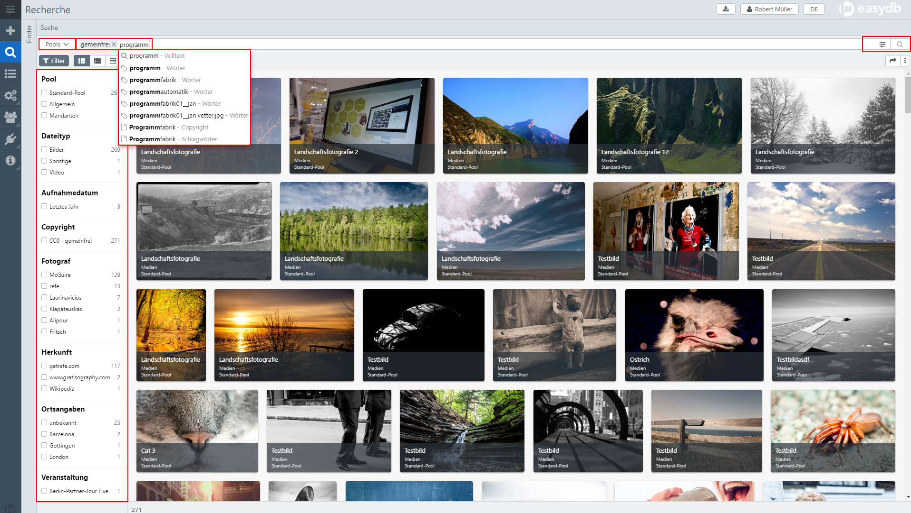
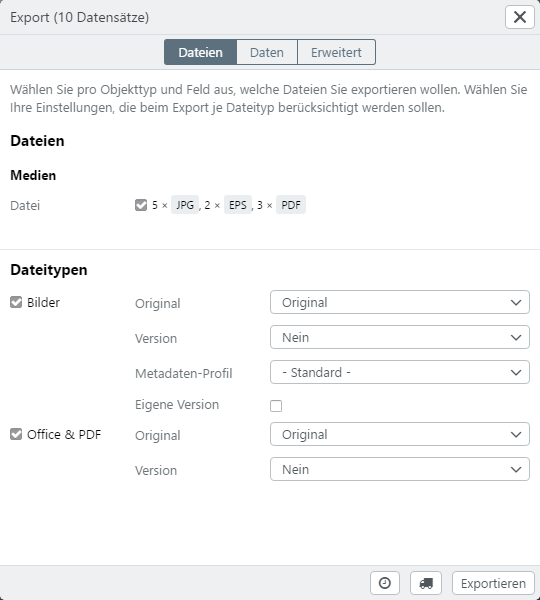
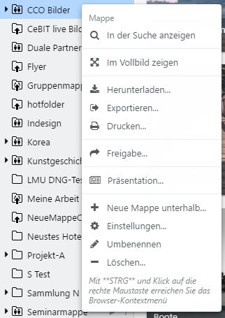

# Getting started for users

This "getting started" guide is provided for the first orientation in easydb. For an overview, the introduction for easydb users is explained here in a few steps. The short version contains the most frequently used functions in easydb, from login, to uploading the first file and the further use of the [Assets](../glossar). Detailed instructions and explanations can be found in the [User Manual](../webfrontend).

* [Start easydb](#start)
* [Login/Login](#login)
* [Structure](#scheme)
* [Create](#upload)
* [Search](#search)
* [View & Download](#show)
* [Export](#export)
* [Share Collection](#share)
 

#  Start easydb {#start}

The easydb is accessed via a web browser. Only a working Internet connection and a current web browser are required. We recommend using Chrome.

#  Login {#login}

Enter your username and password in order to log in to easydb. In addition, you can use the checkboxes below to specify whether easydb should load this login window every time you access it (instead of loading the dropdown view from which you can log in), or save the login for a week.

> After login, users can change their settings. See [User Settings](../webfrontend/userprefs/userprefs) for more information.

## Structure {#scheme}

|Nr.|Area|Function|
|---|---|---|
|1|Menu|By clicking on the icon above, the menu can be opened for full display. Authorized administrators have access to the system settings here.|
|2|Quick access|The area marked as Finder can be highlighted with the arrow at the top. Saved searches, entries, and shared folders are displayed here.|
|3|Detail view for collections|Double click on a folder opens the detail view for folders next to the Finder. The data view can be dimmed again by pressing <code class="button">X</code>. With the button <i class = "fa fa-columns" aria-hidden = "true"> </i>, the search can be displayed next to the detailed view.|
|4|Search|Displayed when you select the menu item Reckon. Used to search and display hits. |
|5|Detail view and editor | Search results can be displayed in the full screen or next to the search in the detailed view. Authorized users can switch to the editing editor.|
|5|Settings for users|By clicking on the icons, downloads can be displayed and user and language settings can be changed|

> Details on the respective functions and ranges are described in detail in the [User Guide](../webfrontend).

# Create {#upload}

## Upload

From the menu on the left, authorized users can upload <code class="button"> New Records ... </code> files to easydb and create new records.

This opens a new window for uploading the new records. The files <code class="button">files</code> and <code class="button"> directories</code> can be used to upload individual files or entire directories. With appropriate authorization can be specified here

* What type of `object type`
* To which `pool` the new records are to be assigned,
* Which `mask` is used for editing additional information (metadata) and
* Which mapping should be used to read the metadata from the file.

Click on <code class="button">Next ...</code> to open the template for further processing of the meta information.

## Edit

In the template, information about the records is edited according to the selected mask. These can be made via the template at the top left of the page for all records or can be customized by selecting the individual files in the left sidebar. In this example, the field with the name `Title` is marked as a mandatory field. It is recommended to set a mandatory field as the minimum requirement for the search. Other mandatory fields can be specified by the easydb administrator in the settings for the data model. When all required or desired information has been added, the process can be completed by <code class="button">Saving</code> in the lower right corner and the data can be loaded into easydb.

> For more information on uploading and editing data sets, refer to chapter [Data Management](../webfrontend/datamanagement/new_objects). For more information about adapting the data model, see [Administration](../webfrontend/administration/datamodel).

#  Search {#search}

Different search functions are available to the user in easydb. The different options are located in the drilldown view above the results display.

* Pools: Select which pool to search for
* Simple search in the free text field: Text input with auto-completion and display of proposals, combined by Boolean operators `AND`,` OR`, `NOT`,`() `
* Filtertree: Search in grouped records for linked list entries via checkboxes
* Display options: standard, text, table and variable in size, format, file info, object type, pool, tags and hits per page
* Expert search: Targeted search in the individual fields from the capture area or with additional meta information such as changelog, system ID, etc.
* Sorting: according to 1st and 2nd criterion with indication of the direction and containment for further options
* Additional options: Select, Filter selection, Reset, Share selection by link, Save search, Export search

> In the user manual under [Search](../webfrontend/datamanagement/search), all details about the search and the other options are explained in detail.

# View & Download {#show}

After a search, the hits are displayed in the search view. By clicking with the left mouse button on one of the hits, the selected record is displayed on the right in the detail view with the metadata defined for the applied mask. With the button <i class = "fa fa-download"> </i>, the data set can be downloaded in preconfigured formats.

By right-clicking on a hit opens a context menu that displays options for viewing and reusing the selection, the file, the record, and the search.

#  Export {#export}

Exports from the easydb can be generated for all data records from the area of ​​data management(searches, folders, lists). Various options are available for exporting:

* Single data record(right-click in the search result)
* Select(right click on a selected data record)
* Mapping(right click on the folder)
* Search(right-click in the search result)

To create the export, a form opens which contains information on the export and details for executing the export.

Records can be exported from the easydb to CSV or XML. A window with the current status of all exports can be opened via the <i class = "fa fa-download"> </i> icon at the top right above the editor.

For folders, the export function is also available in the selection menu at the bottom left by opening the context menu.

#  Share Collections {#share}

Collections are used in the easydb to group records. This allows a selection from one or more pools to be stored in a folder. Through the administration, these folders can be made available to other users, shared via e-mail or shared via an anonymous link.

Can be shared to individual users or groups of easydb or by email or link to external users without own easydb login. In this case, you can use the system management to determine which rights are given for accessing the collections (read, edit, delete, upload).

> You find further information in chapter [Quick access](../webfrontend/datamanagement/search/quickaccess)
