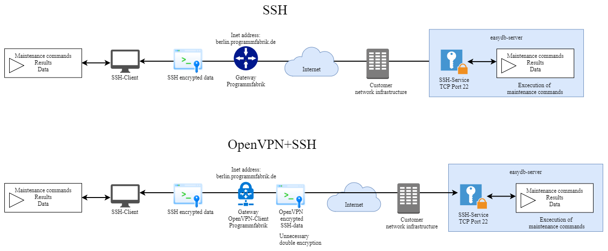

# Requirements

## Software under Debian and Ubuntu

Docker at least in version 1.11.

Versions with the newer version scheme (e.g. 17.03) are all recent enough.

The Community Edition (CE) is quite sufficient. We recommend the "stable" channel and assume the default architecture x86_64.

If we are installing the easydb for you then we will also install Docker ourselves. But please make sure that the requirements for Docker are met.

Here is a link to the [installation guide](https://docs.docker.com/engine/installation/linux/debian/#os-requirements) for Docker under e.g. Debian.

## Software under Red Hat Enterprise Linux 8.1

podman (docker replacement)

For details, e.g. the dnsname plugin for podman, see [our installation guide](../installation/redhat).

## Operating system

Linux kernel-version 3.17 is a minimum requirement. We recommend at least Debian 9, Ubuntu 16.04, RHEL 8.1.

The selection of the operating system depends on Docker. There are, however, the following exceptions:

- If you want Programmfabrik to fullfill a maintenance contract on the server then only on the following distributions, with Docker, without a graphical interface, 64 bit, in a version for which there are security updates:
 - Debian server version 10 (buster) or newer
 - Red Hat Enterprise Linux (RHEL) 8.1 (podman instead of docker)

- If you want Programmfabrik to do isolated tasks on the server (remote installation or troubleshooting) then only on the following distributions, with Docker, without a graphical interface, 64 bit, in a version for which there are security updates:
 - Debian server at least version 9 (stretch)
 - Ubuntu server at least version 16.04 (xenial)
 - Red Hat Enterprise Linux (RHEL) 8.1 (podman instead of docker)

- If you want to use Windows as the operating system platform, then you need the variant "[Docker for Windows](https://docs.docker.com/docker-for-windows/#step-one-install-docker-for-windows)". The easydb 5 does not work with it's alternative "[native Docker](https://msdn.microsoft.com/en-us/virtualization/windowscontainers/quick_start/quick_start_windows_10)", which is also recognizable by it's "docker.exe". Programmfabrik does not support Windows as a platform for easydb or easydbs running on Windows.

We do not make separate tests for "Docker for Windows" or Docker on Mac OSX and have not measured the amount of performance degradation by the [additional virtualization](https://docs.docker.com/engine/faq/#does-docker-run-on-linux-macos-and-windows).

Are you interested in directly downloading a recommended operating system?

1. Go to [http://cdimage.debian.org/debian-cd/current/amd64/iso-cd](http://cdimage.debian.org/debian-cd/current/amd64/iso-cd )
2. Download the file that starts with `debian-1` and ends with `-amd64-netinst.iso`.

&nbsp;

## Hardware

### CPU & RAM
4 processor cores,

+ plus 1 core for each `250000` records ***(Recommendation. Depending on your usage, more.)***

16 GB of RAM,

+ plus 4GB RAM for each `250000` records ***(Recommendation. Depending on your usage, more.)***

*Example calculation:*

easydb5 has `1234567` Records

So you have to calculate the following:
```text
CPU: 1234567 / 250000 = 4,9 --> 5
RAM: 1234567 / 250000 = 4,9 --> 5

CPU: 5   +  4 =  9 Cores
RAM: 5*4 + 16 = 36 GB RAM
```
***Please keep in mind that this is only a guideline and the number of resources needed depends on many factors.***

Docker may have further requirements, e.g. 64 bit processor cores. These are mentioned in the Docker [installation guide](https://docs.docker.com/engine/installation/linux/debian/#os-requirements).

### Storage

Storage space:

- 60 GB for the Docker files of the easydb. These grow slowly over time, starting from 8 GB.
- 50 GB for temporary files, such as intermediate conversion results or files for the zoom function.
- 30 GB for the operating system and log messages.
- 1 GB at least in /boot to accommodate the accumulating kernel versions. We recommend to not have /boot separately but instead as part of the root partition.
- 200% of the storage space of the assets which you want to manage with easydb. 100% is your assets and another 100% for preview versions. If you need additional large preview versions, you also need more storage. Assets and preview versions can be stored on network storage (more on network storage below). These and database dumps are the ***only*** types of data which can be on network storage.
- 4% additional storage space for databases. The databases are the first to put on fast storage (e.g. SSDs). But this is optional.
- 1% additional storage space for database-dumps.
- Summary: 140 GB plus 205% of the spaced used by your assets. If you got 1000 GB of assets, you need 140+2050=2190 GB storage space. Also see Filesystem Layout below.
- Here are two examples from production environments ("Small" and "Large"):

| Storage Requirements |            Assets | Preview Versions | SQL DB       | Elasticsearch DB |
|----------------------|-------------------|------------------|--------------|------------------|
| Small example        |             60 GB |            20 GB | 1,5 GB       |          0,07 GB |
| Large example        |         15,000 GB |        15,000 GB | 224 GB       |           180 GB |
| Rule of thumb        |    100% of assets |   100% of assets | 2% of assets | 2% of assets     |

| (... continued)      | easydb software (docker) | SQL dumps    | temporary files |
|----------------------|--------------------------|--------------|-----------------|
| Small example        |                    18 GB |       0,3 GB |            0 GB |
| Large example        |                    54 GB |        53 GB |           32 GB |
| Rule of thumb        |                    60 GB | 1% of assets |           50 GB |

### Network Storage

If you use network storage then we recommend the NFS protocol. CIFS can also work, but we have seen performance problems on some Windows servers without remedy and even data corruption - thus we do not support CIFS/SMB. Also NFS on a Windows server has been observed to have poor performance compared to Linux servers. 

At most, put assets, previews and database dumps on network storage.

## Filesystem Layout

Assumptions: 1000 GB assets, base directory ("data store") is /srv/easydb

Example "separated by storage type without getting too much into details":

| storage space  | directory                     | candidate for ...                            |
|----------------|-------------------------------|----------------------------------------------|
|   90 GB        | /                             |                                              |
|  100 GB        | /srv/easydb                   | fast storage                                 |
| 2000 GB        | /srv/easydb/eas/lib/assets    | network storage                              |

Probably only the latter two storage types need to grow, if you add more assets later.

Example "maximum separation":

| storage space  | directory                     | candidate for ...                            |
|----------------|-------------------------------|----------------------------------------------|
| 30 GB          | /                             |                                              |
|  1 GB          | /boot                         |                                              |
| 60 GB          | /var/lib/docker               | fast storage (low priority)                  |
| 50 GB          | /srv/easydb/eas/tmp           | fast storage (low priority)                  |
| 20 GB          | /srv/easydb/elasticsearch/var | fast storage (high priority)                 |
| 20 GB          | /srv/easydb/pgsql/var         | fast storage (high priority)                 |
| 10 GB          | /srv/easydb/pgsql/backup      | network storage                              |
| 2000 GB        | /srv/easydb/eas/lib/assets    | network storage                              |

&nbsp;

## Network

The domain name ("URL") of the easydb should be known during installation, so that it can be configured right away. It can be changed later and more addresses can be added later. One domain name is the primary, however, and is used for image URLs. If you use https at all then the primary domain must also have https.

easydb needs a domain or subdomain of its own. Or an IP address.

For example "https<i></i>://media.example.com" or "http<i></i>://1.2.3.4" but not "https<i></i>://example.com/media". 

The "/media" part of the URL is called "path". A static path is not supported by easydb, instead it generates a multitude of paths itself dynamically during use.

The easydb also communicates with its users via e-mail.

- An SMTP relay is specified in the easydb configuration.
- Also a sender address domain name, which must be accepted by the relay and by the receiving server (thus the domain usually has to be valid on the whole Internet).

&nbsp;

## Firewall

Among firewall software, we only know of one that is compatible with docker's firewall rules: shorewall with at least version 5.2.1.1

Therefore if there has to be a firewall on your easydb host, we only support this one.

### Connections during installation

Specifically, if we are installing on one of your servers, the following connections should be allowed.

If these are not possible, we still have at least two alternative approaches: You can install on your server; or we install on our servers (which then needs a hosting contract).

### Connections to the server

For installation, maintenance and monitoring we need SSH access to the server.

Our approach is:

```
SSH is encrypted, secure and state of the art, even as a permanently open port.
```

 - The account has to have administrative rights, either directly as root or via "sudo" or "su".
 - Access can be granted by password or - preferred - by our public ssh key: 
   https://www.programmfabrik.de/files/sshkey4096.txt .
 - Optional: The access may be restricted to our IP address. We are using the IP address of ***bern.programmfabrik.de*** (and if you can allow more than one, ***berlin.programmfabrik.de***) as source IP address during access.
 - Optional: The port can be configured by the customer. The default is 22.
 - Optional: The access can be secured via a customer operated SSH proxy (also known as Jumphost).
 - Optional: Additionally, a customer operated OpenVPN server can be used or a customer operated Cisco-SSL-VPN server(if it is compatible with "OpenConnect") can be used.

We recommend that we test SSH access a few working days prior to the installation, whereby we also check the prerequisites of the server.

We will be using the automation software "ansible" for installation, which is built upon SSH. Almost all SSH-connections are suited for ansible, but if in doubt about a certian SSH-jumphost installation, you (or we) can test it by connecting with ansible.

The installation takes several minutes or a few hours in case of complications.

### Access via SSH or SSH + OpenVPN {#ssh}

The graphic below compares two supported access paths:



### Connections from the server to the Internet

This information applies during installation and normal operation (for updates).

- During the installation docker.easydb.de is being accessed via HTTPS.
- Also package sources of the Linux distribution (Debian or Ubuntu) are accessed via http and package sources of Docker at download.docker.com via https.
- Optional: Use of an HTTP(S) proxy is possible.

#### Proxy

If the easydb host can reach the Internet only by a proxy, then configure this proxy for ...

- Container management software

    Please refer to your container management documentation. To get you started, here an example for docker with systemd:

    In `/lib/systemd/system/docker.service` or `/etc/systemd/system/docker.service.d/proxy.conf` :

    ```
    [Service]
    Environment="http_proxy=http://10.80.80.80:8080/" "https_proxy=http://10.80.80.80:8080/"
    ```

    ```
    systemctl daemon-reload
    systemctl docker.service stop       # beware: stops all containers
    systemctl docker.service start
    ```

- Operating System Updates

    Please refer to your operating system documentation. To get you started, here an example for Debian:

    In `/etc/apt/apt.conf`: `Acquire::http::Proxy "http://10.80.80.80:8080";`


----

# Integration

Further integration into your network is quite possible, but this is not treated as part of the installation. We recommend installation as a first step.

Examples for further integration:

- [HTTPS](../configuration/apache2) with your certificate
- [LDAP](../configuration/easydb-server.yml/plugins/ldap), [SSO](../configuration/easydb-server.yml/plugins/sso), Active Directory
- Import directories of assets that you can deliver by Windows Explorer or other "webdav" clients.

---

# Advanced

[Concrete steps of installation](../installation) of easydb 5.

&nbsp;
