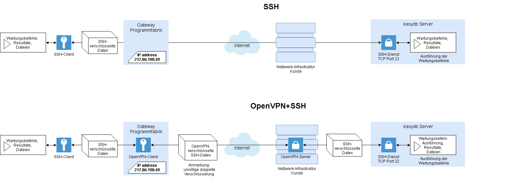

# Voraussetzungen

## Software
Docker mindestens in der Version 1.11.

Versionen mit der neueren Versionsschreibweise (z.B. 17.03) sind alle neu genug.

Die Community Edition (CE) ist völlig ausreichend. Wir empfehlen den "Stable"-Kanal und setzen die Standard-Architektur x86_64 voraus.

Falls Sie uns mit der Installation der easydb beauftragen, dann installieren wir auch docker. Bitte stellen Sie jedoch sicher dass der Server die Voraussetzungen für docker erfüllt.

Hier ein Link zur [Installationsanleitung](https://docs.docker.com/engine/installation/linux/debian/#os-requirements) für docker unter z.B. Debian.

### Betriebssystem
Die Auswahl der verwendbaren Betriebssysteme richtet sich nach Docker. Es gibt allerdings folgende Ausnahmen:

- Falls die Programmfabrik einen Wartungsvertrag erfüllen soll, dann nur mit docker auf einem Debian Server - ohne grafische Oberfläche, 64 bit, in einer Version für die es Sicherheitsupdates gibt.

- Falls die Programmfabrik isolierte Eingriffe vornehmen soll (remote-Installation oder Eingriffe bei Problemen), dann nur mit docker auf einem Debian Server oder Ubuntu Server - ohne grafische Oberfläche, 64 bit, in einer Version für die es Sicherheitsupdates gibt.

- Falls Sie darauf verzichten, dass die Programmfabrik sich um den Server kümmert und als weitere Anforderung Windows einsetzen wollen, dann benötigen Sie die Variante "[docker für Windows](https://docs.docker.com/docker-for-windows/#step-1-install-docker-for-windows)". Die easydb 5 funktioniert nicht mit deren Alternative "[native docker](https://msdn.microsoft.com/en-us/virtualization/windowscontainers/quick_start/quick_start_windows_10)", die auch an der Verwendung einer "docker.exe" erkennbar ist.

Wir machen keine gesonderten Tests für "docker für Windows" oder docker unter Mac OSX und haben keine Messungen über die Performance-Einbußen durch die [zusätzliche Virtualisierung](https://docs.docker.com/v1.11/engine/faq/#does-docker-run-on-mac-os-x-or-windows).

Sie wollen direkt den Download-Link, um ein von uns empfohlenes Betriebssystem zu installieren?

1. Surfen Sie zu [http://cdimage.debian.org/debian-cd/current/amd64/iso-cd](http://cdimage.debian.org/debian-cd/current/amd64/iso-cd)
2. Laden Sie dort die Datei herunter, die mit `debian-9.` beginnt und mit `-amd64-netinst.iso` endet.

## Hardware
4 Prozessor-Kerne. (Empfehlung, je nach Nutzung mehr)

16 GB Arbeitsspeicher. (Empfehlung, je nach Nutzung mehr)

Docker kann weitere Anforderungen stellen, z.B. 64 bit Prozessorkerne. Diese werden dann in der Installationsanleitung für Docker genannt.

Speicherplatz:

- 40 GB Speicherplatz für die Docker-Dateien der easydb-Software. Diese wachsen mit der Zeit langsam an, ausgehend von ca. 8 GB.
- 50 GB für temporäre Dateien wie Zwischenergebnisse der Bildumwandlung und Zoomer-Dateien (Lupenfunktion).
- 30 GB für Betriebssystem, Systemmeldungen.
- 1 GB für die boot-Partition (falls Sie eine solche überhaupt separat anlegen - was nur selten notwendig ist), für sich ansammelnde Kernel-Versionen.
- 200% Speicherplatz vom Ausgangsmaterial (also den Daten, die Sie mit der easydb verwalten möchten). Neben den 100% für Ihre Ausgangsdaten wird noch mal etwa der gleiche Platz für Vorschauversionen benötigt. Falls Sie zusätzliche große Vorschauversionen brauchen, dann mehr. Ausgangsmaterial und Vorschauversionen können auf Netzwerk-Laufwerken liegen (z.B. NFS), die anderen Daten sollten lokal auf dem Server gespeichert sein.
- 4% (vom Speicherbedarf des Ausgangsmaterials) zusätzlich als Speicherplatz für Datenbanken. Falls Sie schnellen Speicherplatz betreiben (z.B. SSDs) dann sollte er als erstes für die Datenbanken genutzt werden. Aber das ist optional.
- Zusammenfassend: 120 GB + 204%. Bei 1000 GB Ausgangsdaten ("Assets") sind das 120+2040=2160 GB Speicherplatzbedarf. 120+40 GB sollten lokal sein, 2000 GB können auf Netzwerkspeicher liegen (oder ebenfalls lokal, was solider ist).
- Hier zwei Beispiele aus dem produktiven Betrieb:

| Speicherbedarf | Ausgangsmaterial | Vorschauversionen |       SQL DB | Elasticsearch DB | easydb Software |
|----------------|------------------|-------------------|--------------|------------------|-----------------|
| kleines Bsp.   |            60 GB |             20 GB |         1 GB |          0,07 GB |            9 GB |
| großes Bsp.    |        15.000 GB |         15.000 GB |       200 GB |           170 GB |           22 GB |
| Faustregel     |   100% vom Ausg. |     100% vom Ausg.| 2% vom Ausg. |     2% vom Ausg. |           40 GB |

Bitte beachten Sie dass Netzwerkspeicher per NFS oder CIFS für Ausgangsmaterial und Vorschauversionen verwendet werden können. Für den restlichen Bedarf brauch der Server allerdings lokalen Speicher.

## Netzwerk
Die zukünftige Adresse ("URL") der easydb sollte bekannt sein, damit diese bei der Installation konfiguriert werden kann. (Kann nachträglich geändert werden. Mehrere sind möglich.)

Die easydb benötigt eine domain oder subdomain oder IP-Adresse, die ausschließlich für die easydb zur Verfügung steht. Also z.B. "https://medien.kunde.de" oder "http://1.2.3.4" aber nicht "https://kunde.de/easydb2. Der "Pfad" genannte Teil in URLs, hier "/easydb", wird nicht unterstützt.

Die easydb kommuniziert mit ihren Nutzern auch per E-Mail.

- Dazu wird in der easydb-Konfiguration ein SMTP relay angegeben. Bitte teilen Sie uns dies rechtzeitig mit.
- Außerdem eine Domain für die Absende-Adresse, die vom relay akzeptiert wird und die vom zustellenden Server akzeptiert wird (also üblicherweise eine Domain die im Internet gültig ist).

&nbsp;

# Verbindungen während der Installation

Die folgenden Verbindungen sollten erlaubt sein, insbesondere falls wir die Installation auf einem Ihrer Server vornehmen.

     Statt dessen möglich: A) Sie installieren selbst. Oder B) Wir installieren auf unseren Servern ("hosting").

## Verbindung zum Server

Für die Installation benötigen wir ein SSH-Zugang auf den Server.

     SSH ist verschlüsselt und nach Stand der Technik sicher.

 - Der Zugang muss administrative Rechte haben oder erlangen können. (z.B. "sudo bash")
 - Zugangsbeschränkung erfolgt per Passwort oder - bevorzugt -  per Schlüssel. Unser öffentlicher Schlüssel ist abrufbar unter https://www.programmfabrik.de/files/sshkey4096.txt .
 - Optional: Der Zugang darf auf unsere IP-Adresse (als Startpunkt) beschränkt sein, die wir Ihnen gerne mitteilen.
 - Optional: Der Port kann vom Kunden konfiguriert werden; der Standard ist 22.
 - Optional: Der Zugang kann über SSH Proxy (auch bekannt als Jumphost) abgesichert sein, falls der Kunde diesen betreibt.
 - Optional: Zusätzlich kann OpenVPN verwendet werden.

### Zugriffsweg per SSH oder SSH+OpenVPN {#ssh}

Die nachstehende Grafik vergleicht die beiden Zugriffswege:

------

Ein SSH-Zugang der per Schlüssel oder IP-Adresse abgesichert ist kann permanent zugänglich sein ("Port offen").

 - Dann können unsere Zugriffe ohne zeitliche Absprachen erfolgen und damit besonders zeitnah und effektiv.
 - Optional: Außerdem ist dann ein Monitoring des Servers durch uns möglich (im Rahmen eines Wartungsvertrages).

Die Installation dauert einige Minuten, oder wenige Stunden falls es zu Komplikationen kommt.

Wir empfehlen zusätzlich ein paar Werktage vor der Installation einen SSH-Zugriff durch uns, wobei wir den Zugang prüfen und die Voraussetzungen des Servers.

## Verbindungen vom Server ins Internet

Während der Installation finden Zugriffe statt zu...

- https://docker.easydb.de
- https://programmfabrik.de
- https://download.docker.com 
- Diverse Paketquellen der Linux-Distribution (Debian oder Ubuntu), per http.
- Optional: Die Nutzung eines Proxy-Servers für HTTP(S) ist möglich.

# Verbindungen im Betrieb

- Die gleichen Angaben (Abschnitt "Verbindungen vom Server ins Internet")  gelten auch für Aktualisierungen.

----

# Integration

Weitere Integration in Ihr Netzwerk ist durchaus möglich, wird hier allerdings nicht mehr als Teil der Installation behandelt. Wir empfehlen die Installation als ersten Schritt.

Beispiele für weitere Integration:

- Storage-Anbindung per NFS oder SMB ("Netzlaufwerk").
- [HTTPS](/de/sysadmin/konfiguration/https) mit Ihrem Zertifikat
- LDAP, [SSO](/de/sysadmin/konfiguration/sso), Active Directory
- Import-Verzeichnisse, die Sie per Windows Explorer ("webdav"), Netzlaufwerk ("SMB") oder NFS befüllen können.

---

# Weiterführendes

[Konkrete Schritte der Installation](/de/sysadmin/installation) der easydb 5.

&nbsp;

