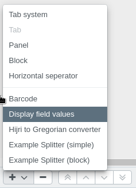
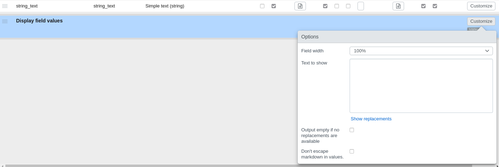
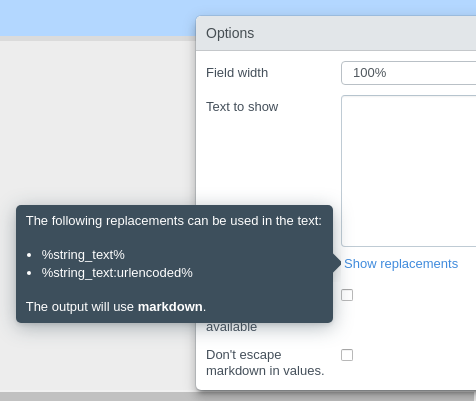

# Display field values plugin
This [plugin](https://github.com/programmfabrik/easydb-display-field-values) is a [custom mask splitter](/en/technical/plugins/reference/webfrontend/#masksplitter-plugins-registerplugin). 

It can be used to render multiple field values of the object as a new field, with extra custom text.

## Usage
Since it's a custom mask splitter, it needs to be added as a splitter in the mask editor.

Then it is necessary to open its mask splitter options to configure it.

### Options

- Text to show: This is a free text where it's possible to use **replacements** which will be replaced by the fields values.
- Output empty if no replacements are available: When it's checked, the output will be empty if at least one replacement couldn't be replaced.
- Don't escape markdown in values: By default, markdown text is escaped, if this option is checked, there won't be any markdown escape.

#### Replacements

It's possible to see all possible replacements by clicking in the link button **show replacements** that is located below the option **text to show**

It's only possible to use fields in the same level of the splitter, therefore fields within a nested would be possible to use when the mask splitter is inside the nested.

Almost every field replacement will consist of its name surrounded by '%', for example: **%my_field%**

##### Special cases

For **date range** fields there will be two replacements, one to show the **from** value and another one to show the **to** value: 

- **%date_field_name:from%**
- **%date_field_name:to%**

For **localized text** fields there will be one replacement per database language, and one to use the best possible:

- **%single_line_text_loca:de-DE%**
- **%single_line_text_loca:en-US%**
- **%single_line_text_loca:es-ES%**
- **%single_line_text_loca:best%**
 
##### Url encoded
For **every** existing replacement, there will be an extra version where the value is url encoded. It's necessary to append **:urlencoded** before the last **%**. For example:

- **%single_line_text_loca:de-DE:urlencoded%**
- **%date_range:from:urlencoded%**
- **%string_text:urlencoded%**