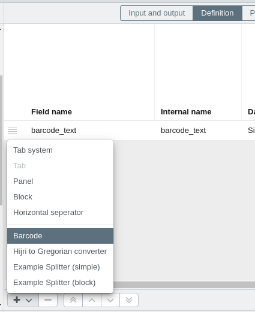
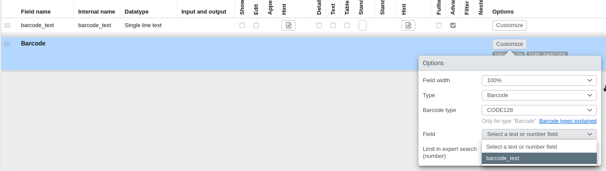

# Barcode plugin
This [plugin](https://github.com/programmfabrik/easydb-barcode-display) is a [custom mask splitter](/en/technical/plugins/webfrontend/#masksplitter-plugins-registerplugin). 

It can be used to render different types of barcodes. 
The library used to generate the barcode is [JsBarcode](https://lindell.me/JsBarcode/), therefore all supported barcodes will depend on which ones the library supports.

The barcode represents a value of an available field in the mask. The type of the field needs to be **text** (not multilingual).

## Usage

Since it's a custom mask splitter, it needs to be added as a splitter in the mask editor.

Then it is necessary to open its mask splitter options to configure which field should be used. It's also possible to set two other options: **Type** and **Barcode type**.

The default option for **Type** is **Barcode**, and when that option is selected, it's possible to change the **Barcode Type** to CODE128, CODE39, or [other](https://github.com/lindell/JsBarcode/wiki#barcodes). 

The second **Type** is **QR**, which basically generates a QR code instead of a Barcode.

After that, the barcode will be visible in the detail & editor if the selected field has a value.

## PDF creator extension

It has an extension which can be used in the [pdf-creator](/en/technical/plugins/webfrontend/pdf-creator)

- https://github.com/programmfabrik/easydb-barcode-display-pdf