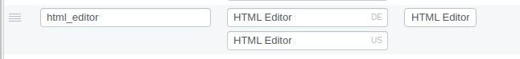

# HTML Editor
This [plugin](https://github.com/programmfabrik/custom-data-type-html-editor) is a [custom data type](/en/technical/plugins/customdatatype/). 

This custom data type is like a multiline text field with a [WYSIWYG](https://en.wikipedia.org/wiki/WYSIWYG) in the editor, so it can be used to create texts with custom styles: colors, sizes, etc.

# Usage

Like any other custom data type, it's necessary to create a field of type **HTML Editor** in the datamodel. It doesn't have mask options.

### Data model

### Editor

It has an extra button to open the whole editor in a new window.

### Detail

