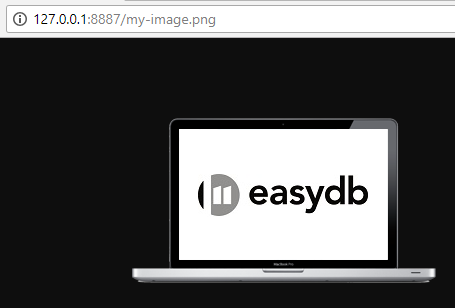

# Dateien importieren

Über den CSV-Importer können auch Dateien importiert werden. Sind die Dateien bereits über das Web erreichbar, so können Sie diese URL einfach in die CSV-Datei eintragen. Befinden sich die Dateien lokal auf Ihrem Computer, müssen diese zunächst über einen Web-Server bereitgestellt werden, da Web-Browser keinen direkten Zugriff auf Dateien auf Ihrem Computer unterstützen.

Eine Möglichkeit diese Einschränkung zu umgehen, bietet eine Extension für den Google Chrome Browser. Hierdurch wird es ermöglicht, mit wenigen Klicks einen Web-Server auf Ihrem Computer einzurichten und darüber Ihre Dateien zu erreichen.

## Vorbereitung

Um Dateien zu importieren, die sich im lokalen Dateisystem befinden, ist es notwendig, sie auf einem lokalen Server bereitzustellen. Der einfachste und schnellste Weg ist, die Google Chrome-Erweiterung ['Web Server for Chrome'](https://chrome.google.com/webstore/detail/web-server-for-chrome/ofhbbkphhbklhfoeikjpcbhemlocgigb) zu verwenden. 

1. Installieren Sie die Erweiterung und öffnen Sie sie.
2. Klicken Sie auf "Choose folder" und wählen Sie den Ordner, in dem sich die gewünschten lokalen Dateien für den Import befinden (z.B. "Bilder").
3. Öffnen Sie die erweiterten Einstellungen und aktivieren Sie die Option 'Set CORS headers'.
4. Starten Sie den Browser neu und öffnen Sie die Erweiterung erneut.
5. Geben Sie **http://127.0.0.1:8887** ein. Dort befinden sich alle Bilder. \(Voreingestellt ist der Port 8887. Dieser kann geändert werden.\)

In Ihre CSV-Datei tragen Sie anschließend ebendiese URL ein, z.B. http://127.0.0.1:887/my-image.png. 

## Beispiel

| id   | titel  | aufnahmedatum | datei                                                        |
| ---- | ------ | ------------- | ------------------------------------------------------------ |
| 1    | Rom    | 2020-01-01    | https://upload.wikimedia.org/wikipedia/commons/c/c0/Rome_Montage_2017.png |
| 2    | Laptop | 2007-02-01    | http://127.0.0.1:887/my-image.png                            |

Wenn Ihr Datenmodell in easydb so konfiguriert ist, dass pro Datensatz mehrere Dateien hochgeladen werden können, dann tragen Sie alle URLs durch einen Umbruch getrennt in eine Zelle ein:

| id   | titel         | aufnahmedatum | Dateien                                                      |
| ---- | ------------- | ------------- | ------------------------------------------------------------ |
| 1    | Trevi Brunnen | 2020-02-17    | http://127.0.0.1:8887/Trevi-001.JPG http://127.0.0.1:8887/Trevi-002.JPG |

Werden in Ihrer easydb die Objekt- und Bildinformationen in getrennten Objekttypen verwaltet (z.B. "Sammlungsobjekte" und "Bilder"), so importieren Sie beide Informationen bitte getrennt. Erstellen Sie eine CSV-Datei mit allen Informationen zu den Objekten inkl. eindeutigem Identifier und importieren diese. In die zweite CSV-Datei tragen Sie alle Informationen zu den Bildern inkl. der URL zur Datei und dem eindeutigen Identifier für das dazugehörige Objekt ein und importieren diese.

> HINWEIS: Über ein separates "Filesystem2CSV" Python-Skript (Siehe www.github.com/programmfabrik) kann eine hierarchische Ordnerstruktur, in der die zu importierenden Daten liegen, in einer CSV-Datei gespeichert werden. Über diesen Weg können Ordnernamen in easydb zum Beispiel als (hierarchische) Kategorien oder Schlagwörter eingelesen werden.

## Vorgehen

- öffnen Sie zunächst den CSV-Importer
- laden Sie Ihre CSV-Datei hoch
- wählen Sie bei CSV-Feldnamen "1. Zeile" aus
- wählen Sie den Ziel-Objekttyp sowie die dazugehörige Maske aus
- wechseln Sie in den Reiter "Import-Mapping" und wählen dort für die Spalte die die URLs enthält, das entsprechende easydb-Zielfeld an
- bei "Typ" wählen Sie "url" um neue Dateien zu importieren
- wechseln Sie zurück zum Reiter "Import-Einstellungen" und wählen noch das "Feld zum Update" aus, wenn bereits Einträge in der Liste vorhanden sind, die ggfs. aktualisiert werden sollen
- klicken Sie anschließend auf "Vorbereiten" und sie erhalten eine Übersicht wie viele Zeilen importiert oder aktualisiert werden
- anschließend kann der Import / die Aktualisierung gestartet werden
