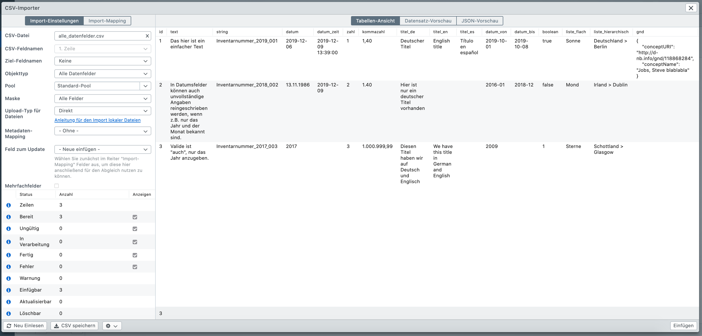

# Import-Einstellungen - In Bearbeitung

Der CSV-Importer bietet diverse Einstellungsmöglichkeiten, die nachfolgend erläutert werden sollen.

## Einstellungen

Nachdem Sie im Feld "CSV-Datei" eine Datei hochgeladen haben, stehen Ihnen die folgenden Einstellungen zur Verfügung.

| Einstellung                   | Beschreibung                                                 |
| ----------------------------- | ------------------------------------------------------------ |
| CSV-Datei                     | Klicken Sie zunächst auf diese Schaltfläche um eine CSV-Datei für den Import auszuwählen. Über das "X" können Sie die Datei wieder entfernen. |
| CSV-Feldnamen                 | Wählen Sie die Zeile aus, in der die Spaltennamen stehen, sodass diese nicht importiert werden. |
| Ziel-Feldnamen                | Wählen Sie die Zeile aus, in der die Ziel-Feldnamen stehen, sodass das Mapping automatisch erfolgt und diese nicht importiert werden. Die Notation ist bei den [allgemeinen Einstellungen](../general) erläutert. |
| Objekttyp                     | Wählen Sie den Objekttyp aus, der importiert werden soll.    |
| Pool                          | Geben Sie den Pool an, in dem die neuen Datensätze angelegt werden sollen. Der Pool wird nur beim Einfügen von Datensätzen gesetzt. Werden vorhandene Datensätze über den CSV-Importer aktualisiert, wird der Pool nicht verändert. Hierzu nutzen Sie bitte den Gruppeneditor. |
| Maske                         | Wählen Sie hier die Maske, die für den Import verwendet werden soll. |
| Upload-Typ für Dateien        | Informationen zum Upload von Dateien über den CSV-Importer finden Sie in den [Beispielen](../examples/files). |
| Metadaten-Mapping             | Wählen Sie hier das Metadaten-Mapping aus, welches beim Import von Dateien angewendet werden soll. |
| Feld zum Update               | Durch Auswahl des Standardeintrags "- Neue einfügen -" werden alle Zeilen der CSV-Datei als neue Datensätze in easydb angelegt. Wählen Sie hier ein Feld aus, über das vorhandene Datensätze identifiziert und mit den Inhalten aus der CSV-Datei aktualisiert werden sollen. Bitte beachten Sie, dass Sie zunächst im Reiter "Mapping" Felder auswählen müssen, damit diese im Pulldown zur Auswahl zur Verfügung stehen. Wählen Sie das Datei-Feld aus, wenn Sie Dateinamen in Ihrem CSV angegeben haben und darüber der Abgleich erfolgen soll. Bei mehrsprachigen Feldern hat man dann die Möglichkeit den Abgleich über eine bestimmte Sprache zu machen (z.B. name#de-DE oder name#en-US). Um die Auswahl zu aktivieren, legen Sie im Reiter "Mapping" fest, für welche Felder, welche Sprachen zur Verfügung stehen sollen. |
| Mehrfachfelder anfügen        | Standardmäßig werden bei der Aktualisierung von in easydb vorhandenen Datenätzen alle Einträge in Mehrfachfeldern durch die Inhalte aus der CSV-Datei ersetzt. Mit dieser Option werden bei Mehrfachfeldern die Inhalte aus der CSV-Datei stattdessen an die vorhandenen Einträge angefügt. Nutzen Sie diese Funktion, um beispielsweise Schlagworte zusätzlich zu den bereits am Datensatz vergebenen hinzuzufügen. |
| Verlinkte Datensätze anlegen  | Legen Sie fest, ob verlinkte Datensätze vor dem eigentlichen Import angelegt werden sollen oder nicht. Bei ausgeschalteter Option müssen alle verlinkten Einträge bereits in easydb vorhanden sein. Bei Klick auf "Vorbereiten" erscheint eine entsprechende Meldung, sollte in der CSV-Datei auf Einträge verwiesen werden, die nicht in easydb gefunden werden konnten. |
| Pool für verlinkte Datensätze | Diese Option erscheint nur, wenn der ausgewählte Objekttyp auf einen anderen Objekttyp verweist, bei dem ebenfalls Pool-Management aktiviert ist. Für verlinkte Objekttypen mit aktiviertem Pool-Management können somit abweichende Pools angegeben werden. |
| Kommentar                     | Geben Sie hier einen Kommentar für den CSV-Import an, der anschließend in der Änderungshistorie der importierten / aktualisierten Datensätze erscheint. |
| Paket-Größe                   | Größe der Verarbeitungs-Pakete die nach und nach zum Server geschickt werden. Bei sehr komplexen Datenmodellen und Datenmengen kann es zu einem Timeout kommen. Versuchen Sie es in diesem Fall mit einer kleineren Paket-Größe. |
| Lokalisierte Namen anzeigen   | Wenn aktiviert, werden im zweiten Reiter "Mapping" für die easydb-Felder die Bezeichnungen aus dem Editor/Detail angezeigt. Andernfalls werden die internen Feldnamen aus dem Datenmodell verwendet. |

## Informationen

Unterhalb der Import-Einstellungen wird nach dem Vorbereiten eine Import-Übersicht angezeigt. Die Checkboxen dienen zur Filterung der Einträge in der Tabellen-Ansicht.

| Name            | Bemerkung                                                    |
| --------------- | ------------------------------------------------------------ |
| Zeilen          | Anzahl der Zeilen im CSV                                     |
| Bereit          |                                                              |
| Ungültig        |                                                              |
| In Verarbeitung |                                                              |
| Fertig          |                                                              |
| Fehler          |                                                              |
| Warnung         |                                                              |
| Einfügbar       | Anzahl der Zeilen / Einträge, die eingefügt / angelegt werden würden |
| Aktualisierbar  | Anzahl der Zeilen / Einträge, die aktualisiert werden würden |
| Löschbar        | Anzahl der Zeilen / Einträge, die gelöscht werden würden     |

## Aktionen

| Button                   | Beschreibung                                                 |
| ------------------------ | ------------------------------------------------------------ |
| Neu Einlesen             | Liest das CSV neu ein und verwirft alle bereits durch das Vorbereiten geladenen Informationen. |
| CSV speichern            | Beim Vorbereiten und nach dem Speichern entstehen Mehr-Informationen, die in das CSV zurückgeschrieben werden (siehe nachfolgende Tabelle). Mit "CSV speichern" können Sie sich diese Informationen auf Ihrem Desktop speichern. |
| Vorbereiten...           | Bereitet den CSV-Import vor. Dazu gehören das Überprüfen der Daten, sowie das Suchen von bereits bestehenden und verlinkten Datensätzen. |
| Einfügen                 | Startet den CSV-Import und fügt alle neuen Datensätze ein. Bereits vorhandene Datensätze werden nicht aktualisiert. |
| Aktualisieren            | Startet den CSV-Import und aktualisiert bestehende Datensätze. Noch nicht vorhandene Datensätze werden nicht in easydb angelegt. Beachten Sie aber, dass leere Spalten im CSV dazu führen, dass durch das Aktualisieren die Inhalte dieser Felder in den easydb-Datensätzen geleert werden. |
| Einfügen + Aktualisieren | Führt beide Schritte direkt hintereinander durch.            |

## Protokoll

| Spalte                           | Bedeutung                                                    |
| -------------------------------- | ------------------------------------------------------------ |
| easydb\|row_idx                  | Nummer der Zeile, beginnend bei 0                            |
| easydb\|operation                | Aktion, die durchgeführt wird ("insert", "update", "delete") |
| easydb\|status                   |                                                              |
| easydb\|timestamp                | Datum + Zeit an dem der Import / das Aktualisieren bzw. Löschen durch den CSV-Importer stattgefunden hat |
| easydb\|status_text              |                                                              |
| easydb\|warning_text             |                                                              |
| easydb\|id                       | ID des in easydb gefundenen Datensatzes (bei Datensätzen die durch den CSV-Import angelegt werden, bleibt diese Spalte leer) |
| easydb\|version                  | Version des Datensatzes                                      |
| easydb\|id_parent                | ID des übergeordneten Eintrags (nur bei hierarchischen Objekttypen) |
| easydb\|depth                    | Tiefe des Datensatzes (nur bei hierarchischen Objekttypen), beginnend bei 0 |
| easydb\|path                     | Pfad des Datensatzes (nur bei hierarchischen Objekttypen)    |
| easydb\|eas_ids\|datei           |                                                              |
| easydb\|eas_ids\|datei\|metadata |                                                              |
| easydb\|*objekttyp*\|*maske*     | Für alle verlinkten Objekttypen wird eine eigene Spalte generiert. Nach dem Vorbereiten kann dieser Spalte entnommen werden, ob die Einträge auf die verwiesen wird, bereits in easydb vorhanden sind (bei ihnen wird eine ID angezeigt), ob sie neu angelegt werden (sie erscheinen mit "new") oder wenn die Option "Verlinkte Einträg anlegen" deaktiviert ist, ob sie nicht in easydb gefunden wurden (sie erscheinen mit "searching"). |

