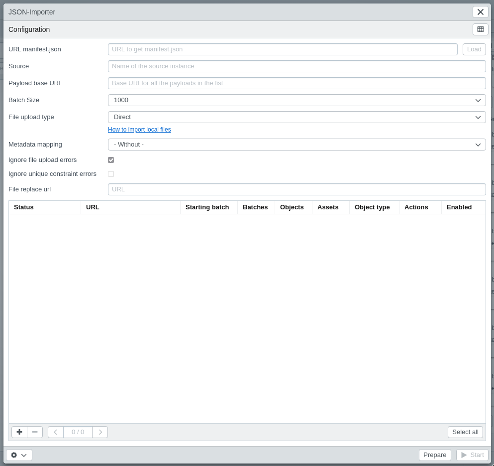

# JSON Importer

The JSON importer can be used to bulk import data in JSON format.

A step by step tutorial on how to generate JSON Payloads can be found [here](/en/tutorials/jsonimport/).

The importer can be found under "Tools &gt; JSON Importer".

The configuration for the JSON importer can be uploaded in a manifest file (`.json`). The manifest contains payloads and other information which will preset the importer.

> Please note that the server where the `manifest.json` and the payloads are needs to be accesible from the frontend

## Handling problems with Mixed Content

Since the frontend loads the JSON files as a client, it is possible that the browser you are using will block the request to the other server.

**Mixed Content Blocking** is implemented in many browsers and is a security feature:

* Google Chrome: https://blog.chromium.org/2019/10/no-more-mixed-messages-about-https.html
* Mozilla Firefox: https://support.mozilla.org/en-US/kb/mixed-content-blocking-firefox
* Microsoft Edge: https://docs.microsoft.com/en-us/deployedge/edge-learnmore-mixed-content-downloads
* might also be implemented in other browsers in some way

If the manifest and the payload files can not be loaded, check the developer tab of your browser and look for an error message that looks like any of these (there my be variations):

    ... has been blocked by CORS policy: No 'Access-Control-Allow-Origin' header is present on the requested resource.

or

    This request has been blocked; the content must be served over HTTPS.

If this is the case, your browser blocks the request. Depending on the browser, there are ways to work around this, and allow loading the files anyways.

### CORS Plugin

> **Caution:** Mixed Content Blocking is a security feature. Only disable it if you trust the other server. This might be a **security risk!**

For different browsers, there are plugins available which allow to disable Mixed Content Blocking, for example:

* Google Chrome: https://chrome.google.com/webstore/detail/allow-cors-access-control/lhobafahddgcelffkeicbaginigeejlf?hl=en
* Mozilla Firefox: https://addons.mozilla.org/en-US/firefox/addon/cors-everywhere/

With many of the available plugins it is possible to toggle Mixed Content Blocking. Please check the availability of plugins for your browser.

## Fields

| Option                          | Description                                                  |
| ------------------------------- | ------------------------------------------------------------ |
| URL manifest.json               | This is a URL to get the manifest.json by clicking 'Load' button next to the input \(optional). This file can contain the following settings, alternatively, they must be entered in the JSON Importer form. |
| Source                          | Name of the source instance \(optional). Can be freely selected. This information is not migrated, it is only used for identification purposes. |
| Payloads base URI               | Base URI for all the payloads in the list. It will be prepended to each payload. The default value will be the same base URL of the manifest. If the payloads are not stored in the same folder as the manifest (or on another server), this is needed to build absolute paths from the payload file names. This value needs to be the relative path to the payload folder. |
| Batch size                      | Quantity of objects pushed to the server per request.        |
| File upload type                | <ul><li>**Direct**: frontend uploads files to EAS using `put`</li><li>**URL (remote put)**: EAS loads file from remote url using `rput`</li><li>**Ignore**: no files are uploaded</li></ul> |
| Metadata mapping                | Metadata mapping used for files. (Optional)                  |
| Ignore file upload errors       | When checked, all errors of file uploads will be ignored and the import process will continue. All errors will be available in the logs. |
| Ignore unique constraint errors | When checked, all 'constraint' errors from the server will be ignored. |
| File replace url                | The location for each file URL will be replaced by the value configured here.(Optional) |

### Pre-fill fields from manifest.json

Some of these fields can be pre-filled by values in the `manifest.json` file:

| Option | Key | Type | Description |
|---|---|---|---|
| Source | `"source"` | String | |
| Payloads base URI | `"payload_base_uri"` | String | |
| Batch size | `"batch_size"` | Integer | min: `1`, max: `1000` |
| File upload type | `"eas_type"` | String | <ul><li>`direct`: Direct</li><li>`url`: URL (remote put)</li><li>`ignore`: Ignore</li></ul> |
| Ignore file upload errors | `"eas_skip_errors"` | Boolean | |
| File replace url | `"eas_replace_url"` | String | Valid URL |
| Metadata mapping | `"mapping"` | Integer | ID of the metadata mapping |

## Payload list

This list show all available payloads. It is possible to see the content by clicking them.

| Header         | Description                                                  |
| -------------- | ------------------------------------------------------------ |
| Status         | Current status of the payload. Pending/Success/Error         |
| URL            | The url of the payload                                       |
| Starting batch | Number of the starting batch. As default the first one is selected, so all batches are processed. |
| Batches        | Quantity of batches (they will depend on the quantity of objects and the selected batch size) |
| Objects        | Quantity of objects.                                         |
| Objecttype     | Objecttype of the payload.                                   |
| Actions        | Opens the payload in a new tab.                              |
| Enabled        | Checkbox to enable or skip the payload (Ctrl+Click to select/unselect all in the selected page, or click in the button below to select/unselect in all pages) |

## Buttons

| Function                       | Description                                                  |
| ------------------------------ | ------------------------------------------------------------ |
| Download logs in CSV format.   | Download the logs in CSV format.                             |
| Clear the logs                 | Clear the logs of the last run.                              |
| See the last report generated. | See the report of the last run.                              |
| Prepare                        | By clicking some validations are performed before the actual import can be started. |
| Start                          | It starts the import of all the enabled payloads.            |

