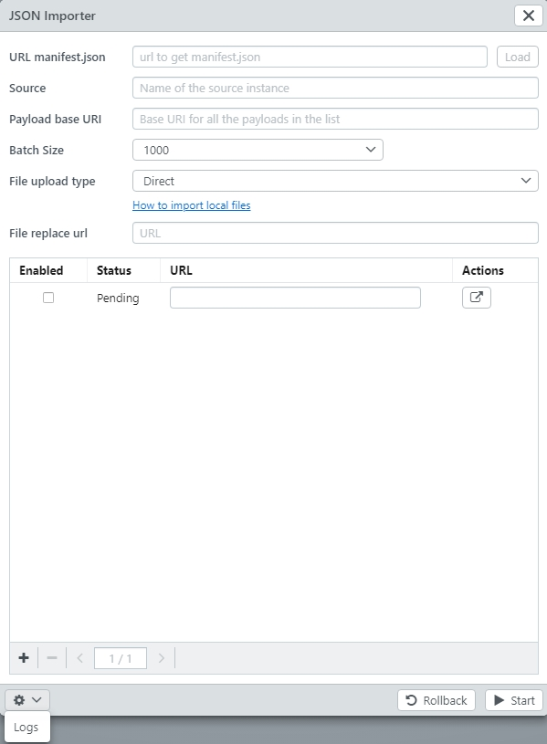

# JSON Importer

The JSON importer can be used to bulk import data in [JSON format](/en/technical/datamanagement/jsonimport/).

The importer can be found under "Lists &gt; JSON Import".

The configuration for the JSON importer can be uploaded in a manifest file \(.json\). The manifest contains payloads and other information which will preset the importer.

## Frontend form

Fields:

* URL manifest.json: \(Optional\) This is a URL to get the manifest.json by clicking 'Load' button next to the input.
* Source: \(Optional\) Name of the source instance.
* Payloads base URI: \(Optional\) Base URI for all the payloads in the list. It will be prepended to each payload.
* File upload type: See [Import files](../importfiles)
* File replace url: \(Optional\) The location for each file URL will be replaced by the value configured here.
* Payload list
  * Enabled: Checkbox to enable or skip the payload
  * Status: Current status of the payload. Pending/Success/Error
  * URL: The url of the payload
  * Actions
    * Open the payload in a new tab.

Buttons:

* Start: It starts the import of all the enabled payloads.
* Rollback: It makes a rollback of the imported data \(e.g. if an error occures while loading the payloads\).  All created data will be undone. The rollback data will be lost if the JSON Importer is closed and all successfully created data will remain in the database. 
* Logs

