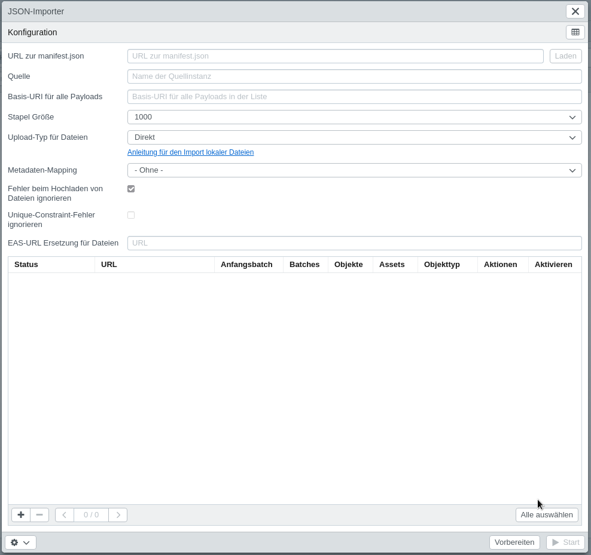

# JSON-Importer

Der JSON-Importer kann zum Massenimport von Daten im [JSON format](/en/technical/datamanagement/jsonimport/) verwendet werden.

Den Importer finden Sie unter "Tools &gt; JSON-Importer".

Die Konfiguration für den JSON-Importer kann in einer Manifestdatei \(manifest.json\) hochgeladen werden. Das Manifest enthält Payloads und weitere Informationen, die als Voreinstellungen im Importer übernommen werden.

## Felder

| Option                                       | Description                                                  |
| -------------------------------------------- | ------------------------------------------------------------ |
| URL zur manifest.json                        | Dies ist die URL, um das manifest.json zu erhalten (optional). |
| Quelle                                       | Name der Quell-Instanz \(optional).                          |
| Basis-URI für alle Payloads                  | Basis-URI für alle Payloads in der Liste. Sie wird jeder Payload vorangestellt. Der Standardwert ist die gleiche Basis-URL des manifest.json. |
| Stapelgröße                                  | Anzahl der Objekte die pro Anfrage zum Server geschickt werden. |
| Upload-Typ für Dateien                       | Siehe [Dateien importieren](../csvimport/examples/files/)    |
| Metadaten-Mapping                            | Für den Import verwendetes Metadaten-Mapping, um Informationen aus den XMP-/IPTC-/EXIF-Daten auszulesen (optional). |
| Fehler beim Hochladen von Dateien ignorieren | Wenn diese Option aktiviert ist, werden alle Fehler beim Hochladen von Dateien ignoriert und der Importvorgang wird fortgesetzt. Alle Fehler sind in den Logs verfügbar. |
| Unique-Constraint-Fehler ignorieren          | Wenn diese Option aktiviert ist, werden alle Constraint-Fehler vom Server ignoriert. |
| EAS-URL-Ersetzung für Dateien                | Die URL unter der die Dateien aufrufbar sind kann hier verändert werden (optional). |

## Payloads

Hier werden alle verfügbaren Payloads angezeigt. Durch Anklicken wird der Inhalt der Datei angezeigt.

| Header      | Description                                                  |
| ----------- | ------------------------------------------------------------ |
| Status      | Aktueller Status (In Bearbeitung / Erfolgreich / Fehler)     |
| URL         | URL der Payload                                              |
| Startstapel | Nummer des Stapels mit dem gestartet werden soll. Standardmäßig beginnt der Import bei 1, sodass alle Stapel verarbeitet werden. |
| Stapel      | Anzahl der Stapel (sie hängen von der Menge der Objekte und der gewählten Staplgröße ab) |
| Objekte     | Anzahl der Objekte                                           |
| Objekttyp   | In der Payload enthaltener Objekttyp                         |
| Aktion      | Öffnet die Payload-Datei in einem neuen Tab                  |
| Aktiviert   | Aktivieren oder Deaktivieren Sie einzelne Payloads für den Import-Vorgang (Strg+Klick, um alle auf der ausgewählten Seite zu aktivieren oder zu deaktivieren, oder klicken Sie auf die Schaltfläche unten, um auf allen Seiten zu aktivieren oder zu deaktivieren) |

## Funktionen

| Function                | Description                                                  |
| ----------------------- | ------------------------------------------------------------ |
| Log als CSV exportieren | Laden Sie das Log / Protokoll als CSV-Datei herunter         |
| Logs löschen            | Löschen Sie die Logs / Protokolle des letzten Durchlauf      |
| Letzten Report öffnen   | Öffnet den letzten Report                                    |
| Vorbereitung            | Durch Klicken werden einige Validierungen durchgeführt, bevor der eigentliche Import gestartet werden kann. |
| Start                   | Startet den Importvorgang und importiert alle aktivierten Payloads. |