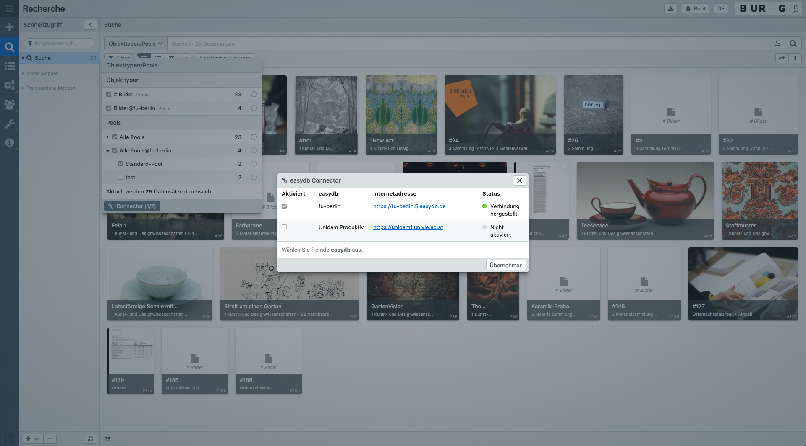

# Tutorial: Connector

Der Connector ermöglicht es Ihnen sich mit anderen easydb oder fylr Instanzen zu verbinden. In diesem Tutorial finden Sie alle notwendigen Schritte um

1. einen Connector-Partner in Ihrer easydb einzubinden, und um
2. Ihre easydb über den Connector-Verbund bereitzustellen.

## 1. Connector in Ihre easydb einbinden

Um eine easydb oder einen fylr in Ihrer Instanz über den Connector einzubinden, benötigen Sie zunächst folgende Informationen von Ihrem Connector-Partner:

- URL
- Login
- Passwort

Falls es sich bei dem Connector-Partner um einen fylr handelt, müssen sie zusätzlich die folgenden Daten zur [OAuth2-Authentifizierung](https://docs.fylr.io/for-developers/api/oauth2) angeben:

- Client ID
- Client Secret (nur benötigt, falls in der anderen ein Secret konfiguriert ist)

> Hinweis: Ihr Connector-Partner muss die unter 2. aufgeführten Schritte durchgeführt haben.

Übermitteln Sie Ihrem Connector-Partner Ihre easydb-URL und bitten ihn diese im Bereich ["Basis-Konfiguration"](../../webfrontend/administration/base-config/) > ["Allgemein"](../../webfrontend/administration/base-config/general) als "Erlaubte Herkunftsadresse" einzutragen.

Melden Sie sich nun als Administrator in Ihrer easydb an und wechseln in den Bereich ["Basis-Konfiguration"](../../webfrontend/administration/base-config/) > ["Connector"](../../webfrontend/administration/base-config/connector) und tragen dort die oben genannten Daten Ihres Connector-Partners ein und aktivieren die Verbindung für die Benutzer.

> Um eine Verbindung zum Connector-Partner aufzubauen, muss sich die easydb einmalig mit dem eingerichteten Nutzernamen und Passwort anmelden. Dazu muss das Passwort in der Basis-Konfiguration im Klartext hinterlegt sein. Mehr Informationen zur Sicherheit bei der Benutzung des Connectors finden Sie [am Ende dieses Artikels](#sicherheit-bei-der-connector-benutzung).

Ab diesem Schritt können Ihre Nutzer die über das Systemrecht "Diesen Nutzern in der Recherche eine Suche in anderen easydb's ermöglichen" verfügen in der Recherche über die Auswahl "Objekttypen/Pools" den eingerichteten Connector-Partner auswählen und in dessen freigegebenen Beständen recherchieren.

## 2. Ihre easydb für Connector-Partner einrichten

Damit Ihre Connector-Partner auf Ihre easydb zugreifen können, müssen Sie zu allererst bestimmen auf welche Inhalte diese Zugriff erhalten sollen.

Legen Sie hierzu zunächst im Bereich ["Benutzer"](../../webfrontend/rightsmanagement/users) einen neuen Nutzer-Account an und vergeben im Reiter "Systemrechte" das Recht "Connector-Verbindungen von anderen easydb's aus über diesen Nutzer zulassen" sowie die Frontend-Funktion "Herunterladen" falls Sie Ihrem Connector-Partner den Download ermöglichen wollen.

> Wir empfehlen für jeden Connector-Partner einen eigenen Nutzer-Account einzurichten, da Sie so die Möglichkeit haben Ihre Inhalte ganz gezielt freizugeben.

Legen Sie nun im Bereich ["Pools"](../../webfrontend/rightsmanagement/pools) fest, auf welche Inhalte Ihr Connector-Partner Zugriff erhalten soll indem Sie im Reiter "Berechtigungen" eine neue Zeile hinzufügen und die notwendigen Lese- und Download-Berechtigungen für den zuvor angelegten Nutzer vergeben. Wiederholen Sie dies für alle Pools und ggfs. im Bereich "Tags & Workflows".

> Bitte beachten Sie, dass Sie bei den Berechtigungen min. die Rechte "Datensätze ansehen" und "Erlaubte Masken" vergeben müssen.

Damit die Nutzer des Connector-Partners auch die Expertensuche nutzen können, erteilen Sie auch im Bereich ["Objekttypen"](../../webfrontend/rightsmanagement/objecttypes) alle notwendigen Rechte an den Connector-Nutzer.

Senden Sie zu guter Letzt Ihre URL, den Login sowie das Passwort Ihrem Connector-Partner und tragen seine URL im Bereich ["Basis-Konfiguration"](../../webfrontend/administration/base-config/) > ["Allgemein"](../../webfrontend/administration/base-config/general) unter "Erlaubte Herkunftsadressen" ein.

## Sicherheit bei der Connector-Benutzung

Bei der Verbindung mit einem Connector-Partner wird ein dort speziell dafür eingerichteter Benutzer genutzt. Der Login und das Passwort dieses Benutzers wird genutzt, um sich beim Partner anzumelden.

Mit dem bei erfolgreicher Anmeldung generierten Token lassen sich mit den Rechten des Benutzers beliebige API-Requests ausführen. Achten Sie daher unbedingt darauf, diesem Benutzer nicht zu umfangreiche Rechte zu erteilen, mit denen sich unter Umständen Daten verändern oder löschen lassen, oder Einstellungen an der easydb zu ändern.

> Die Rechte des Connector-Nutzers sollten ausschließlich Rechte an der Suche sowie Leserechte an den Pools, Objekttypen und Masken umfassen, die innerhalb des Connector-Verbunds geteilt werden sollen. Darüber hinausgehende Rechte sollten diesem Nutzer nicht erteilt werden.

In der Basis-Konfiguration müssen je Connector-Partner der Login und das Passwort im Klartext hinterlegt werden. Achten Sie daher darauf, den Zugriff auf die Basis-Konfiguration möglichst stark einzuschränken, so dass nur der Administrator Zugriff auf die gespeicherten Benutzerdaten hat.

Die Anmeldung bei den Connector-Partnern erfolgt über das Serverplugin. Das im Frontend für die Suche genutzte Token wird einmalig per Request vom Server angefordert. Sofern der aktuelle Nutzer Rechte an der Benutzung des Connectors hat, wird mit den Login-Daten aus der Basis-Konfiguration für jeden Connector eine Anmeldung durchgeführt, und zudem geprüft, ob der Nutzer auch Zugriffsrechte auf die entfernte easydb besitzt.

Nur in diesem Fall kann das Frontend auf das Token der Connector-Partner zugreifen und dort Suchen durchführen. Die tatsächlichen Benutzerdaten sind somit nur für Benutzer sichtbar, die Zugriff auf die Basis-Konfiguration besitzen.
