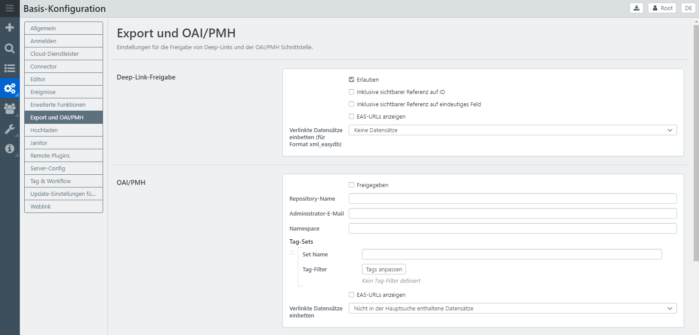
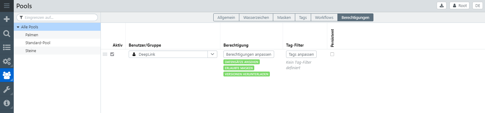

# Tutorial: Deeplinks

Bei Deeplinks handelt es sich um Links, die auf Inhalte in easydb verweisen und von außen, z.B. einer Webseite, verwendet werden können. Deeplinks werden über den System-Nutzer "Deeplink" gesteuert und freigegeben.

### 1. Deeplinks für Versionen

Um Deeplinks verwenden zu können, gibt es 2 Bedingungen, die erfüllt sein müssen:

- Freigabe der Funktion in der Basiskonfiguration
- Datensatz-Berechtigungen für den Systemnutzer "Deeplink"

In der Basiskonfiguration unter dem Menüpunkt Export und OAI/PMH finden Sie Deep-Link-Freigabe. Hier muss die Deep-Link-Freigabe erlaubt werden.

Anschließend geben Sie dem System-Nutzer "Deeplink" die Datensätze frei für die Deeplinks erzeugt werden können sollen. Im folgenden Screenshot wurde dies für alle Datensätze definiert.

Sollten Sie jedoch solch eine Freigabe-Möglichkeit nur für ausgewählte Datensätze wünschen, können Sie vorab ein Tag definieren, z.B. Tag "Deep-Link-Freigabe". Anschließend geben Sie den Tag am Tag-Filter (siehe Screenshot) an. Dann gilt diese Rechtezeile nur für Datensätze, an denen dieser Tag gesetzt wurde.

