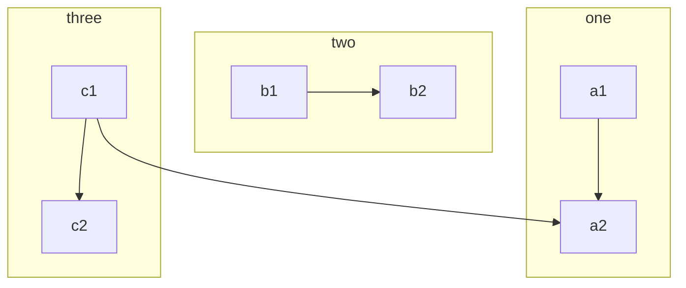

# How to CMS

This is a document describing HENKs how to use the easydb CMS to write documentation.

We are using the [Hugo CMS](https://gohugo.io/documentation/) to render static pages of this website.

## Use on Desktop

We use three Desktop programs for the workflow to edit documentation

* [Git](https://git-scm.com/downloads)

* [Github Desktop](https://desktop.github.com/)
* [Typora](https://typora.io/)

The repository to use is https://github.com/programmfabrik/easydb-documentation.

Add this repository to Github Desktop.

## Typora

Make your you have these settings:

* Unix Line Endings (LF)
* Copy dragged images to the current directory


## Start your own Webserver

From the Github Desktop client you can choose *Open in command prompt* to open a Command Shell.

```bash
hugo server # windows
./hugo_linux server # linux
./hugo_mac server # mac
```

This will start the Hugo Webserver serving the documentation on your computer on http://localhost:1313/.

Any change you save to disk will trigger a re-render of the page you saved. With your browser open, you can see a live reload of the page.

## Fetch & Pull & Commit & Push

### Fetch & Pull

Before you start changing any documentation, make sure that you use your Github client to **fetch origin** the latest version of the repository. After the **fetch** you need to **pull**. **fetch** loads the new data from the server and **pull** copies new stuff into your local directory.

### Edit, Create

Next step is to edit and or create new content.

## Commit & Push 

When you are done, head over to Github Desktop to review your changes. Add a commit note and do **Commit to master**. This will commit your changes to your local copy of the Git Repository.

After **commit** you need to **push** your changes to the Github server. The **push** will trigger a rebuilt of the documentation website over on **Netifly**. Your changes should be visible and accessible within minutes.


## Diagrams

We support [**mermaid**](https://mermaidjs.github.io/) and [**sequence**](https://bramp.github.io/js-sequence-diagrams/) diagrams.

### Sequence

Put sequence diagrams in a block like this:

~~~
```sequence
Alice->Bob: Hello Bob, how are you?
Note right of Bob: Bob thinks
Bob-->Alice: I am good thanks!
```
~~~

The rendered diagram will look like this:

```sequence
Alice->Henk: Hello Bob, how are you?
Note right of Bob: Bob thinks
Bob-->Jklds: I am good thanks!
```
#### Mermaid

Mermaid diagrams look like this:

~~~

~~~


