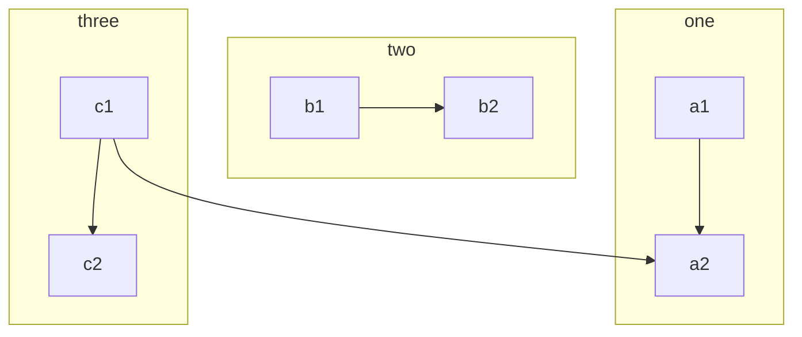

# How to CMS

This is a document describing HENKs how to use the easydb CMS to write documentation.

We are using the [Hugo CMS](https://gohugo.io/documentation/) to render static pages of this website.

## Diagrams

We support [**mermaid**](https://mermaidjs.github.io/) and [**sequence**](https://bramp.github.io/js-sequence-diagrams/) diagrams.

### Sequence

Put sequence diagrams in a block like this:

~~~
```sequence
Alice->Bob: Hello Bob, how are you?
Note right of Bob: Bob thinks
Bob-->Alice: I am good thanks!
```
~~~

The rendered diagram will look like this:

```sequence
Alice->Henk: Hello Bob, how are you?
Note right of Bob: Bob thinks
Bob-->Jklds: I am good thanks!
```
#### Mermaid

Mermaid diagrams look like this:

~~~

~~~


