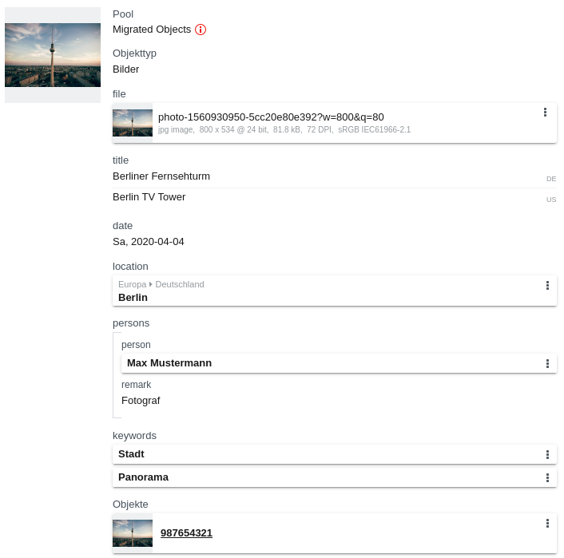
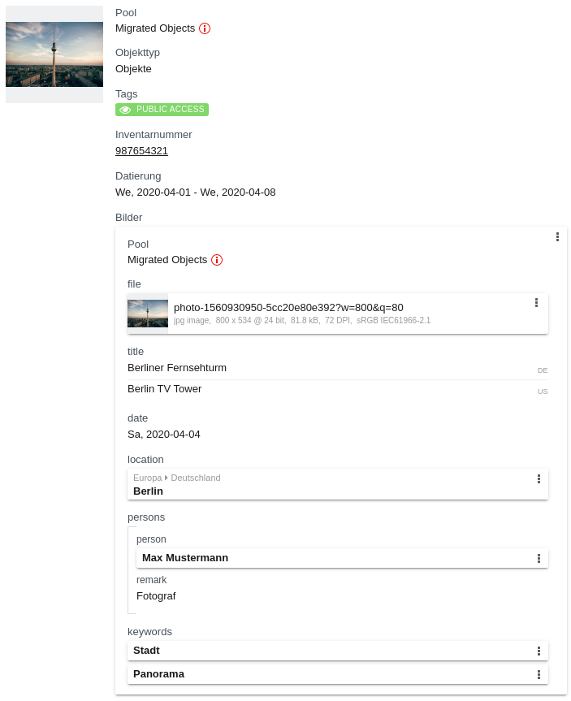
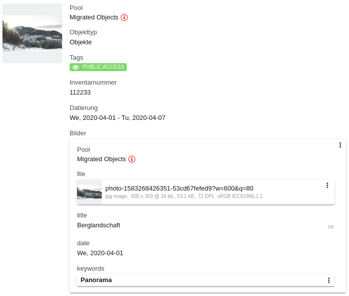
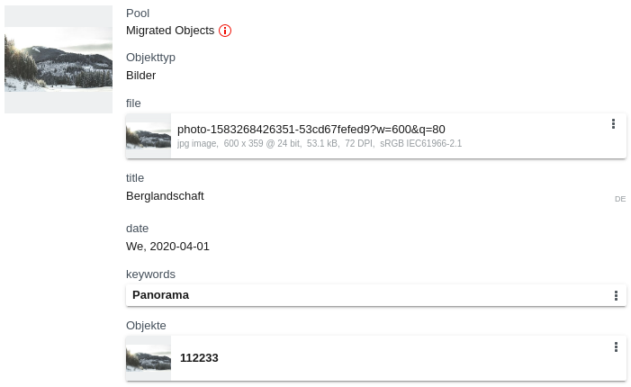

# Tutorial steps

The following steps show some basic import payloads.

## 1. Import Manifest

Create a file named `manifest.json` with the following content:

```
{
  "source": "Example Migration",
  "batch_size": 100,
  "payload_base_uri": "",
  "eas_type": "url",
  "payloads": []
}
```

This manifest is used to preload the migration data in the JSON Importer. All information in the manifest can also be changed in the frontend, so a manifest file is not needed, but very helpful.

* `source`: A name to identify the migration, can be freely chosen
* `batch_size`: Maximum number of objects from a payload that are posted in a single request. If the payloads contain more objects, the payloads are uploaded in parts. This value is necessary to control the request size. For complex objects which take a long time to be saved, it is possible that the request might time out. In this case, the batch size needs to be decreased. The internal limit of the server is 1000.
* `payload_base_uri`: If the payloads are not stored in the same folder as the manifest (or on another server), this is needed to build absolute paths from the payload file names. This value needs to be the relative path to the payload folder.
* `eas_type`: Preselect the [asset upload type](#asset-upload) in the import dialog:
  * `direct`: The assets are uploaded using the browser
  * `url`: Remote put (assets are loaded by the EAS using the URL)
  * `ignore`: No assets are imported
* `payloads`: List of the filenames of all payloads, in the order they are posted

----

## 2. Payloads for basetypes

Basetype payloads should always be imported first since they are referenced in most user objects. There is no strict order of the basetypes, but you have to consider that they can reference each other. Since circular references between basetypes are possible, importing of second versions of the basetypes might be needed (update migration).

Possible, but not exclusive, references between basetypes:

* Tags:
    * do not reference other basetypes
    * can be referenced by all other basetypes by tagfilter based rights management
    * tags, users, groups as part of the rightsmanagement

* Groups:
    * tags, users, groups as part of the rightsmanagement

* Users:
    * can reference groups (as being inside a group)
    * tags, users, groups as part of the rightsmanagement

* Pools:
    * hierachical, so pools reference other pools as a parent
    * tags, users, groups as part of the rightsmanagement

----

### Tags

Tags belong to tag groups. We add a tag "Public Access" to a new tag group "Tag Group 1". To reference this tag later, it will get the reference `"public"`.

The tag group and the tag(s) inside the group are stored in one JSON object. The object is added to the array of the payload:



Save this file as `basetype-tags.json` and add this filename to the payload list in the manifest.

For an overview of all fields that can be set in the tag and tag group object, see [Type Tag](/en/technical/types/tag/).

----

### Groups

We create a group, to which migrated users will be assigned. Any user who is in this group, will have the right to use the search function in the frontend, and manage collections.

The group will be named "Migrated Users", and it will get the reference `"migrated_users"`.

The group payload is:



Save this file as `basetype-groups.json` and add this filename to the payload list in the manifest.

For an overview of all fields that can be set in a group, see [Type Group](/en/technical/types/group/).

----

### Users

Add a test user and assign it to the group "Migrated Users".

We name the user "Max Mustermann", with the easydb login `"mustermann"` and the password `"password123"`. The reference of the user will be `"mustermann"`.

To add the new user to the group "Migrated Users", use the lookup `"lookup:_id"` for the group reference `migrated_users`.

The user payload is:



Save this file as `basetype-users.json` and add this filename to the payload list in the manifest.

For an overview of all fields that can be set in a user, see [Type User](/en/technical/types/user/).

----

### Pools

Any empty easydb always contains two system pools:

* "All pools" (reference: `"system:root"`)
    * "Default pool" (reference: `"system:standard"`) (child of `system:root`)

All pools have to be inserted into this hierarchy. Any new pool needs to have a parent.

For this tutorial, we create a new pool "Migrated Objects" and use "All pools" as the parent pool. To reference it later, set the reference to `"migrated_objects"`.

Instead of setting the parent pool using `"_id_parent": 1`, we have to use the lookup to let the server find the ID of "All pools". The lookup is done by replacing `"_id_parent": 1` with `"lookup:_id_parent": { "reference": "system:root" }`.

Add the pool JSON object to a pool payload. This payload is defined as:



Save this file as `basetype-pools.json` and add this filename to the payload list in the manifest.

For an overview of all fields that can be set in the pool object, see [Type Pool](/en/technical/types/pool/).

----

## Payloads for user objects

Here we will create payloads for objects of different objecttypes, as well as linking these objects together using lookups.

### Simple linked objects

These objects are simple and are not linking other objects.

#### Orte (`orte`)

This objecttype is hierarchic. Each field contains a link (`_id_parent`) to reference its parent. Instead of `_id_parent`, we will use `lookup:_id_parent` instead. The unique field that is used for reference is `name`. Apart from this, there are no other fields in this objecttype.

All user objects consist of meta-fields, and an object with the actual data under a key which must be the same as the value of `_objecttype`. For importing, always use the `_mask` `_all_fields`.

We will create the following hierarchical structure of places:

* Europa
    * Deutschland
        * Berlin
        * Brandenburg

There are four levels, so we need to upload the objects in four different payloads in the following order: `["Europa"]`, `["Deutschland"]` and `["Berlin", "Brandenburg"]`. So we make sure that the parent has always been imported already before it is referenced.

**Payload #1**

The structure for the user object payloads is always the following:

```
{
  "import_type": "db",
  "objecttype": "orte",
  "objects": []
}
```

The objects have the following structure:

```
{
  "_objecttype": "orte",
  "_mask": "_all_fields",
  "orte": {
    "_id_parent": null,
    "_version": 1,
    "name": "Europa"
  }
}
```

On top level, the `_objecttype` and `_mask` must be defined. The value of `_objecttype` is `"orte"`, so we define the object itself under the key `orte`.

In `orte`, the `_id_parent` is `null` (or it can also be not set at all), since this object is on the top level of the hierarchy and has no parent.

Every imported object must have the `_version`, since it is a object that will be newly created.

The actual data "Europa" is saved under the key `name`. The key is the same as the internal field name in the datamodel.

The complete first payload looks like this:



Save this payload as `userobject-orte-level-0.json` and add the filename to the manifest.

For hierarchical objects it is good practice to include the hierarchy level in the payload filenames to make sure they are in the correct order.

**Payload #2**

Define the object that contains the name "Deutschland", which is a child of "Europa".

The complete second payload looks like this:



The parent object is referenced by the field `name` in `lookup:_id_parent`. The only key in this object is the field name, and the value is the value of this field in the database. This feature only works, if you know that the field is set and unique for all objects of this objecttype.

Here we tell the server to use the ID of the object with `name = "Europa"` as the parent ID.

Save this payload as `userobject-orte-level-1.json` and add the filename to the manifest.

**Payload #3**

On this level, there are two objects, that both have the same parent "Deutschland". Both can be saved in the same payload, since they are not depending on each other in any way.

The complete second payload looks like this:



Save this payload as `userobject-orte-level-2.json` and add the filename to the manifest.

----

#### Personen (`personen`)

This objecttype is not hierarchical, so all objects can be saved in the same payload:



Note that you can use the newline character `\n` in multiline text fields (`adresse` in first object). Also you can leave any field empty, as long as it has no `NOT NULL` constraint or any other check constraints that do not allow empty fields (missing key `adresse` in second object).

Save this payload as `userobject-personen.json` and add the filename to the manifest.

----

#### Schlagwörter (`schlagwoerter`)

This objecttype is not hierarchical, so all objects can be saved in the same payload:



Save this payload as `userobject-schlagwoerter.json` and add the filename to the manifest.

----

### Main objects

Here we create the payloads for the more complex main objects (objects that can be found in the main search). These objects can have assets, tags, pools, links to the other simple objects we created before, and have links to eachother.

#### Bilder (`bilder`)

This objecttype is used to save images as well as additional information about the time and place the picture was taken, and who was the photographer.

We create an object that saves this image from [unsplash.com](https://unsplash.com/photos/pN684G33h_M):


Fields that are set in the object:

**`pool`**

The pool must be specified for all objects with pool management. We want to add the new objects to the pool ["Migrated Objects"](#pools) by referencing the pool `reference` instead of the `_id`:

```
"_pool": {
  "pool": {
    "lookup:_id": {
      "reference": "migrated_objects"
    }
  }
}
```

**`reference`**

To be later able to reference this object, use the field `reference` to set a unique value. Other than for basetypes, this field is part of the schema and must be included in the datamodel. Set the reference to "bild_01", so later you can use a lookup to [link to this object](#reverse-linking-of-bilder-in-objekte) in a `objekte` object:

```
{
  "lookup:_id": {
    "reference": "bild_01"
  }
}
```

**`titel`**

This is a multi language field, so under the key, there is an object with language codes and the translations for each language. Here we set the title for german and english:

```
{
  "de-DE": "Berliner Fernsehturm",
  "en-US": "Berlin TV Tower"
}
```

**`datei` (asset)**

The image is saved in the asset field `datei` in the object. During the import, the images must be hosted and are loaded over HTTP(S). You can save the images in the same server where the payloads are stored, and use the server url, or use an image from any other HTTP server.

To tell the JSON Importer which file should be uploaded to the EAS and linked in the object, you have to specify the URL of the file. The Importer will load the file from the URL and upload it. So, replace `_id` with `eas:url`:

```
{
  "eas:url": "https://images.unsplash.com/photo-1560930950-5cc20e80e392?w=800&q=80",
  "preferred": true
}
```

There must always be one asset that is set as preferred.

**`aufnahmedatum` (date field)**

This is a date field, so under the key, there is an object with the `value` and the date representation in `YYYY-MM-DD` format:

```
{
  "value": "2020-04-06"
}
```

**`aufnahmeort` (link to objecttype [`orte`](#orte-orte))**

This is a link to another object. Instead of linking it using the `_id`, the object is referenced in a lookup by the unique field `name` (the same as in the hierarchical lookup for the parent ID):

```
{
  "aufnahmeort": {
    "orte": {
      "lookup:_id": {
      "name": "Berlin"
      }
    },
    ...
  }
}
```

This creates a link to the `orte` object with the `name` "Berlin".

**`personen.person` (links in nested table to objecttype [`personen`](#personen-personen))**

There are multiple links to objects of type `personen` inside a nested table. The nested table `personen` has the fields `bemerkung` and `person`. The field for the nested table in the datamodel consists of the prefix `nested:`, the objecttype name and the name of the nested table: `"_nested:bilder__personen"`.

`bemerkung` is a free text field, `person` is the link to the `personen` object.

Instead of linking it using the `_id`, the object is referenced in a lookup by the unique field `name`:

```
{
  "person": {
    "personen": {
      "lookup:_id": {
      "name": "Max Mustermann"
      }
    },
    ...
  }
}
```

Each element in the array `"_nested:bilder__personen"` represents a row in the nested table. In this example, we will add one row to the nested table, which contains the link to `person` "Max Mustermann", and the `bemerkung` field "Fotograf".

Combined, the entry for the linked object in the nested table, looks like this:

```
"_nested:bilder__personen": [
  {
    "bemerkung": "Fotograf",
    "person": {
      "_mask": "_all_fields",
      "_objecttype": "personen",
      "personen": {
        "lookup:_id": {
          "name": "Max Mustermann"
        }
      }
    }
  }
]
```

**`schlagwoerter.schlagwort` (links in nested table to objecttype [`schlagwoerter`](#schlagwörter-schlagwoerter))**

There are multiple links to objects of type `schlagwoerter` inside a nested table. `schlagwort` is the link to the `schlagwoerter` object.

Instead of linking it using the `_id`, the object is referenced in a lookup by the unique field `name`:

```
{
  "schlagwort": {
    "schlagwoerter": {
      "lookup:_id": {
        "name": "Stadt"
      }
    },
    ...
  }
}
```

A second object in the nested table can be added by referencing the second object by the `name` "Panorama".

Combined, the entry for the linked objects in the nested table, looks like this:

```
"_nested:bilder__schlagwoerter": [
  {
    "schlagwort": {
      "_mask": "_all_fields",
      "_objecttype": "schlagwoerter",
      "schlagwoerter": {
        "lookup:_id": {
          "name": "Stadt"
        }
      }
    }
  },
  {
    "schlagwort": {
      "_mask": "_all_fields",
      "_objecttype": "schlagwoerter",
      "schlagwoerter": {
        "lookup:_id": {
          "name": "Panorama"
        }
      }
    }
  }
]
```

##### Complete Payload

The complete payload for the bilder object(s) looks like this:



Save this payload as `userobject-bilder-0.json` and add the filename to the manifest.

----

#### Objekte (`objekte`)

This is the other main object. It has pool management, and can have tags.

Fields that are set in the object:

**`pool`**

Add the new object to the pool ["Migrated Objects"](#pools) by referencing the pool `reference` instead of the `_id`.

**`tags`**

Tags are set in an array next the object, at the top level key `_tags`. Each object in the array is one tag. Instead of using the tag ID, reference the tag ["Public Access"](#tags) by using the lookup for the reference "public":

```
"_tags": [
  {
    "lookup:_id": {
      "reference": "public"
    }
  }
]
```

**`inventarnummer`**

This is a simple text field, the value can be assigned directly.

**`datierung` (date range field)**

This is a date range field, so under the key, there is an object with the start date (`from`) and the end date (`to`). Both values contain the date representation in `YYYY-MM-DD` format:

```
{
  "from": "2020-04-01",
  "to": "2020-04-08"
}
```

##### Complete Payload

The complete payload for the bilder object(s) looks like this:



Save this payload as `userobject-objekte-0.json` and add the filename to the manifest.

----

#### Reverse linking of `bilder` in `objekte`

The objecttype `objekte` contains a reverse editable link to the objecttype `bilder`. This means, in the JSON there is nested table where multiple `bilder` objects can be linked. These linked objects can be edited directly in the `objekte` object which contains them. Escpecially, this means they can be created inline. By adding a `bilder` object inside the reverse linked table in the payload for a new `objekte` object, you can create multiple objects at the same time.

We create an object that saves this image from [unsplash.com](https://unsplash.com/photos/425Czbxtyug) inside its internal `bilder` object.


Add the `bilder` object, including the `eas:url` and other fields, directly in the reverse nested table `_reverse_nested:bilder:objekte`. This nested table can include multiple `bilder` objects, that link back to this object, and can be directly edited inside this object.

The `bilder` and `objekte` objects both need a lookup to the pool, and the top level object has a lookup for the tag.

##### Complete Payload

The complete payload for the bilder object(s) looks like this:



Save this payload as `userobject-objekte-1.json` and add the filename to the manifest.

----

## 4. Collections

Objects can be assgigned to new collections after the objects have been migrated. As an example, we create a collection for the Root user, where images of landscapes are stored.

The new collection will get the base user collection for Root with the reference "user:ref:system:root" as its parent: `"lookup:_id_parent": {
    "reference": "user:ref:system:root"
}`

It is important to allow adding objects to this collection by setting `"objects_allowed": true`.

The objects inside the collection are referenced in the array `_objects` next to each `collection` object. Each object is referenced by using a lookup for the `_global_object_id`, which requires the objecttype and a field-value-pair (for more details, see ["Collections and Collection Objects"](/en/technical/datamanagement/lookups/#collections-and-collection-objects)).

The objecttype of the collection object is `objekte`, and we want to reference the object where the field `inventarnummer` has the value `112233`:

```
{
  "lookup:_global_object_id": {
    "_objecttype": "objekte",
    "inventarnummer": "112233"
  }
}
```

The payload for the collection looks like this:



Save this payload as `basetype-collection-0.json` and add the filename to the manifest.

----

## 5. Updating of imported objects

In some cases, it might be necessary to update objects during the migration process, for example if there are links to objects that did not exist yet at the time of the first import. In this case, it is possible to update existing objects by using lookups for the object ID, and incrementing the object version.

In this example, we want to link the first `bilder` object we created (with the reference "bild_01") to the first `objekte` object with the `inventarnummer` "987654321". For referencing the objects, we can use lookups for the IDs with fields that we know are unique and not empty in the existing objects. The direct link between these objects is from the `bilder` object to the `objekte` object, in contrast to the [reverse nested link](#reverse-linking-of-bilder-in-objekte) in the examples above.

> Make sure to include all values in the update of the object, that you want to save in the object. Since the server would delete all values that are not set, they need to be inlcuded. The latest version of any imported object will define all values in the object.

#### Lookup for object ID

To reference the object for the update, instead of specifying the `_id` (which was not inlcuded in the first version), use a lookup for the reference "bild_01", which was set in the first object version:

`"lookup:_id": { "reference": "bild_01" }`

#### Incremented version

The version can be specified directly, so you can set `"_version": 2`, if you know that this is the first update. For every update, the version must be exactly one more than the current version. Otherwise, this will cause an error.

If you do not want to keep track of object versions, you can use the JSON Importer feature which will care for setting the correct version: replace `"_version": 2` with `"_version:auto_increment": true`.

#### Link to the `objekte` object

From the perspective of the `objekte` object, the reverse nested link has the structure of a nested table, since one `objekte` object can be referenced by multiple `bilder` objects.

On the other hand, any `bilder` object can only have one link to one `objekte` object. So from the perspective of `bilder`, it is a normal link to an `objekte` object. We know that the unique field in the `objekte` object is `inventarnummer`, and the value we specified is "987654321". So the lookup in the link is the following:

```
"objekte": {
  "_objecttype": "objekte",
  "_mask": "_all_fields",
  "objekte": {
    "lookup:_id": {
      "inventarnummer": "987654321"
    }
  }
}
```

#### Complete Payload

The complete payload for the bilder object(s) looks like this:



Save this payload as `userobject-bilder-0-version-2.json` and add the filename to the manifest.

----

## 6. Starting the migration

### Complete Manifest

After all payloads have been created and the filenames have been added to the payload list, this is the manifest we use to migrate all basetypes and objects:



### Import process

In the frontend, open the [JSON Importer](/en/tools/jsonimport/). Enter the URL of the manifest, and click "Load". The Importer will list all Payloads, and preselect some settings that were saved in the manifest.

#### Asset Upload

For uploading assets, select the upload type in the dropdwon menu "File upload type":

* *Direct*: The assets are uploaded using the browser. This may have an impact on the performance and the migration duration
* *URL (remote put)*: The assets are loaded by the EAS using the URL. This might be the faster type of upload
* *Ignore files*: No assets are imported. Use this option if you want to run a faster test migration

This can be preselected by defining [`eas_type`](#1-import-manifest) in the manifest file.

If the assets are stored on a different server, and you want to specify this server only for the migration process, you can use `http://localhost` as the server url for all assets in the `eas:url` entries in the payloads. The actual server path is set in the field "File replace url". If this field is not empty, `http://localhost` will be replaced by this URL.

In the examples above, the URLs could also have been specified in the form `"eas:url": "http://localhost/photo-1560930950-5cc20e80e392?w=800&q=80"`, and the actual URL `https://images.unsplash.com` would be set in the JSON Importer.

#### Run import

After all settings are done, click "Prepare" and "Start" to run the migration.

## Result of the migration

If the import of the migration was successful, we expect the following objects in the main search in the frontend:

| | |
|---|---|
| [Object `bilder`](#bilder-bilder), with updated link to [`objekte` `"987654321"`](#5-updating-of-imported-objects) |  |
| [Object `objekte`](#objekte-objekte) with reverse edit link to [`bilder` `"bild_01"`](#bilder-bilder) |  |
| [Object `objekte` with reverse edit link to `bilder` `"bild_02"`](#reverse-linking-of-bilder-in-objekte) |  |
| [Object `bilder`, with link to `objekte` `"112233"`](#reverse-linking-of-bilder-in-objekte) |  |
