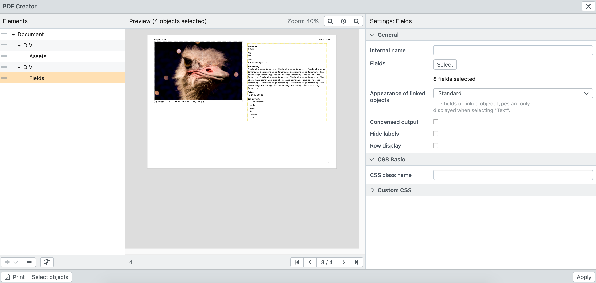

# PDF Templates

You can find a description of all available functions under ["Object types"](/en/webfrontend/rightsmanagement/objecttypes/). In the following, the steps to create an example PDF template are explained step by step. This template displays one image and the corresponding metadata per page.

- Go to "Object types".
- Click on the object type for which you want to create a PDF template
- Switch to the "PDF Creator" tab
- Click on the plus to add a new template
- Click "Select Records" in the lower left corner and select a few sample records to preview the following changes
- For the Document element, choose Landscape orientation and One Record layout
- If necessary, enter a document heading, date or page numbers in the "Header" and "Footer" areas
- Add a DIV via the Plus in the lower left corner
- Specify a width of "50%".
- Under the DIV, use the plus button to add "File Fields"
- Activate the corresponding file field on the right
- Add another DIV under the "Document" element
- Enter a width of "470" there
- Add "Fields" below this DIV
- Under "Fields", select all fields you want to display
- Click on "Apply" at the bottom right to save the template

> TIP: Customize the design of the PDF file using CSS by embedding your own CSS file or writing your own CSS directly in the PDF Creator.