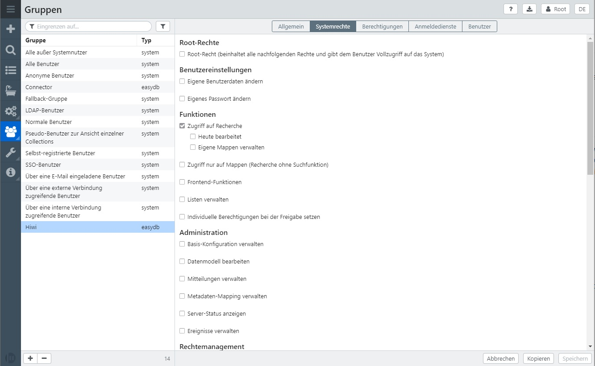
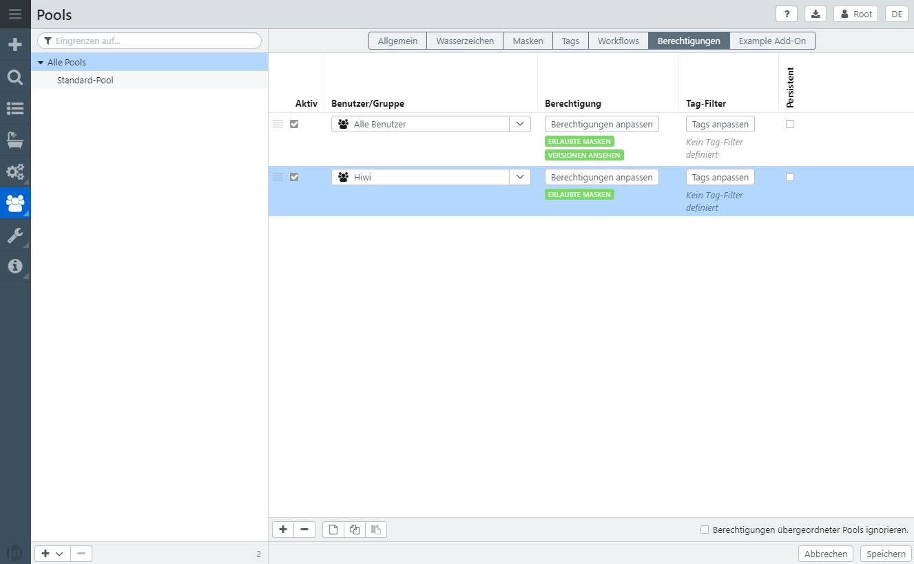
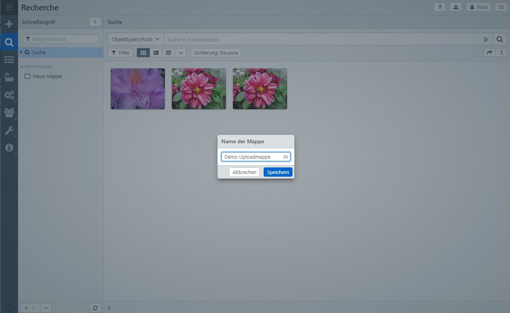
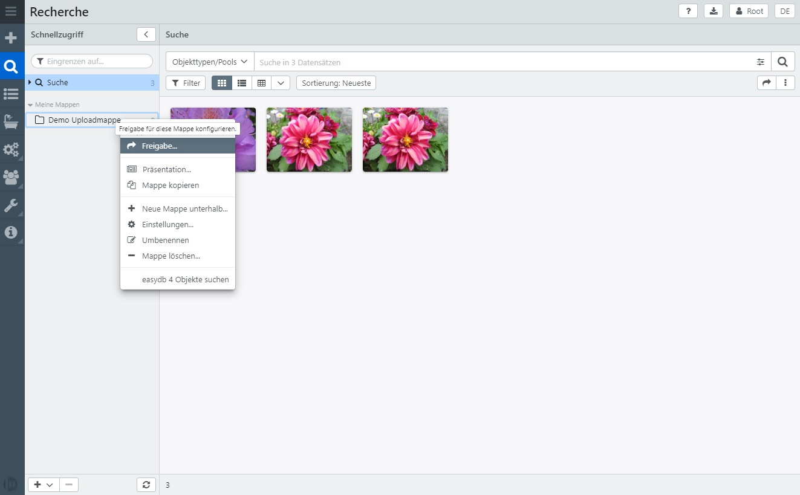
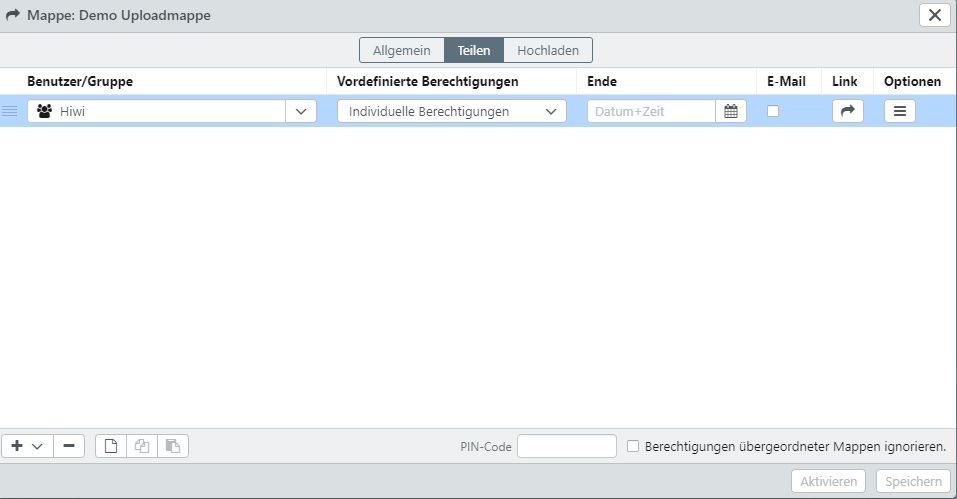
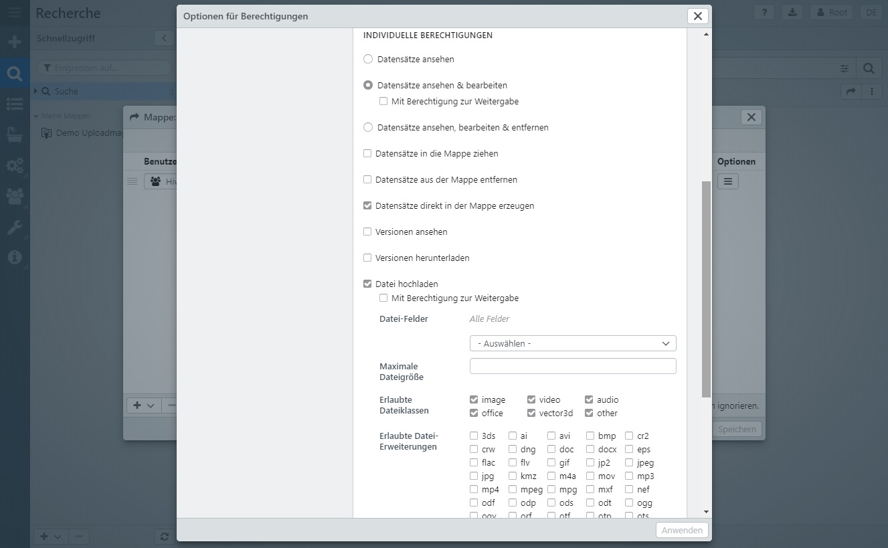
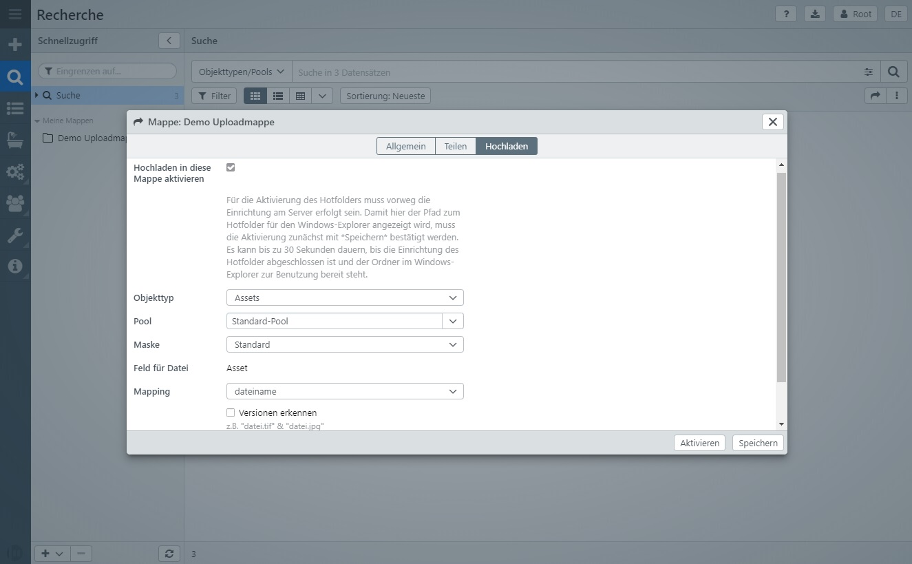
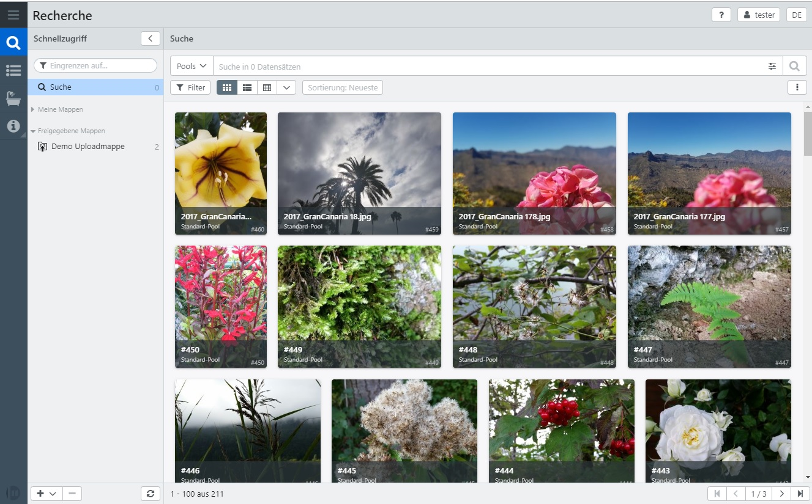

# Tutorial:  Upload-Mappe für einen Hiwi konfigurieren & nutzen

Die Mappen-Freigabe in easydb ist sehr mächtig. Sie können zum Beispiel eine Mappe freigeben um einem Nutzer den Upload in easydb zu ermöglichen, der sonst keine Datensätze anlegen darf. Nachstehend ein exemplarisches Beispiel:

### Schritt 1: Systemrechte

- Zu Beginn müssen die grundlegenden Systemrechte konfiguriert werden. Der Nutzer benötigt mindestens den Zugriff auf den Recherche-Bereich:
- Öffnen Sie die Übersicht aller Gruppen.
- Öffnen Sie die Hiwi-Gruppe im Editor.
- Wechseln Sie in den Reiter "Systemrechte" und aktivieren Sie folgende Berechtigung:
  - Zugriff auf Recherche
- Diese eine Checkbox stellt das Mindest-Set dar. Sie können natürlich auch weitere Berechtigungen erlauben.

### Schritt 2: Poolrechte

- Setzen Sie in den Pool-Berechtigungen die erlaubt Maske um dem System mitzuteilen, wie die Datensätze dem Hiwi-Nutzer angezeigt werden sollen:

### Schritt 3: Mappenrechte

- Legen Sie eine neue Mappe an, indem Sie unten auf das Plus-Zeichen klicken, einen Namen für die Mappe vergeben und mit der Schaltfläche "Speichern" die Eingabe bestätigen.

- Öffnen Sie das Kontextmenü der soeben angelegten Mappe durch Rechtsklick auf der Mappe.
- Wählen Sie aus dem Kontextmenü "Freigabe".

- Fügen Sie eine neue Rechtezeile hinzu und geben in der Spakte "Benutzer/Gruppe" die Hiwi-Gruppe an.
- Klicken Sie auf die Schaltfläche in der Spalte "Optionen" um die Rechteeinstellungen zu öffnen.

- Um Datensätze in die Mappe laden zu dürfen, sind folgende Rechte notwendig:
  - Datensätze ansehen & bearbeiten
  - Datensätze direkt in der Mappe erzeugen
  - Datei hochladen
    - z.B. image
  - Mappe ansehen

- Wechseln Sie in den Reiter "Hochladen".
- Aktivieren Sie die Checkbox "Hochladen in diese Mappe aktivieren".
- Nehmen Sie die gewünschten Einstellungen für Objekttyp, Pool etc. vor (siehe dazu ggfs. vorheriges Kapitel [Rechte 2.1: Mappenfreigabe - Download für E-Mail-Nutzer](rechte_downloadmappe))
- Speichern Sie Ihre Eingaben.

### Ergebnis

- Der Hiwi-Nutzer sieht im Recherche-Bereich keinen "Plus-Button" um neue Datensätze zu erzeugen, jedoch kann er nun Dateien von seinem Computer direkt in diese Arbeitsmappe ziehen.
- Die Dateien werden hochgeladen und in dem von Ihnen an der Mappe angegebenen Pool verschoben.

