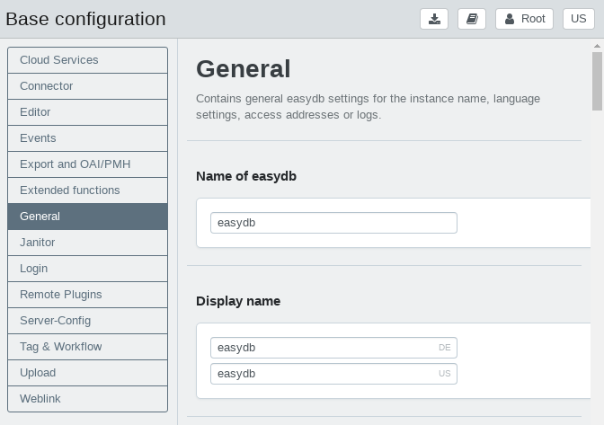
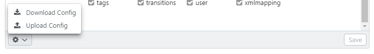

# Basic configuration

Global settings for easydb are set in the basic configuration. Via the tabs the setting area can be chosen.

This chapter contains explanations for the topics:

* [Cloud Services](cloud)
* [CMS](cms)
* [Custom Datatype Update](custom_datatype_update)
* [Editor](editor)
* [Events](event_logging)
* [Export and OAI/PMH](export)
* [Extended Functions](extended)
* [General](general)
* [Login](login)
* [Remote Plugins](plugins)
* [Server-Config](server-config)
* [Upload](upload)

## Upload/Download for basic configuration schema

Via the <i class="fa fa-cog"></i> button in the bottom left it is possible to download the existing settings of the basic configuration and also upload a basic configuration file (e.g. as fallback).

The configuration is downloaded and uploaded as JSON file. Media files (e.g. logos) contained in the basic configuration are not included in the download or upload.

### Create configuration file for other easydb instances

When downloading the file, the file IDs are included by default. Press the `ALT` button when downloading the file to get an ID-cleaned version of the configuration file. The IDs are required when you save the file as a backup for a production system. When transferring the configuration settings to another easydb, a cleaned version is required, as references to files such as logos and XSLT sheets may not be available in another system.
