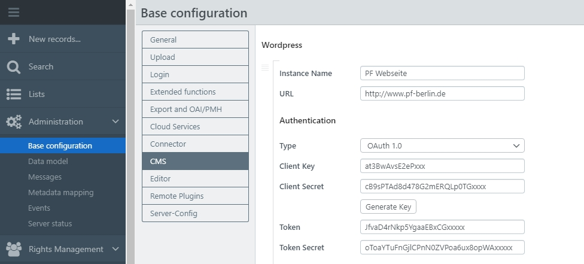
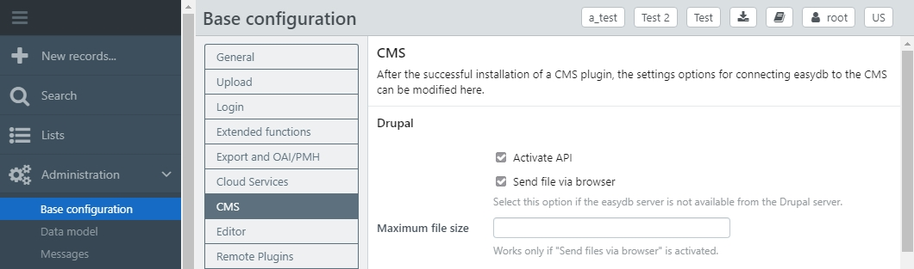
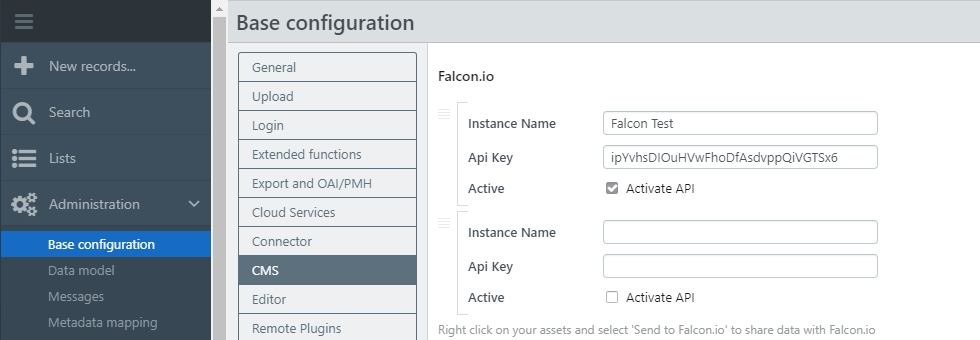

# CMS

Connecting CMS-Systems in easydb works via [Plugins](../../../datamanagement/features/plugins). The settings for the connection of CMS systems are made here.

## Wordpress {#wordpress}

If the [installation of the plugin](/en/sysadmin/configuration/easydb-server.yml/plugins/) is finished successfully, you will find the configuration block for Wordpress in the <code class="tab">CMS</code> tab.

1. Enter an instance name and your URL and choose an authentication method (see details in the table below the screenshot).
2. Save the basic configuration after successful authentication.

> NOTE: Required are Wordpress 4.7 or higher, an active JSON-Rest-API (is default) and a configured authentication. 

|CMS|Field|Description|
|---|---|---|
|Wordpress|Instance name|It is possible to add one or more instances. You must assign a name for each instance.|
||URL| The Worldpress URL to which the export is supposed to be deliverd.|
||Authentication|Authentication type HTTP:   login name and password for Wordpress administration. |
|||Authentication type OAuth 1.0a:  Copy the client key and client secret of the [prepared application user](/en/sysadmin/configuration/easydb-server.yml/plugins/) from Wordpress.   Click "Generate Key" to connect to Wordpress. Authenticate yourself via the pop-up. After that you will receive a token and token secret. Copy it from here into the corresponding field. |

If you have successfully saved the basic configuration, the **system rights for users** must still be set up. Authorized users or groups require the [system right](/en/webfrontend/rightsmanagement) "Allow Wordpress Export".

## TYPO3 {#typo3}

After the successful [plugin configuration](/en/sysadmin/configuration/easydb-server.yml/plugins) in a YAML file through a system administrator, you can make settings for the TYPO3 plugin here.

|CMS|Field|Description|
|---|---|---|
|TYPO3 (starting with Version 7)|Activate API|Activates the [Plugin](../../../datamanagement/features/plugins). |
||Send files via browser| With the TYPO3 plugin, easydb can be used for exporting files. If the export from the easydb server to the Typo3 server is not directly possible, the option for export via browser can be activated.|
||Maximum file size| Limit for files, if they are sent via the browser. |
||Metadata mapping|Settings for the easydb export to Typo3.  **- Standard only -**: Without a mapping Standard A will be mapped to *title* and Standard B to *description*.   **Individual mapping**: Individuel Mappings can be created as described in [Metadata mapping](../../profiles). All mappings appear in the pulldown. |

## Drupal {#drupal}

easydb supports Drupal CMS from version 8 on. easydb can be accessed from Drupal to search files in easydb. easydb supports different file sizes for the transfer to drupal.

The Drupal [Plugin configuration](/en/sysadmin/configuration/easydb-server.yml/plugins) needs to be done in a YAML file by a system administrator. settings for the Drupal plugin can be made here.

After the successful installation, the following settings are made here in the basic configuration:

|CMS|Field|Explanation|
|---|---|---|
|Drupal|Activate API|Activate the [Plugin](../../../datamanagement/features/plugins). |
||Send files via the browser| Using the plugin in Drupal, easydb can be used to export files. If the export from the easydb server to the Drupal server is not directly possible, the option for export via the browser can be activated.|
||Maximum file size| Limit for files, if the files are send via the browser. |

## Falcon.io {#falconio}

|CMS|Field|Description|
|---|---|---|
| Falcon.io | Instance name| You can create one or more instances here. You must assign a name for each instance. |
|| API_Key | For the use of the RESTful API the unique API Key from falcon.io is needed. |
|| Active | The checkbox can be used to activate and deactivate the API for for each instance.|

