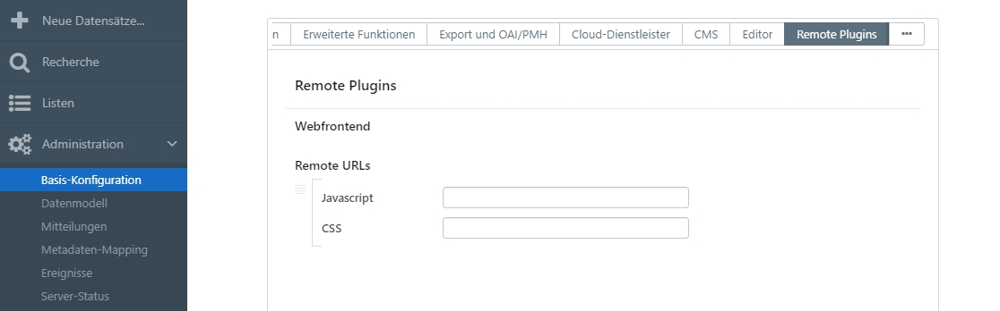

# Remote Plugins

Diese Funktion wird über ein Plugin zu der Basis-Konfiguration hinzugefügt. Das Feature ermöglicht es eigene Plugin-Dateien für das Frontend, die keine Serverkomponente haben, zu easydb hinzuzufügen.

* Das Plugin steht über [Github](https://github.com/programmfabrik/easydb-remote-plugin) bereit.
* Das Plugin wird in der yml auf dem Server konfiguriert, siehe [Plugin-Installation](/de/sysadmin/installation/plugin/).

Nach erfolgreicher Installation erscheint das Plugin in der Auswahl der Basis-Konfiguration.

> Das Remote Plugin wird bei Standard-easydb-Installation mit ausgeliefert und muss nicht separat installiert und konfiguriert werden.

* In die Eingabefelder kann je eine URL für eine JS-Datei und eine CSS-Datei angegeben werden.
* Es können mehrere solcher Tuple eingegeben werden.

