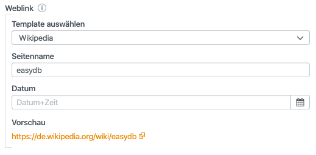

# Weblink

Mit Hilfe des Weblink-Plugins lassen sich Templates für Links erstellen. Mittels Variablen lassen sich URLs dynamisch aus Datenbankinhalten zusammensetzen. Dies hat den Vorteil, dass Sie nicht jedes Mal die komplette URL in easydb ablegen müssen, sondern nur die Teile die sich voneinander unterscheiden. Geben Sie unter Verwendung des Weblink-Plugins beispielsweise nur die GND-ID ein, wird die URL aus der Basis-Konfiguration ergänzt.

| Einstellung |             | Bemerkung                                                    |
| ----------- | ----------- | ------------------------------------------------------------ |
| Templates   |             | Konfigurieren Sie hier mehrere Templates die für den Nutzer zur Auswahl stehen sollen. |
|             | Name        | Name des Templates, wird dem Nutzer bei der Auswahl eines Templates angezeigt |
|             | URL         | Geben Sie hier die URL inkl. der Variablen an die ersetzt werden sollen. Sie können mehrere Variablen in einer URL verwenden. Variablen werden mit "%name%" angegeben. Z.B. https://de.wikipedia.org/wiki/%pagename%. |
|             | Anzeigetext | Dieser Text wird als klickbarer Link angezeigt.              |
| Variablen   |             | Geben Sie hier alle Variablen an, die ersetzt werden können. Pro Variable wird ein Eingabefeld generiert. |
|             | Variable    | Geben Sie hier die Variable an, die Sie in der URL verwendet haben. Z.B. "pagename". |
|             | Name        | Geben Sie der Variablen einen Namen, welcher dem Nutzer bei der Eingabe der Daten angezeigt werden soll. |

Das Weblink-Plugin kann im Bereich "[Datenmodell](../../datamodel)" > "[Objekttyp](../../datamodel/objecttype)" bei beliebigen Feldern als "Datentyp" ausgewählt werden.

Im Frontend sieht dies dann folgendermaßen aus:

