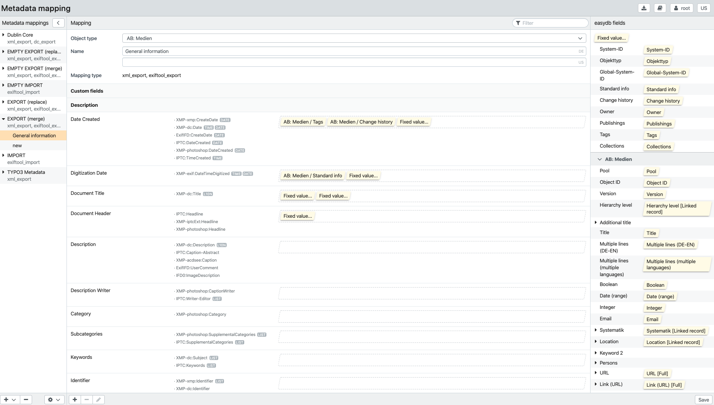
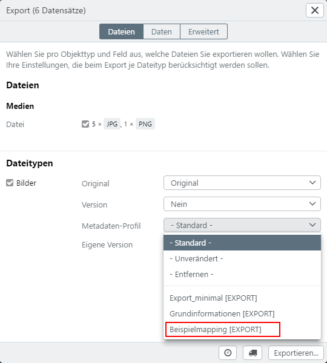
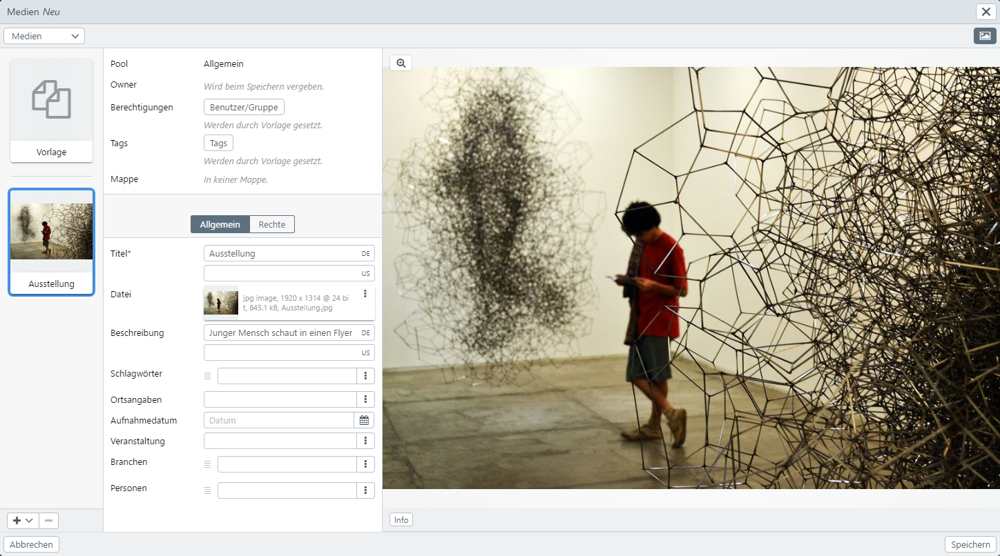

# Metadata mapping (Profiles)

Mappings (profiles) are used to define the import and export of metadata. A distinction is made between import or export profiles. In addition, profiles are divided into three types, which are available in different areas of easydb:

- exiftool_export (Download, Export)
- exiftool_import (New records, object type management, pool management)
- xml_export (Export)

Currently it is possible to define mappings for **EXPORT**, **IMPORT**, **Dublin Core** and **TYPO 3 Metadata** by default. 

General export profiles are distinguished by the options **replace** and **merge**:

* Wählen Sie *erhalten*, wenn bestehende Metadaten exportiert werden sollen. Die gemappten Felder werden dem bestehenden Mapping hinzugefügt. Dies ist z.B. empfehlenswert, wenn Dateien wie psd, dng, ai etc., eine Bearbeitungshistorie enthalten und diese nach dem Export erhalten bleiben soll. 

* Select *merge* if you want to export existing metadata. The mapped fields are added to the existing mapping. This is recommended, for example, if files such as psd, dng, ai etc. contain a editing history and this should be retained after the export. 

* Select *replace* if existing metadata is to be discarded and rewritten by the mapping.

Via the object type management in the rights management, you can determine which mapping is output as -standard in the selection for exports and downloads.

Mappings can be set as -standard- output for exports and downloads via the [rights management for object types](../../rightsmanagement/objecttypes).

## Set up and apply mapping

Multiple mappings can be defined for each profile. To create a new mapping, click the <code class="button">+</code>-button in the list of profiles below and select the profile for which you want to set up a mapping.

Assign a name for the mapping. The fields of the easydb are assigned to the fields of the mapping by drag & drop. For example, in the example below, the Title field was moved from left to right in the Document Title field.

To remove the field selection, drag the entry slightly next to the field.

If the fields listed by default do not meet your needs, you can add your own custom fields using the plus sign at the bottom to further customize the mapping.

> NOTE: For each field that is to be added, it must be researched in advance whether the value is PRINTABLE (i.e. is in the tag prt) or RAW (raw). This varies from field to field and depends on all tags or their manufacturers (e.g. there are own tags from Photoshop or camera manufacturers). 

> NOTE: If the mouse is held over a mapping field for some seconds, a mouse over appears, which contains details about the mapping field. For example, the field **Keywords** in the tab description contains the equivalents XMP-dc:Subject and IPTC:Keywords and would be mapped to these locations for these formats.

Depending on the profile, there are many target fields in the mapping, into which the easydb fields can be mapped. Multiple easydb fields can be mapped into a mapping field.

After the field assignment has been completed, the mapping is saved with the <code class="button">Save</code> button. In the exporter. The screenshot below shows the exporter with the newly created mapping.

When uploading new data sets, the mapping can be selected in the uploader. Existing metadata are then mapped directly to the selected profile. The screenshot below shows the Uploader. A file has already been uploaded and the mapping "basic information" has been selected in the mapping pulldown.

Click on the button <code class="button">weiter</code> to get to the editor. If the uploaded file is now selected, the contents of the fields show a preview of the mappings performed. In this example, the information for "Title" and "Description" was mapped.

