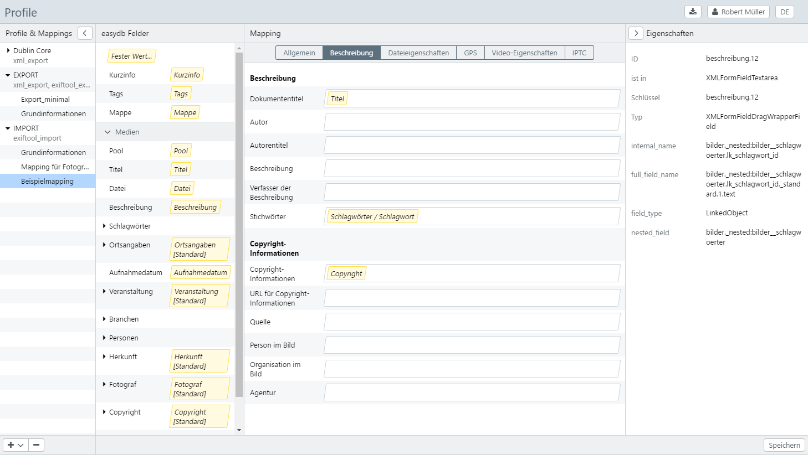

# Metadaten-Mapping (Profile)

Mit Hilfe des Metadaten-Mappings können Importe und Exporte von Metadaten definiert werden. Es wird dabei zwischen Import- oder Exportprofilen unterschieden. Ferner werden Mappings in drei Typen gegliedert, wovon jeder anderen Bereichen zur Verfügung steht:

- exiftool_export (Herunterladen, Export)
- exiftool_import (Neue Datensätze, Objekttypen-Management, Pool-Management)
- xml_export (Export)

Aktuell können Mappings für **EXPORT**, **IMPORT**, **Dublin Core** und **TYPO3 Metadaten** standardmäßig erstellt werden. 

Bei den allgemeinen Exportprofilen wird außerdem zwischen den Optionen **ersetzen** und **erhalten** unterschieden:

* Wählen Sie *erhalten*, wenn bestehende Metadaten exportiert werden sollen. Die gemappten Felder werden dem bestehenden Mapping hinzugefügt. Dies ist z.B. empfehlenswert, wenn Dateien wie psd, dng, ai etc., eine Bearbeitungshistorie enthalten und diese nach dem Export erhalten bleiben soll. 

* Wählen Sie *ersetzen*, wenn bestehende Metadaten durch das Mapping verworfen und neu geschrieben werden sollen.

Über das [Rechtemanagement am Objekttyp](../../rightsmanagement/objecttypes) kann festgelegt werden, welches Mapping in der Auswahl für Exporte und Downloads als -Standard- ausgegeben wird.

## Mapping einrichten und anwenden

Für jeden Typ können mehrere Mappings definiert werden. Um ein neues Mapping einzurichten, klicken Sie in der Liste der Typen unten auf den <code class="button">+</code>-Button und wählen Sie den Typ, für den Sie ein Mapping einrichten möchten.

Vergeben Sie einen Namen für das Mapping. Die Felder der easydb werden den Feldern des Mappings per Drag & Drop zugeordnet. Im nachstehenden Beispiel wurde beispielsweise das Feld "Titel" von links nach rechts in das Feld "Dokumententitel" gezogen. 

Um die Feldauswahl wieder zu entfernen, ziehen Sie den Eintrag etwas neben das Feld.

> HINWEIS: Wird die Maus etwas länger über ein Mapping Feld gehalten, erscheint ein Mausover, das Details zum Mappingfeld enthält. Z. B. ist da ersichtlich, dass das Feld **Stichwörter** im Reiter Beschreibung die Entsprechungen XMP-dc:Subject und IPTC:Keywords enthält und für diese Formate an diese Stellen gemappt würde.

Je nach Typ gibt es im Mapping unterschiedliche Zielfelder, in die die easydb Felder gemappt werden können. Es können auch mehrere easydb Felder in ein Mapping Feld gemappt werden.

Sollten die standardmäßig aufgeführten Felder nicht Ihren Wünschen entsprechen, können Sie über das Plus-Zeichen am unteren Rand eigene Custom-Fields hinzufügen und so das Mapping noch mehr individualisieren.

> HINWEIS: Sollten beim Mapping Umlaute verloren gehen, liegt dies daran,  dass UTF-8 nicht forciert wird. Dies ist im Standard von IPTC nicht  gesetzt. Sollten Sie UTF-8 wünschen, müssten Sie dies im Mapping  forcieren. Dazu gehen Sie, wie folgt, vor:
>
> Fügen Sie als Custom-Field das Feld "IPTC:CodedCharcterSet" hinzu und geben Sie als festen Wert "UTF8" ein.

Nachdem die Feldzuordnung abgeschlossen ist, wird das Mapping mit dem Button <code class="button">Speichern</code> gesichert und steht ab sofort als Auswahl z.B. im Exporter zur Verfügung. Der nachstehende Screenshot zeigt den Exporter mit dem neu angelegten Mapping.

Beim Hochladen neuer Datensätze kann das Mapping im "Neue Datensätze Editor" gewählt werden. Vorhandene Metadaten werden dann direkt mit dem gewählten Profil gemappt. Der nachstehende Screenshot zeigt den "Neue Datensätze Editor". Es wurde bereits eine Datei hochgeladen und im Mapping-Pulldown das Mapping "Grundinformationen" ausgewählt.

Nach Klick auf den Button <code class="button">weiter</code> gelangt man in den Editor. Wird nun die soeben hochgeladene Datei angewählt, zeigt der Inhalt der Felder eine Vorschau des durchgeführten Mappings. In diesem Beispiel wurden die Informationen für "Titel" und "Beschreibung" gemappt.

## Metadaten-Mapping für TYPO3 Exporte

Nach erfolgreicher Installation des TYPO3 Plugins können an dieser Stelle eigene Metadaten-Mappings für den Export zu TYPO3 erstellt werden.

