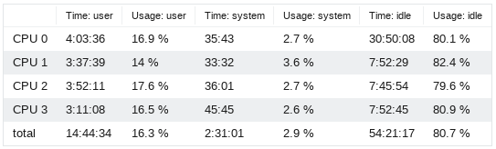
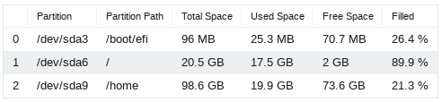

# Server status

## System

### General information

- uptime
- API version
- software version
- OS version

### Number of CPUs

- Logical
- Physical

### CPU Usage

Shows CPU usage and times for `user` and `system`, as well as idle time and usage

### Memory (RAM)

Shows the memory usage of the system

- Total Memory
- Used Memory
- Available Memory
- Free Memory
- Active Memory
- Inactive Memory
- Cached Memory
- Shared Memory
- Load

### Swap Memory

Shows the swap memory usage of the system

- Total Memory
- Used Memory
- Free Memory
- Available Memory

### Partitions and Disk Usage

Shows the disk usage and the partitions on the system

## Index

Overview of processes and current jobs of the index.

## easydb AssetServer (EAS)

Overview of the status of the asset server.

### Notes:

#### Supervisor version status

- `new`: number of assets where no versions have yet been produced, which are pending
- `changed`: number of assets where new versions have to be produced, which are pending
- `current`: number of assets where currently all versions have been produced

#### EAS-Jobs:

- `recent-*`: recent means during a rolling time window over the last 24 hours
- `time-per-job`: based on the number of `recent-done` assets, the average processing time per asset (in seconds) over the last 24 hours is calculated. This number may be misleading if a batch of asset processing has been started less than 24 hours ago

## Data Overview

### Object Types

List of objecttypes in the system and how many objects of this objecttype exist. Ordered by the number of objects.

### Assets

List of assets in the system. Grouped by fileclass, MIME type and extension and ordered by number of assets of this group.

### Languages

List of configured database languages, frontend languages and autocompletion (suggest) languages, that are currently activated in the [base configuration](../base-config/general/#languages).

### Logins / search requests over time

Accumulated number of login and search events over the last hour, the last 24 hours, the last week and the last month. Please note that each time period also includes all events in the shorter periods.

> These events can only be counted if logging of these event types has been activated in the [base configuration](../base-config/event_logging/#log-user-activity)!

## Elasticsearch

Overview of general information about the status of the ElasticSearch, such as the server URL, index name, cluster name, cluster status, and connection error.

## Server Configuration

This overview shows the complete [system configuration](../../../sysadmin/konfiguration/easydb-server.yml/). The Configuration is grouped by the subnodes of `system`.
