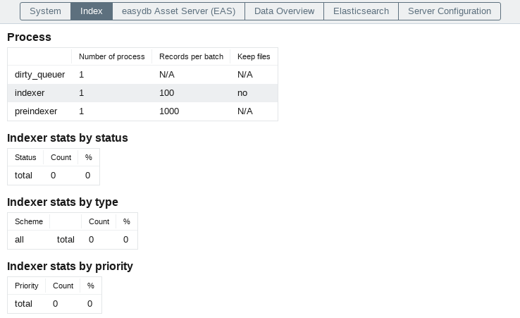
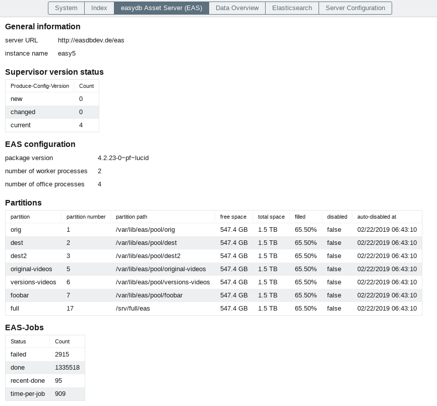
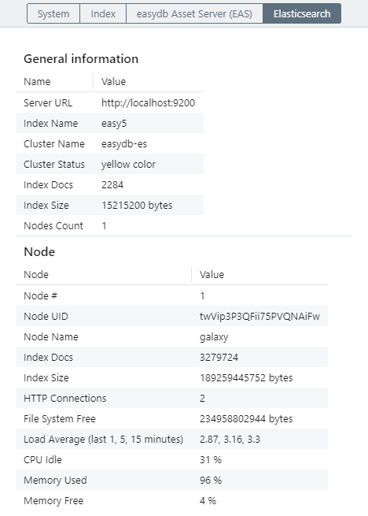

# Server status

## System

Overview of general information about the status of the system, such as Uptime, API version, software version and OS version.

## Index

Overview of processes and current jobs of the index.

## easydb AssetServer (EAS)

Overview of the status of the asset server.

## Elasticsearch

Overview of general information about the status of the ElasticSearch, such as the server URL, index name, cluster name, cluster status, and connection error.

