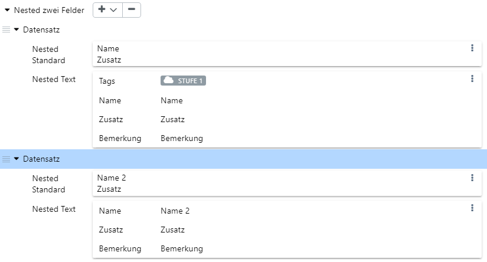
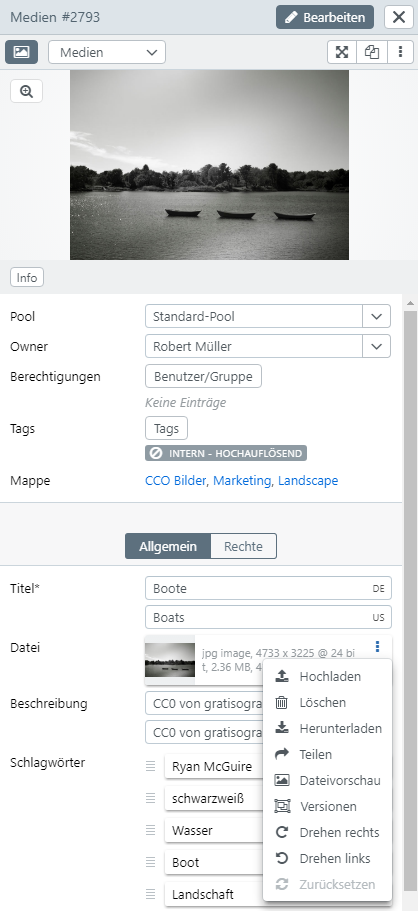
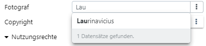
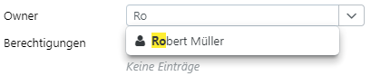

# Data Types (User)

easydb supports various types of data which have different inputs and outputs in the [search](../../search), [detail](../../search/detail), and [editor](../../search/editor).

## One-line text

|Context | Explanation |
| --- | --- |
| Search | Text is split into tokens and searched left-aligned|
| Detail | Text is displayed. With long text it can come to a break|
| Editor | One-line input. |

## One-line text (multilingual)

|Context | Explanation |
|---|---|
| Search | Multilingual text is divided into tokens and searched left-aligned. According to [Language Settings](../../../userprefs/language) one or more languages ​​are searched
| Detail | Text is displayed in the currently set [data languages](../../../userprefs/language). Non-filled languages ​​are not displayed. Each language in the corresponding field is marked with the country code
| Editor | Text can be entered in the currently set [Data languages](../../../userprefs/language)

## Multiline text

The same as *One-Line Text*, with the exception that line breaks are allowed and the input fields are larger.

## Multiline text (multilingual)

As *single-line text (multilingual)*, with the difference that line breaks are allowed and the input fields are larger.

## Simple text (string)

It behaves like *one-line text* with the difference that the search is not divided into individual tokens. The *string* is understood as a unit, thus treated as a single token and searched left and right.

Postcodes are also treated as strings. You can use a wildcard (3* for 3...) to find all postal codes starting with the number 3, for example.

## Date

The date can be entered in the input field shortened as Year and Year + Month. Negative values for BC dates in date fields are also supported.

## Date (Range)

Date specification with start and end date **from - to**.

## Date + Time

Date specification with date and time, B. **12.06.2011 10: 13**

## Number (integer)
Number consisting of a number.

This does not apply to postal codes, which may contain a leading 0. Postcodes are treated as *strings*.

## Number (comma)
Several comma-separated numbers. For example, 1-10,45, 46 or 57

## Boolean (Yes/No Type)

| Area | Note |
|---|---|
|Search |The search is performed by a pull-down search |
|Detail view|If this option is set, the entry "Yes" or optionally "No" is displayed. See also [Options](../../../administration/datamodel/mask) in Mask Settings. |
|Editor|Set via a pull-down.|

## Multiple fields

Multiple fields consist of several data lines. The individual data lines can in turn contain one or more fields. The mask settings can be used to specify whether the fields are displayed horizontally or vertically in the input and output.

The position of the newly inserted data lines can be changed manually. To do this, use the line at the left margin and change the position using drag & drop. The new positioning is saved by saving.

### Horizontal representation

The entry into a field automatically creates another data line. Only rows containing an input are saved. The respective line can be deleted again via the options button <i class="fa fa-ellipsis-v"></i> on the right.

### Vertical representation

In the vertical view, several data lines are displayed as blocks. The lines appear below each other. The separation of the blocks is marked by a blank line in the field column. The following options are available for adding blockbars:

| Selection | statement |
|---|---|
| New Line | Adds a new empty line of data. |
| *Type of object* search | Opens the search for linked object types. The selection appears for linked object type fields in the data line. More than one record can be selected in the search. Then, a corresponding number of data lines are inserted at the end |
| *Object Type* Create new | Appears for linked object type fields in the data line. Use this option to create new records of this linked object type |
| Upload files | If there are file fields in the data line, this selection appears. You can upload files directly. A data line is added to the file at the end |
| At the beginning | Is set to add the new line of data in the first place. |
| At the end | Is set to add the new line at last. |

Select the block line to remove the entire block with <i class="fa fa-minus"></i>.

## File

### Search

In the full text, files with their original filenames are found when *Fulltext* is activated for this field.

In the expert search under *All object types* a common search for *files* appears. In *Common fields*, the search input appears if the field is available for more than one object type. For the *linked object types*, the search entries for the individual object types are displayed.

Depending on the selected file class (*Images*, *Video*, *Audio*, *Office*, *Other*), other selection fields appear. Note that the displayed file extensions are already the result of a visibility search,  If you do not have *TIF* files in the database (or you do not see them because the rights are missing), *TIF* does not appear in the selection.

| Field | | Note |
|---|---|---|
| Class | | Select the file class, the input fields adjust accordingly. The *All* class searches for all file classes
| Type | | In the database for you visible types of files. |
| Unit | Pixel | The *Width* and *Height* fields are interpreted in pixels. |
| | Mm | The fields *width* and *height* are interpreted in millimeters, the *DPI* must be defined
| | Cm | Like *mm* only with centimeters. |
| | KB | Here you can specify the file *size* in kilobytes for the search
| | MB | Here you can specify the file *size* in megabytes for the search
| | GB | Here you can specify the file *size* in Gigabyte for the search
| DPI | @ 150 | 150 DPI for the dimension calculation (150 pixels per inch, i.e. 2.54cm)
| | @ 300 | 300 DPI for the dimension calculation (300 pixels per inch, i.e. 2.54cm)
| | @ 600 | 600 DPI for the dimension calculation (600 pixels per inch, i.e. 2.54cm)
| | @ 1200 | 1200 DPI for the dimension calculation (600 pixels per inch, i.e. 2.54cm)
| Width | of | Lower dimension for the width (for *Pixel*, *mm*, *cm*). |
| | Up | Top measure for the width (for *Pixel*, *mm*, *cm*). |
| Height | of | Lower dimension for the height (for *Pixel*, *mm*, *cm*). |
| | To | Upper measure for height (for *Pixel*, *mm*, *cm*). |
| Format | Any | The format is not considered. |
| | Format | Search Aspect Ratio> 1.05,  Portrait. |
| | Querformat | Search in Aspect Ratio <0.95,  Landscape orientation. |
| | Square | Search in Aspect ratio between 0.95 and 1.05,  square. |
| Filename | | Original filename of the file when uploading. In some cases, this also includes the path to the file. With automatic completion
| Date | Creation date | File is filtered by date of manufacture. Specify a period of time for the search. Only year or year + month is allowed
| | Upload date | File is filtered by upload date. Specify a period of time for the search. Only year or year + month is allowed

### Editor

| Button | Note |
|---|---|
| <code class="button">Upload</code> | File is loaded from your desktop into the easydb. An existing file is overwritten. If you close the editor without saving, the previous file is restored. The metadata for esasydb fields are not mapped. This is only possible in the Uploader and Hotfolder for creating [new records](../../new_objects). For more information on mapping, see [Profile](../../../administration/profiles) |
| <code class="button">Delete</code> | Remove the file. An empty field is saved when saving. You may not be allowed to upload a new file |
| <code class="button">Download</code> | The file is downloaded locally |
| <code class="button">Share</code> | The file is downloaded locally. |
| <code class="button">File preview</code> | Show or hide the preview of the file in the editor. |
| <code class="button">Versions</code> | easydb saves several versions per file. These versions are independent of the versions of the entire data set. You can find out more about versions under [File Versions](../../search/assetversions). |
| <code class="button">90 ° left</code> | Rotate the image to the left. Continuous rotation is not currently planned |
| <code class="button">90 ° right</code> | Rotate the image to the right. Continuous rotation is not currently planned |
| <code class="button">Reset</code> | Resets the image to its original state. |

###  Output

File output provides different tools depending on the file class.

#### Metadata

This tool displays the original metadata of the file at the time of upload.

#### Zoomer

Images can be zoomed. The maximum zoom size is 800%. Note that the easydb Zoomer is only working in 100 steps from 100% onwards, and the pixels are displayed unchanged, ie not interpolated.

The zoomer displays a small card at the bottom right. Use the mouse wheel to zoom in and out. Drag and drop to move the zoomed section. This works also in the map.

#### Viewer

For office documents, easydb offers a single-page viewer. Automatic preview images are calculated with a 1000 resolution.

#### Video

easydb uses HTML5 to view videos,  No additional plugin like Flash or Silverlight is required. Videos are stored in MP4 with AAC codec. The resolution can be changed.

#### Audio

easydb uses HTML to play audio files,  No additional plugin like Flash or Silverlight is required. Audio files are stored in MP3.

## Linked object type

Linked object types are links to other records. The link is made internally via an ID. If changes are made to the linked data record, these are also automatically active in the linked data set.

### Editor

In the editor, linked object types appear first as search.

In the input field, you can quickly search for the linked record according to the rules of the full-text search. For hierarchical data records (as in our example), the position of the found data record is clarified with a path display.

If you click on one of the found records, this is accepted.

Click  <i class="fa fa-ellipsis-v"></i>  to find the record in a pop-up. The search in the pop-up works the same as the main searches.

Select the data to be linked by clicking on it. Use <code class="button">Transfer</code> to close the search and apply the selected record.

After the record is accepted, it is displayed instead of the search field. Depending on the type of display (set in the [Mask](../../../administration/datamodel)), the linked data record is displayed as *Link*, *Card* or *Table*.

### Display

When viewing, you can click <i class="fa fa-ellipsis-v"> </i> on the linked record to get more information.

| Button | Note |
|---|---|
| <i class="fa fa-info-circle"></i> | Opens a pop-up with the detail display for the record
|<i class="fa fa-search"></i> | Retains the entry in the search
| <i class="fa fa-arrow-circle-right"></i> | Displays the record in the sidebar. With appropriate authorization, it can be changed here. The change is adopted easydb-wide. |

### Search

The search for linked data sets can be carried out in the main search in autocompletion by full text. Alternatively, you can search in the search field in the search field as in the editor. When selecting, you can select several linked records. For example, a search in a step can search for records linked to at least one of the searched linked records (OR search).

# Data Types (System)

Pool

> Note that the basic visibility of the *pool* depends on whether pool management is activated in the [data model](../../../administration/datamodel).

### Editor

Select the *Pool* here. Use the search field, <code class="button">Backspace</code> or<code class="button"> Delete</code> to delete and <code class="button">Esc</code> to reset.

A record must always be assigned to a pool.

### Display

> Note that the basic visibility of the *Pool* is defined in the data model in the [Masks](../../../administration/datamodel).

The pool is displayed with a complete path.

### Search

To filter the search for pool, use the[<code class="button">Object Types/Pool</code> Selection](../../search).

## Owner

> Note that the basic visibility of the *owner* is set in the data model for the [masks](../../../administration/datamodel).

Each record has a *owner* (owner). The *Owner* of a record is automatically assigned certain rights. A change of *Owner* requires the right *CHANGE_OWNER*. *Owner* can also be groups in easydb.

> The display and behavior of the owner field is set in the [mask](../../../administration/datamodel).

### Editor

Use <code class="button">Delete</code> or<code class="button"> Backspace</code> to change an owner. A quick search opens. Each record has a *Owner*. When a record is created, the current user is always added to the *Owner*. If you use <code class="button">Esc</code>, close the search result for the first time, and the original *Owner* will be restored the second time.

### Display

The *Owner* is displayed with its display name.

### Search

It can be searched in a search bubbel exactly one *Owner*.

## Authorizations

> Note that the basic visibility of the rights lists in the data model is defined under [Masks](../../../administration/datamodel).

Authorizations can be set up on the data record if the corresponding *object type* provides this in the [data model](../../../administration/datamodel).

### Editor

How to edit rights lists can be found [here](../../../rightsmanagement)

### Display

When output, a list of the users for which access is currently allowed appears.

## Tags

> Note that the basic visibility of the tags is set in the [Tags & Workflows](../../../rightsmanagement/tags) section.

### Editor

The tags that are currently active are displayed on the record. A Tooltip appears above the tags, if an explanatory text is stored. Enable and disable tags as you like. Note that you can only check whether the new combination of tags is allowed for you or not. For example, a [workflow](../../../rightsmanagement/tags) can prohibit the setting or the [legal management](../../../rightsmanagement) generally do not allow this process for you.

### Display

The tags that are currently active are displayed on the record. In some search results, it is possible that only the tags that are marked with an *icon* are displayed. A Tooltip appears above the tags, if an explanatory text is stored.

### Search

The search searches all records in which all actively set tags are set together. If you want to search for alternative tags, you must work with *OR*.

## Edit History (Changelog)

When saving, a copy is stored for each record in the change history.

### Editor

The history versions can be accessed via pull-down in the full-screen editor.

### Detail

The history versions can not be accessed here.

###  Search

The change history in the expert search can be used to search for data records in which certain changes have been made. The search result does not indicate in which history version the search was found.

| Field || Note |
|---|---|---|
| Who | | User or group that made the change. When searching for groups, all users who are members of this group are considered |
| Process | All | Search for inserted and updated records |
| | Created | Only created records are searched |
| | Updated | Search only updated records |
| From | | The change took place after or at this time |
| To | | The amendment took place before or at this time |
| Comment || Search in the comments that were saved when saving. With automatic completion |
