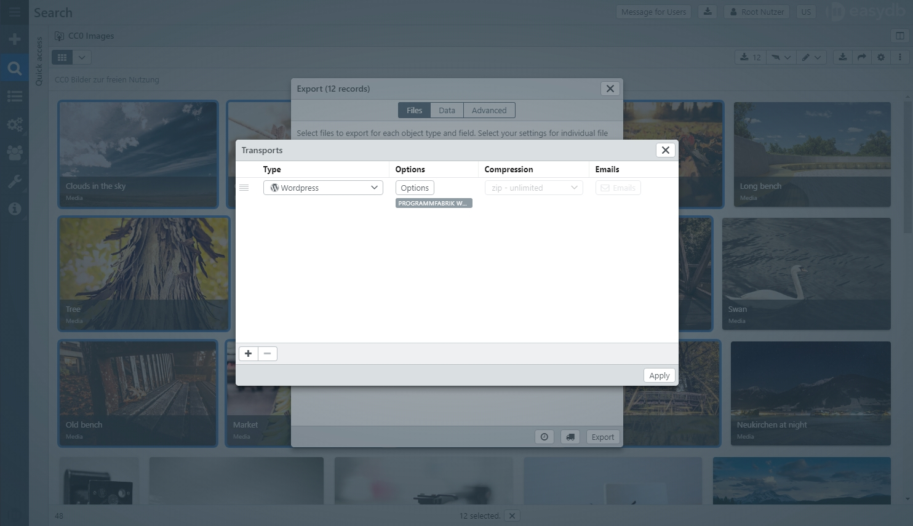
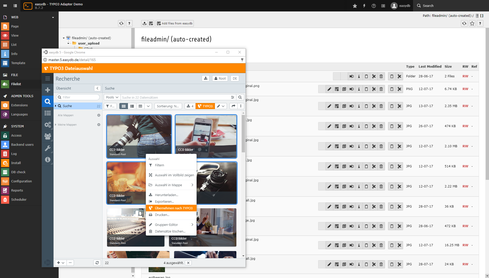

# CMS Plugins

easydb provides an open API and can be extended by features using plugins. It is possible to use existing plugins or add your own plugins to easydb.

Some plugins for easydb are open source and are freely available via the Programmfabrik [GitHub](https://github.com/programmfabrik) repository.

Chargeable Plugins are delivered by Programmfabrik. Some of the available plugins for CMS integration consist of 2 components.

|CMS|	Plugin for easydb	| Plugin for CMS|
|---|---|---|
|Wordpress|	Yes, chargeable |none|
|TYPO3|Yes, chargeable	|Yes, open source via github|
|Drupal|Yes, chargeable	|Yes, open source via github|
|Falcon.io|	Yes, chargeable |none|

## Wordpress {#wordpress}

With this easydb plugin you can transfer media files to Wordpress CMS. In Wordpress they appear in the Media Gallery and can be used as usual. Media files can be sent from easydb and updates can be synchronized. There is no support for deleting media.

The installation to activate the Wordpress plugin in easydb takes 3 steps:

1. [Install Wordpress Plugin](/en/sysadmin/installation/plugin)

2. Configure Access to Wordpress in [Basic Configuration](/en/webfrontend/administration/base-config/cms).

3. Assign the [system rights](/en/webfrontend/rightsmanagement) ** Allow Wordpress Export** to authorized users or groups.

After successful installation and configuration, users can use [Exporter](../../features/export) to create a [Wordpress transport](../../features/export). Only image files are sent.

The following applies to Wordpress for changes to records in easydb:

|Change in easydb | example | change in Wordpress |
|---|---|---|
| Delete a record || Image file is retained in WordPress. |
| File change | crop the image | Image file is created during transport in Wordpress. |
| Change metadata to the record | Change the title and use it as a new filename for export. | During transport, the existing file is retained in WordPress. The name of the file is updated
| Change to the user | by changing the name | image file remains unaffected in Wordpress. |

## TYPO3 {#typo3}

An easydb plugin for TYPO3 (starting with Version 7) and can be used to send records from easydb to TYPO3. They appear in the file list and can then be used as usual. The plugin for setup in easydb can be found on [GitHub](https://github.com/programmfabrik/typo3-easydb-plugin). In the Typo3 Extensions, the easydb plugin for TYPO3 is available and can be installed in the CMS.

After the installation, a button appears above the filelist, with which easydb opens in a new window. Here the data records to be sent to TYPO3 are selected. The "Transfer to TYPO3" option is available via the toolbar and the context menu.

Modified or deleted records in easydb are not synchronized with TYPO3. Changes to the record must be manually transferred in TYPO3.

## Drupal {#drupal}

After the successful [plugin installation](/en/sysadmin/installation/plugin) and configuration in the [basic configuration](/en/webfrontend/administration/base-config/cms), files can be sent from easydb to Drupal.

This easydb plugin supports the transfer of media files from easydb to the Drupal CMS. After transfering the files to Drupal they appear in the media gallery and can be used out of the gallery as usual. Media files can be sent from easydb and updates can be synchronized. Support for deleting media does not exist. Currently only image formats are supported.

## Falcon.io {#falconio}

With the plugin for Falcon.io it possible to export records from easydb and use them in Falcon.io. First the plugin needs to be installed and acivated by a system adminitrator, see [Plugin Installation](/en/sysadmin/installation/plugin). After installing the plugin, one or more Falcon. io instances can be created in the easydb [Basic Configuration](../../../administration/base-config).

Records can be exported from easydb to Falcon.io after successful installation. In Falcon.io they appear in the content pool and can be used as usual.
A Falcon.io-transport can be sent from the easydb asset browser or from the list view. If the Falcon.io plugin is active, right-click on one or more records and select "Send to Falcon. io".
