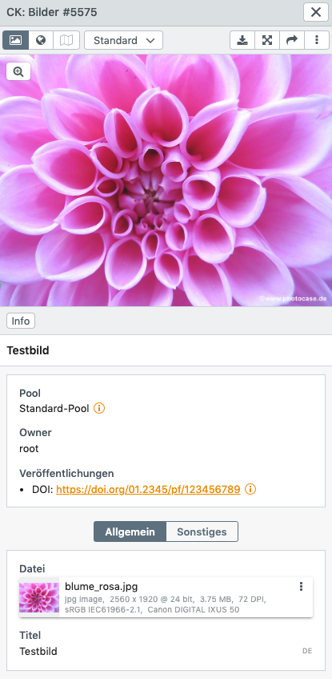

# Veröffentlichungen mit DOIs

DOIs (Digital Object Identifier) sind eindeutige und dauerhafte digitale Identifikatoren für physische oder digitale Objekte (in diesem Fall für easydb-Datensätze) die von sog. Collectoren vergeben werden. Collectoren sind Registrierungsstellen, die DOIs oder URNs vergeben, wie z.B. [DataCite](https://doi.datacite.org/). 

Um eine DOI-Vergabestelle wie z.B. DataCite anzubinden, muss ein sog. [Workflow](../../../rightsmanagement/tags) konfiguriert werden, der z.B. bei der Vergabe eines Tags "Veröffentlichen" einen [Webhook](../../../../../en/technical/plugins/webhooks/webhook) aufruft. Der Code des Webhooks registriert eine URL bei der DOI-Vergabestelle und nutzt [/api/publish](../../../../../en/technical/api/publish) um die vergebene DOI an die easydb zurückzumelden.

Die angebundenen Collectoren müssen in der [Basis-Konfiguration](../../../administration/base-config/export) definiert werden.

Sofern im Datenmodell an der [Maske](../../../administration/datamodel/mask) aktiviert, können diese Veröffentlichungen eines Datensatzes anschließend in der Detailansicht eingesehen werden. 

Die DOI-Vergabe sowie die Erstellung des Webhooks erfolgt nicht durch die Programmfabrik GmbH. Ein Beispiel-Plugin ist auf [GitHub](https://github.com/programmfabrik/easydb-publish-datacite) zu finden.