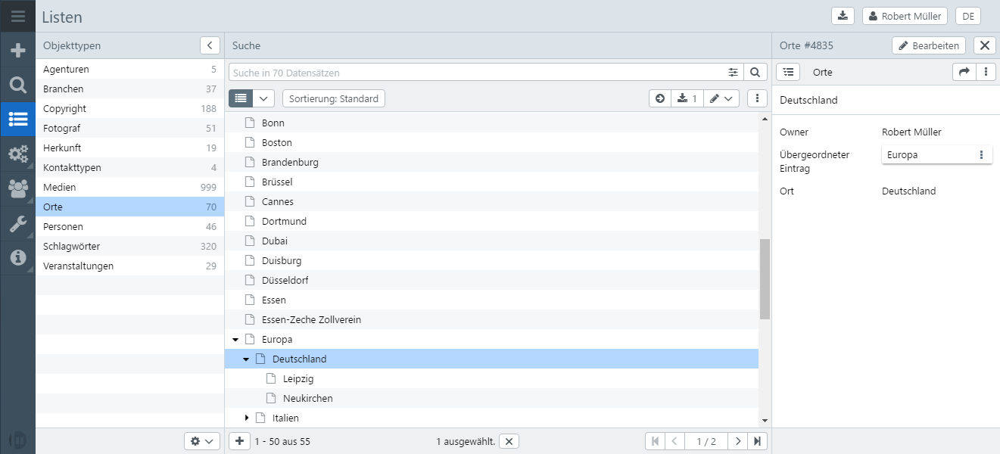

# Lists

Under the menu item Lists, records are managed according to their assignment to object types.

In the left sidebar is the list of available object types. The number of records associated with this object type is indicated on the right. The number includes records of all hierarchy levels. Clicking on an object type displays the list of available records for this object type in the search. Hierarchically subordinate records can be displayed or hidden using the arrow button.

You can use the search field to search the records of the selected object type. On the right side of the search field the search can be refined via the expert search. Below the search field, the number of hits per page and the sorting preferences can be selected. The options button  on ​​the right above the results offer different functions for processing the data records. The functions can also be called up via a context menu by operating the right mouse button on a data record.

Records of the list can be displayed and edited in the right sidebar or in the full screen. Using the <code class="button">+</code> at the bottom of the search view, authorized users can add new records to the list.
