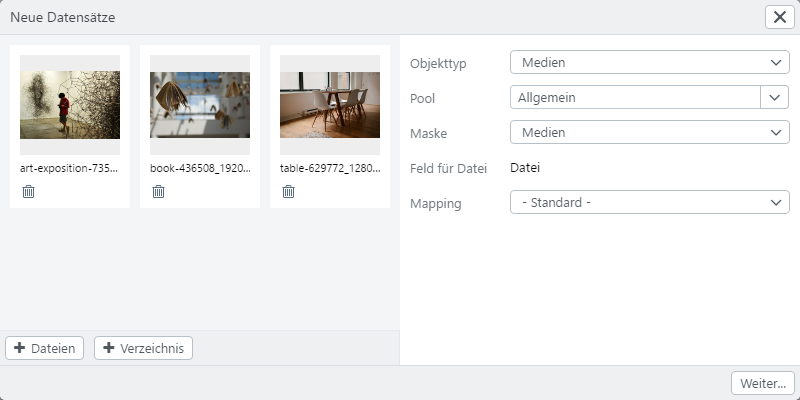

# Neue Datensätze

## Neue Datensätze anlegen

Um Datensätze für Haupt-Objekttypen in die easydb zu bekommen, können Sie von Ihrem Desktop aus einfach per Drag & Drop diesen Dialog öffnen. Alternativ gelangen Sie über das Hauptmenü hierher.

|Einstellung|Erläuterung|
|---|---|
|Objekttyp|Der Objekttyp, für den die neuen Datensätze angelegt werden. Hier sind erstmal nur Haupt-Objekttypen aufgeführt. Wenn Sie die ALT-Taste halten und dann auf das Pulldown klicken, erscheinen alle Objekttypen mit zusätzlichen Informationen.|
|Pool|Auswahl des Pools, in den die Datensätze angelegt werden sollen. Die Auswahl des Pools bestimmt die Auswahlmöglichkeit der *Maske* und des *Feldes*.|
|Maske|Maske, die zur Bearbeitung verwendet werden soll. Entsprechend der Einstellungen im Rechtemanagement, sehen Sie hier eine oder mehrere Masken.|
|Feld für Datei|Wenn Sie Dateien hochladen wollen, bestimmen Sie hier das Feld, für welches die Dateien bestimmt sind. Beachten Sie, dass in diesem Schritt Dateien gruppenweise immer nur einem Feld zugeordnet werden können. Wenn Sie also für einen Datensatz zwei Dateien hochladen möchten (z.B. *Vorderseite* und *Rückseite* eines Objektes), so können Sie das nur im Editor tun.|
|Mapping|Wählen Sie ein Mapping aus, um Metadaten aus den Dateien in die Eingabe-Maske zu übernehmen.|

In der großen Fläche gibt es noch die Möglichkeit mit <code class="button">+Dateien</code> und <code class="button">+Verzeichnis</code> weitere Dateien hochzuladen. <code class="button">+Verzeichnis</code> wird derzeit nur in *Google Chrome* angeboten. Sie können auch weitere Dateien per Drag & Drop in diese Fläche ziehen.

Unten links wird der Upload-Status angezeigt. Über "Abbrechen" kann das Hochladen der Dateien abgebrochen werden.

Klicken Sie auf <code class="button">Weiter...</code>, um den Editor zu öffnen.

## Neue Datensätze Editor

Auf der linken Seite sehen Sie die Liste mit den neuen Datensätzen, die angelegt werden, wenn Sie auf <code class="button">Speichern</code> klicken. Zuoberst gibt es *Vorlage*. Die Eingaben hier beziehen sich auf alle Datensätze, die Sie anlegen.

Sie können auf *Vorlage* oder auf einen anderen Datensatz klicken, um die Felder im Editor mit den entsprechenden Daten zu befüllen. Durch Vorlage gesetzte Daten erscheinen als Platzhalter in den Eingabefeldern des eigentlichen Datensatzes. Hier können Sie durch die Auswahl der einzelner Datensätze abweichende Angaben machen.

Benutzen Sie das Menü unten links, um weitere Datensätze in den Editor zu laden. Dabei können Sie wieder Dateien oder Verzeichnisse hochladen oder leere Datensätze erzeugen.

Der markierte Datensatz kann im Menü unten links mit <i class="fa fa-minus"></i> entfernt werden.

Auf der rechten Seite sehen Sie im Bild die *Datei-Vorschau* mit aktiviertem Zoom.

Oben rechts gibt es ein Pulldown zum Umschalten in eine andere Maske, wenn mehrere Masken verfügbar sind.

Nach der Eingabe kann der Vorgang über <code class="button">Speichern</code> abgeschlossen werden. Gibt es ein Pflichtfeld, muss dieses ausgefüllt werden, bevor der Vorgang gespeichert werden kann. Ist für das Pflichtfeld Mehrsprachigkeit vorgesehen, muss nur eins der Felder befüllt sein, um den Vorgang abzuschließen.

Mehr Informationen zum Editor finden Sie im entsprechenden Kapitel [Editor](../search/editor).

## Dubletten-Check

Beim Upload neuer Datensätze überprüft easydb, ob der Datensatz bereits enthalten ist. Sie können dann entscheiden, ob Sie diesen Datensatz <code class="button">Überspringen</code> oder dennoch <code class="button">Importieren</code>.

<code class="button">Überspringen</code> Sie die Dublette, wird diese aus dem Upload-Vorgang entfernt und der Upload-Prozess mit den übrigen Datensätzen fortgeführt, sofern mehrere Datensätze ausgewählt wurden.

Stimmen Sie mit <code class="button">Importieren</code> der Übernahme der Dublette zu, können Sie mit dem Anlegen des Datensatze wie gewohnt fortfahren.

Der Dubletten-Hinweis erscheint für jeden doppelten Datensatz einzeln. Über die Check-Box "Auf alle anwenden" kann der Vorgang auf alle Dubletten, die sich in dem aktuellen Upload-Prozess befinden, einmal übertragen werden.

Technisch erfolgt die Dubletten-Prüfung durch Berechnung eines Prüfwertes (MD5 Hash), welcher auch die zum Beispiel in Bildern enthaltenen IPTC, XMP und EXIF Metadaten miteinbezieht.

## Serienbilder und Versionen {#batch}

Beim Hochladen von Datensätzen in easydb können bereits im Editor für neue Datensätze Serienbilder und Versionen hergestellt werden.

Wenn die Option für den Objekttyp konfiguriert ist, kann in `Feld für Datei` festgelegt werden, wie die hochgeladenen Datensätze und dazugehörige Dateien/Datensätze in easydb abgelegt werden.

Ist **Versionen erkennen** aktiv für den Upload, werden Dateien, die den gleichen Dateinamen haben und sich nur anhand der Dateiendung unterscheiden, in easydb als **Versionen** erkannt (z.B. `foto.jpg` und `foto.png`).

Die erste Datei wird als Original angelegt, alle nachfolgenden als Version. Dies kann in der Vorlage am Datensatz dann nochmal geändert werden, indem in dem Feld für die Datei die Versionen aufgerufen und manuell verschoben werden.

Ist **Serien erkennen** für den Upload aktiviert, werden diese anhand des Dateinamen erkannt und automatisch zu einem Datensatz gruppiert, sofern das Datenmodell für diesen Objekttyp mehrere Dateien pro Datensatz vorsieht. Dazu muss in `Feld für Datei` ein Dateifeld innerhalb eines Mehrfachfelds oder innerhalb eines revers verlinkten Objekts ausgewählt werden.

Die Unterscheidung erfolgt durch die Notation `"_"` (Unterstrich), `" "` (Leerzeichen) oder "-" (Bindestrich), gefolgt von einer Zahl und der Dateiendung (z.B. `datei-1.jpg`, `datei-2.jpg` oder `bild_1.png`, `bild_2.png`).

Bitte beachten Sie, dass aus einer Gruppe von Dateien wie `image.jpg`, `image_01.jpg`, `image_02.jpg` nur die Dateien `image_01.jpg` und `image_02.jpg` als eine Serie von Dateien erkannt wird, während `image.jpg` nicht als Teil der Serie, sondern als eigenständiges Objekt betrachtet wird.

> HINWEIS: Sind **Versionen** deaktiviert und **Serien** aktiv, werden auch Dateien mit identischem Namen, die sich nur anhand der Dateiendung unterscheiden, als Serie erkannt und abgelegt. Sind beide aktiv, wird diese Art der Datei-Notation wie oben beschrieben als Version erkannt.
