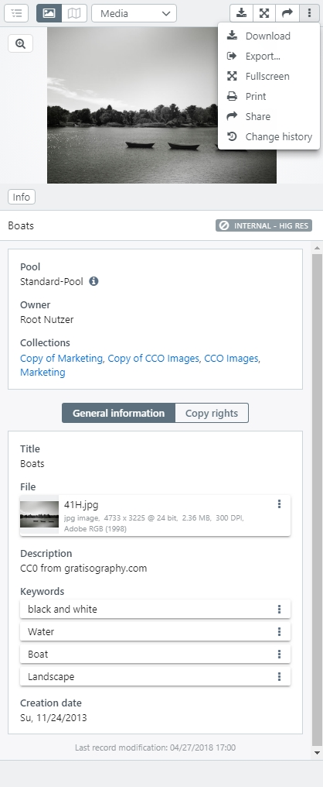
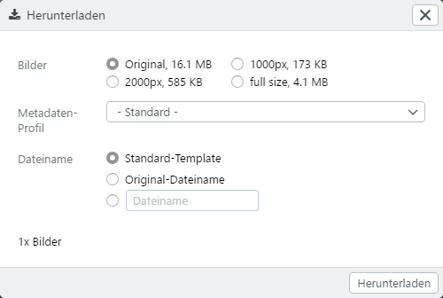

# Detail view

The detail view for a data record appears either on the right side of the sidebar or on the full screen.

## Sidebar {#sidebar}

In the sidebar, the [File Viewer](../../features/datatypes) appears in the upper area, which you can switch on and off with <i class="fa fa-image"></i>. This stetting automatically will be saved for your user profile.

|Button|Description|
|---|---|
|<i class="fa fa-pencil"></i><code class="button">Edit</code>|Appears, if the user has edit rights for the record. By pressing the button the detail view turns to editor mode.|
|<i class="fa fa-times"></i>|Close the detail view in sidebar.|
|| Appears for hierarchical object types. Shows and hides the hierarchy tree next to the detailed view.|
|<i class="fa fa-image"></i>|Shows or hides the file preview.|
|<i class="fa fa-map-o"></i>|If the file(s) contain geo-coordinates, these are displayed on a map. Map views are included by default in easydb as a plug-in and can be activated via the [Basic configuration](../../../administration/base-config/extended).|
|<code class="button">Mask</code>| If several masks are available for the record, authorized users can switch the maske here. Otherwise, only the name of the currently used mask is displayed. The same applies, if only one mask exsist for the object type.|
|<i class="fa fa-download"></i>|Opens a selection dialog for a file download. Depending on the configuration, different sizes, mappings and the assignment of a file name are available (see below).|
|<i class="fa fa-sign-out"></i>|Opens a selection dialog for the [export ](../../features/export) of the record. Different settings for the file, the metadata and the export itself can be made via the tabs in the dialog.|
|<i class="fa fa-arrows-alt"></i>|Opens the detail view in full screen mode.|
|<i class="fa fa-print"></i> Print...|Available via the option menu. Opens the print dialog for the record. For printing, the detail view or the text view and a high or low resolution can be selected.  |
|<i class="fa fa-share"></i> Share |Creates a link to the record which can be passed on to authorized users.  *Note: If you press `SHIFT` or `Alt` at the same time as clicking on the share button, an url with the current session is created for the deep-link url to /api/objects. This way the record can be reached for test purposes, even if it is not or not yet released for the deep-link user.*|
|<i class="fa fa-history"></i> Change history|Displays the change history to authorized users (see [System Rights](/en/webfrontend/rightsmanagement)). The changes are displayed chronologically with time and date, type of change and the corresponding user. |
|Last modification| This is a hint at the bottom of the sidebar which indicates when the record has been modified the last time. |

### Download {#download}

Select a download size for the file you want to download. Select an option whether to export the metadata profile and which file name you prefer. You can also enter your own filename. You can use the substitutions that are also available for the object types under [*File names for export and download*](../../../rightsmanagement/objecttypes).

The download is a ZIP file. 

easydb supports the download of different file sizes (variants). By default the versions 250px (minimum length), 1.000px (maximum length), 2.000px (maximum length) are calculated. [Custom variants](/en/sysadmin/configuration/easydb-server.yml/versions) can be configured by a system administrator using a .yml file.

## Full screen

You can scroll through lists in full screen. At the bottom there is an overview with previews. At the top left, you can use <code class="button">Detail</code> to display more information about the record. With <i class =" fa fa-expand "> </i> you can enlarge the full screen to the whole screen and with <i class="fa fa-times"> </i> you close the full-screen view. In the upper left corner <i class="fa fa-search-plus"> </i>, the zommer is activated to show details enlarged.

With <i class="fa fa-chevron-left"> </i> and <i class = "fa fa-chevron-right" aria-hidden = "true"> </i> next to the displayed record can move to the next Record. The preview bar can be moved to the left and right using the appropriate icons at the edge. Records containing other assets are grouped by a border, as shown in the screenshot.

> NOTE: If the full-screen icon is gray (= disabled) in the full-screen view in the asset browser as well as in the asset detail, the user has not activated full-screen mode on his browser.

## Share 

From the top of the Data View, you can share <i class="fa fa-share"></i> the record or the file that is associated with the record from the corresponding field. For more information on sharing and releasing via links, see the [DeepLinks](../../features/deeplinks) section.

## Hirachical object type Objekttypen

## Thumpnails dispalyed in map {#geotag}

The detail view offers an option to display files in maps, if they contain geocoordinates in the metadata. Next to the button for showing and hiding the file preview is a button with a map. These buttons can be used to switch between the views. The preview of the file is shown by a small thumbnail on the included [OpenStreetMap](http://www.openstreetmap.org).  

The geodata must be included in the file. The representation in maps does not apply if the geodata is only written into the metadata of the data set. 

The display of geotags in maps is a plugin for easydb, which is delivered as standard (incl. YML-config). It can be activated via a checkbox in the [Basic Configuration](/en/webfrontend/administration/base-config) in the tab "Design". It is also possible to individualize the display in maps for each object type by changing the settings in the masks.
