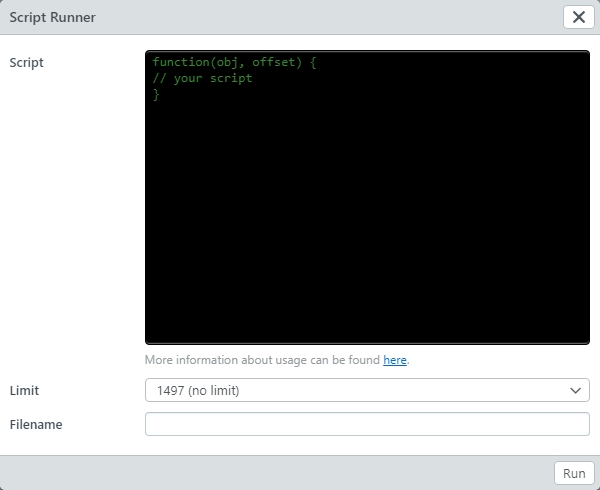

# Script Runner

> The Script Runner needs the system right **root** or **frontend_features[script_runner]**.

The Script Runner offers a simple way to collect data from a search using small Javascript snippets and download it as e.g. CSV.


After a search has been performed, the Script Runner can be found by **Run script...** via the options menu.



|Field| Explanation |
|---|---|
|Limit | Number of records on which the script is running. You can select *10*, *100* or the current number of all records. The Script Runner always fetches the records in blocks of *100* from the server, regardless of the selected limit. Use *10* or *100* for a quick test of your script.|
|Script|Script, which is running for each record. The execution takes place in a function ```function(obj, offset) { .... }```. Reed more below.|
|Filename|File name for the download. If the field is left empty, a default name is used. Note that a file is only offered for download if there is an output with ```download(text, delim)```.|

After the script and all settings are done, click <code class="button">Run</code> to execute the script.

## Script functions

```javascript
function(obj, offset) {
  // your
  // script
  // lives
  // here
}
```

The script gets two variables:

* **obj** The current record as JSON-Map.
* **offset** The current Offset as Integer.

If you want to abort the script run, use

```javascript
return false
```

Other return-values are ignored.

A simple script allows a first overview in the browser console:

```javascript
console.debug(offset, obj._objecttype);
```

The offset and the current object type are displayed here in the console.

> Only use **obj** to output the complete object. This makes it easy to view the received records.

As example you can use the following script to output the original file names of all found records. We assume that the object type **medien_ab** with the field **medium** exists in the data model.

```javascript
if (offset==0) {
  // output header for the CSV file
  download("system_object_id,filename")
}
if (!obj.medien_ab) {
  // check for existance of the right objecttype
  return
}
if (obj.medien_ab.medium && obj.medien_ab.medium.length > 0) {
  // access the first asset of the column "medium", the
  // first is the preferred asset, which the user sees in all
  // views
  var fn = obj.medien_ab.medium[0].original_filename
  // console.debug(offset, fn)
  download(obj._system_object_id+',"'+fn.replace('"','""')+'"');
}
```

## download(text, delim)

The function **download(text, delim)** copies a line of text into the file, which is supposed to be output. At the end, all lines are connected.

* **text** The output text.
* **delim** This string is automatically added to the text. By default it is **\n**


## Complete example

This example gets the file names from all data records, splits them to `/` or `\` and creates a keyword for each part of the path.

The first column contains the `System-Object-ID` and the 2nd column `Keywords`. All keywords are inserted, one line per keyword.

This format is suitable for the easydb CSV importer.

```javascript
var fn, id, keywords, rows, values, row_text

if (offset == 0) {
  download('"_system_object_id";"keywords"')
}

if (!obj.medien.datei) {
  return
}

fn = obj.medien.datei[0].original_filename
sid = obj._system_object_id
keywords = fn.split(/[/\\]/)
rows = []

for (idx in keywords) {
   keyword = keywords[idx]
   if (keyword.length == 2 && keyword.indexOf(":") == 1) {
      // keyword is a drive letter, skip
      continue;
    }
    rows.push([keyword])
}

if (rows.length == 0) {
  // nothing to update
  return
}

values = [
 sid,
 // for nested imports, the cell itself needs to be csv
 // escaped
 new CUI.CSVData({rows: rows}).toText()
]

// compile row, suitable for CSV Importer
row_txt = new CUI.CSVData({rows: [values]}).toText()

download(row_txt)
// console.debug(id, fn, keywords, values, row_txt)
```
