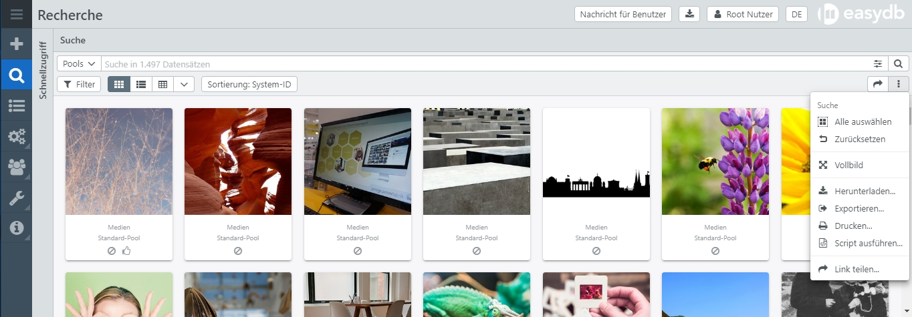

# Script Runner

Der Script Runner ist eine einfache Möglichkeit, Daten aus einer Suche mittels kleiner Javascript Snippets zu sammeln und beispielsweise als CSV herunterzuladen.



In der Suche ist der Script Runner im Kontextmenü unter **Script ausführen...** zu finden, nachdem eine Suche ausgeführt wurde.


|Feld| Erklärung|
|---|---|
|Limit | Anzahl der Datensätze auf denen das Script ausgeführt wird. Es können *10*, *100* oder die aktuelle Anzahl aller Datensätze ausgewählt werden. Der Script Runner holt die Datensätze immer in 100er Blöcken vom Server, unabhängig von dem gewählten Limit. Benutzen Sie *10* oder *100* um Ihr Script schnell zu testen.|
|Script|Das Script welches je Objekt ausgeführt wird. Die Ausführung erfolgt in einer Function ```function(obj, offset) { .... }```. Mehr dazu unten.|
|Dateiname|Der Dateiname für den Download. Wenn nichts angegeben wird, wird ein Standardname verwendet. Beachten Sie, dass nur dann eine Datei zum Download angeboten wird, wenn mit ```download(text, delim)```, etwas ausgegeben wurde.|

Nach Script-Eingabe und allen Einstellungen, klicken Sie auf <code class="button">Ausführen</code>, um die Scriptausführung zu starten.

## Script-Funktion

```javascript
function(obj, offset) {
  // your
  // script
  // lives
  // here
}
```

Das Script erhält zwei Variablen:

* **obj** Das aktuelle Objekt als JSON-Map.
* **offset** Den aktuellen Offset als Integer.

Das Script kann mit

```javascript
return false
```

die Ausführung abbrechen. Andere return-Values werden ignoriert.


Ein einfaches Script erlaubt einen ersten Überblick in der Console des Browsers:

```javascript
console.debug(offset, obj._objecttype);
```

Hier wird in der Console der Offset und der aktuelle Objekttyp ausgegeben.

> Benutzen Sie nur **obj** zum Ausgeben des kompletten Objektes. Damit lassen sich die empfangenen Daten einfach anschauen.

Um beispielsweise den Original Dateinamen aller gefundenen Objekte auszugeben, können Sie folgendes Script benutzen. Wir nehmen an, dass im Datenmodell der Objekttyp **medien_ab** mit dem Feld **medium** existiert.

```javascript
if (offset==0) {
  // output header for the CSV file
  download("system_object_id,filename")
}
if (!obj.medien_ab) {
  // check for existance of the right objecttype
  return
}
if (obj.medien_ab.medium && obj.medien_ab.medium.length > 0) {
  // access the first asset of the column "medium", the
  // first is the preferred asset, which the user sees in all
  // views
  var fn = obj.medien_ab.medium[0].original_filename
  // console.debug(offset, fn)
  download(obj._system_object_id+',"'+fn.replace('"','""')+'"');
}
```

## download(text, delim)

Die Funktion **download(text, delim)** übernimmt eine Zeile Text in die auszugebene Datei. Am Ende werden alle Zeilen verbunden ausgegeben.

* **text** Der auszugebene Text.
* **delim** Dieser String wird automatisch an den Text angefügt. Standardmässig ist das **\n**


## Vollständiges Beispiel

Das vorliegende Beispiel holt aus allen Datensätzen die Dateinamen, zerteilt sie an  `/` oder `\` und erzeugt für jeden Teil des Pfades ein Keyword.

Die erste Spalte erhält die `System-Objekt-ID` und die 2. Spalte `Keywords`. Alle Keywords werden eingefügt, je Keyword eine Zeile.

Dieses Format eignet sich dann zum Einlesen im CSV-Importer der easydb.

```javascript
var fn, id, keywords, rows, values, row_text

if (offset == 0) {
  download('"_system_object_id";"keywords"')
}

if (!obj.medien.datei) {
  return
}

fn = obj.medien.datei[0].original_filename
sid = obj._system_object_id
keywords = fn.split(/[/\\]/)
rows = []

for (idx in keywords) {
   keyword = keywords[idx]
   if (keyword.length == 2 && keyword.indexOf(":") == 1) {
      // keyword is a drive letter, skip
      continue;
    }
    rows.push([keyword])
}

if (rows.length == 0) {
  // nothing to update
  return
}

values = [
 sid,
 // for nested imports, the cell itself needs to be csv
 // escaped
 new CUI.CSVData({rows: rows}).toText()
]

// compile row, suitable for CSV Importer
row_txt = new CUI.CSVData({rows: [values]}).toText()

download(row_txt)
// console.debug(id, fn, keywords, values, row_txt)
```
