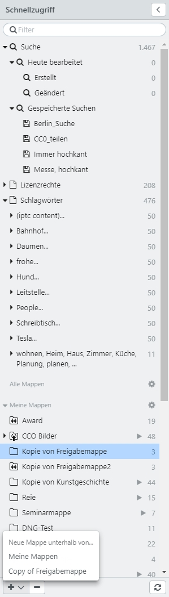

# Schnellzugriff

Über den Schnellzugriff werden Zusammenstellungen von Datensätzen verwaltet. Das sind dynamische Mappen, wie gespeicherte Suchen und ad hoc Mappen für tagesaktuell bearbeitete Datensätze und  manuelle Zusammenstellungen, wie eigene und freigegebene Mappen. Mit <code class="button"> < </code> kann der Schnellzugriff ein- und ausgeblendet werden.

* [Gespeicherte Suche](search)
* [Kategoriebrowser](category)
* [Mappen](collection)

## Übersicht im Schnellzugriff

easydb bietet im Schnellzugriff folgende Speicheroptionen an:

|Mappe|Untergeordnet|Erklärung|
|---|---|---|
|<i class="fa fa-search"></i> Suche||Entspricht der aktuellen Anzahl von Datensätzen, die Ihnen in easydb zur Verfügung steht. Aus einer Mappe gelangen Sie über diesen Weg wieder direkt in die Hauptsuche. Die Zahl rechts zeigt die Anzahl verfügbarer Datensätze an. |
||<i class="fa fa-search"></i> Heute bearbeitet|Enthält die von Ihnen heute bearbeiteten Datensätze. Hierfür wird das aktuelle Tagesdatum verwendet, d.h. 0:00 bis 23:59 des aktuellen Tages. Für komplexere Suchen, die zeitlich weiter zurückgehen, kann eine Abfrage der [Änderungshistorie](../../features/datatypes) in der [Expertensuche](../../search) durchgeführt werden. Die Zahl rechts zeigt die Summe tagesaktuell von Ihnen geänderter Datensätze an.|
||<i class="fa fa-search"></i> Erstellt|Die heute von Ihnen erstellten Datensätze. Die Zahl rechts zeigt die Anzahl tagesaktuell von Ihnen erstellter Datensätze an.|
||<i class="fa fa-search"></i>Geändert|Die heute von Ihnen geänderten Datensätze. Die Zahl rechts zeigt die Anzahl tagesaktuell von Ihnen geänderter Datensätze an.|
|<i class="fa fa-search"></i> Gespeicherte Suchen||Die Treffer einer Suche können über das Optionen-Menü unter <i class="fa fa-floppy-o"></i> gespeichert und an dieser Stelle wieder erneut aufgerufen werden. Diese Mappe ist dynamisch. Hier werden alle Datensätze gezeigt, die für die gesetzten Kriterien der gespeichert Suche passen. Die Anzahl ist dynamisch.|
|<i class="fa fa-file-o"></i> Kategoriebrowser||Wenn aktiviert, erscheinen hier Listen von Nebenobjekttypen, über die ein schneller Zugriff auf verknüpfte Datensätze möglich ist. Der Kategoriebrowser ist eine Filtermethode, die als Schnellzugriffsvariante dient und entsprechend der Eingabe über die Expertensuche agiert. Die Zahl rechts neben der Kategorie zeigt die Summe der Einträge, die zur Kategorie gehören. Die Zahl rechts neben den einzelnen Kategorieeinträgen zeigt die Anzahl der verknüpften Datensätze an. |
|Meine Mappen|| Vom Benutzer angelegte Zusammenstellungen von Datensätzen. Die Zahl rechts neben der Mappe zeigt die Anzahl der Datensätze, die in dieser Mappe verknüpft sind, an. |
|Freigegebene Mappen|| Zusammenstellungen von Datensätzen, die von anderen Benutzern freigegeben wurden. Es gelten die Berechtigungen an der Mappe, die der Ersteller zugewiesen hat. Die Zahl rechts zeigt die Anzahl verknüpften Datensätze in dieser Mappe an.|

## Suchen im Schnellzugriff

Über das Suchfeld kann der Schnellzugriff durchsucht und auf entsprechende Treffer eingegrenzt werden. Durchsucht werden die Bezeichnungen der gespeicherten Suchen, der Einträge aus dem Kategoriebrowser sowie der Mappen (nicht aber die damit verknüpften Datensätze). Angezeigt werden dann nur übereinstimmende Einträge. Nicht passende Einträge werden aus dem Schnellzugriff ausgeblendet. 

