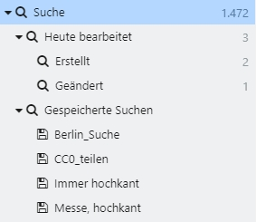

# Gespeicherte Suche

easydb bietet die Möglichkeit, Suchen zu speichern und über den Schnellzugriff mit einem Klick jederzeit wieder aufzurufen. Hierfür kann in der Recherche ein Suchauftrag über eine einfache Sucheingabe oder über die Expertensuche angelegt werden. Im Optionen-Menü rechts oberhalb der Treffen wird die Suchanfrage mit *Speichern...* unter *Suche* gesichert. Mit dem Speichern öffnet sich ein Dialog, in dem ein Name für die Suche vergeben werden kann.

Die gespeicherte Suche erscheint im Schnellzugriff unter *Gespeicherte Suchen* und kann von dort wieder aufgerufen werden. Die gespeicherten Sucheinträge werden wieder in die Suchleiste übernommen und können da wieder verändert werden.

## Funktionen im Kontextmenü

Für die gespeicherten Suchen stehen einige Funktionen über das Kontextmenü zur Verfügung. Durch Klick auf die rechte Maustaste stehen folgende Optionen zur Verfügung

|Funktion|Detail|Erläuterung|
|---|---|---|
|<i class="fa fa-share"></i> Freigabe... ||Eine gespeicherte Suche kann ähnlich wie eine Mappe für andere Nutzer freigegeben werden. Hierfür öffnet ein Kontextmenü, in dem die Freigabebestimmungen erteilt werden. |
||Für Benutzer/Gruppen/E-Mail|Hier kann für Benutzer oder Gruppen aus easydb eine Freigabe definiert werden. Benutzer mit entsprechendem Systemrecht können auch eine E-Mail angeben, für die dann ein neuer Nutzer angelegt wird. Weitergegeben werden die Sucheinstellungen. Bedenken Sie, dass die Benutzer möglicherweise andere Ergebnisse sehen, wenn deren Rechteumfang nicht ausreicht für die gleichen Ergebnisse.  |
||Link erzeugen für externen Zugriff | Hier kann ein Link für Benutzer erzeugt werden, die nicht in easydb registriert sind (hierfür muss der *Pseudo-Benutzer zur Ansicht einzelner Collections* im im Gruppenmanager konfiguriert sein). Weitergegeben werden die Sucheinstellungen. Bedenken Sie, dass die Empfänger möglicherweise andere Ergebnisse sehen, wenn deren Rechteumfang nicht ausreicht für die gleichen Ergebnisse.|
|<i class="fa fa-cog"></i> Einstellungen|Name|Hier kann der Name und eine Beschreibung der gespeicherten Suche bearbeitet werden. Referenz und Kurzname werden in der Regel nur für Exporte der Datenbank benötigt.  |
||Beschreibung||
||Kurzname|Freitextfeld. Kann aus technischer Sicht für Exporte der Datenbank genutzt werden. |
||Referenz|Freitextfeld. Kann aus technischer Sicht für Exporte der Datenbank genutzt werden.|
||Link zur Mappe|Bei dem Link handelt es sich um den easydb internen Link. Ohne Freigabebestimmungen über den Reiter Teilen, können andere easydb Benutzer mit diesem Link nicht auf die Suche zugreifen.|
|<i class="fa fa-pencil"></i>Umbenennen...||Hier kann der Name der gespeicherten Suche geändert und bei Mehrsprachigkeit Übersetzungen hinzugefügt werden.|
|Mappe löschen...||Löscht die gespeicherte Suche.|

## Überblick aller Suchen im Schnellzugriff

Innerhalb der gespeicherten Suchen gibt es auch einen Schnellzugriff auf tagesaktuell erstellte oder veränderte Datensätze.

|Mappe|Untergeordnet|Erklärung|
|---|---|---|
|<i class="fa fa-search"></i> Suche||Entspricht der aktuellen Anzahl von Datensätzen, die Ihnen in easydb zur Verfügung steht. Diese Zeile kann auch angesteuert werden, um aus einer Mappe direkt wieder in die Hauptsuche zu gelangen. Die Zahl rechts zeigt die Summe verfügbarer Datensätze an. Wenn weniger Datensätze in der Trefferanzeige angezeigt werden, kann es daran liegen, dass nicht alle Pools oder Objekttypen in den Suchbestimmungen neben der Sucheingabe aktiv sind. |
||<i class="fa fa-search"></i> Heute bearbeitet|Enthält die von Ihnen heute bearbeiteten Datensätze. Hierfür wird das aktuelle Tagesdatum verwendet, d.h. 0:00 bis 23:59 des aktuellen Tages. Für komplexere Suchen, die zeitlich weiter zurückgehen, kann eine Abfrage der [Änderungshistorie](../../../features/datatypes) in der [Expertensuche](../../../search) durchgeführt werden. Die Zahl rechts zeigt die Summe tagesaktuell von Ihnen erstellter und geänderter Datensätze an.|
||<i class="fa fa-search"></i> Erstellt|Die heute von Ihnen erstellten Datensätze. Die Zahl rechts zeigt die Anzahl tagesaktuell von Ihnen erstellter Datensätze an.|
||<i class="fa fa-search"></i>Geändert|Die heute von Ihnen geänderten Datensätze. Die Zahl rechts zeigt die Anzahl tagesaktuell von Ihnen geänderter Datensätze an.|
|<i class="fa fa-search"></i> Gespeicherte Suchen||Die Treffer einer Suche können über das Optionen-Menü unter <i class="fa fa-floppy-o"></i> gespeichert und an dieser Stelle wieder erneut aufgerufen werden. Diese gespeicherten Suchen verhalten sich dynamisch. Hier werden alle Datensätze gezeigt, die für die gesetzten Kriterien der gespeichert Suche passen. Enthält eine gespeicherte Suche das Schlagwort "Wolke", werden bei jedem neuen Aufruf die aktuell mit dem Schlagwort verknüpften Datensätze angezeigt. |

