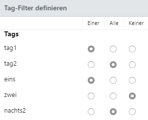

# Rechtemanagement

Das Rechtemanagement in der easydb ist mehrstufig, additiv und in vielen Teilen durch den Administrator in Echtzeit anpassbar. Das Rechtemanagement verändert die Auffindbarkeit und Sichtbarkeit von Daten und Datensätzen.

> HINWEIS: In Mehr-Benutzer-Umgebungen können Rechte in easydb additiv hinzugefügt werden. Das bedeutet, dass Rechte, die einem Benutzer an einer Stelle zugewiesen werden, ihm an anderer Stelle nicht wieder entzogen werden können.

Grundsätzlich besteht die Möglichkeit

1) die Rechte und Berechtigungen auf der Ebene des Systems zu definieren, um damit den Zugriff für Benutzer und Benutzergruppen in definierte Bereiche zu steuern und
2) Berechtigungen auf der Ebene der Inhalte zu konfigurieren und damit die Sichtbarkeit von Datensätzen zu steuern

Für Datensätze funktioniert das Rechtemanagement in diesen Bereichen:

* Objekttyp
* Pool
* Tags
* Datensatz

Rechte, die auf den ersten zwei Ebenen *Objekttyp* und *Pool* vergeben werden, beziehen sich auf Gruppen von Datensätzen. Sie betreffen alle dem Bereich zugeordneten Datensätze. Die Anwendung von Tags bezieht sich auf Gruppen von Datensätzen ebenso wie auf einzelne Datensätze.

Grundsätzlich ist es möglich, Rechte für individuelle Benutzer und Benutzergruppen einzurichten. Durch die Kombination von System-, Daten- und Benutzerrechten ist ein sehr differenziertes Rechtemanagement möglich. Hierbei können nicht nur statische Zugriffsrechte, sondern auch dynamische Berechtigungsprozesse eingerichtet werden.

## Benutzer

Benutzer werden in easydb vom Administrator verwaltet. Mit entsprechender Berechtigung können auch andere Benutzer indirekt neue Benutzer einrichten (z. B. E-Mail-Benutzer, mit eingeschränkten Rechten) und automatisch erzeugen (Anonyme Benutzer und Mappen-Benutzer). [mehr...](../rightsmanagement/users)

## Gruppen

Jeder Benutzer kann Mitglied einer oder mehrerer Gruppen sein. Rechte können an Gruppen vergeben werden. Ist ein Benutzer Mitglied in mehreren Gruppen, so bekommt er alle Rechte, die den Gruppen, denen er angehört, zugewiesen sind. [mehr...](../rightsmanagement/groups)

## Objekttypen

Auf dieser Ebene können pauschal für alle Datensätze eines Objekttypen Rechte vergeben werden. Über andere Ebenen wie Pools, Tags und einzelne Datensätze können diese Rechte nicht wieder entzogen werden. Deshalb sollte diese Option der Rechtezuweisung für Benutzer mit Bedacht gewährt werden. [mehr...](../rightsmanagement/objecttypes)

## Pools

Datensätze von Objekttypen, für die das Pool-Management aktiviert ist, können über ihre Zugehörigkeit zu einem Pool Rechte zugewiesen werden. Da Pools hierarchisch sind, kann das auf verschiedenen Ebenen geschehen. Grundsätzlich vererben die Pools konfigurierte Einstellungen auf die untergeordneten Pools. Dazu zählen auch die Rechte. [mehr...](../rightsmanagement/pools)

## Tags & Workflows

Datensätze, für die das Tag-Management aktiviert ist, können eine beliebige Anzahl an Tags bekommen. Über Tags können Rechte vergeben und Workflows (Transaktionen) verwaltet werden. [mehr...](../rightsmanagement/tags)

> ### Tagfilter {#tagfilter}
>
> Tagfilter stehen an mehreren Stellen in easydb zur Verfügung und können für Objekttypen, Pools, Voreinstellungen und an allen Datensätzen, für die Berechtigungen aktiviert wurden (siehe hierfür [Datenmodell](../administration/datamodel)), angewendet werden. Dort, wo Tagfilter zur Verfügung stehen, werden die im System konfigurierten Tags angezeigt. In unserem Beispiel haben wir mehrere Tags als Beispiel angelegt.
>
> 
>
> In der vorliegenden Konfiguration passt ein Datensatz dann auf den Tagfilter, wenn:
>
> * *tag1* oder *eins* gesetzt ist (**Einer**)
> * *tag2* und *nachts2* gesetzt sind (**Alle**)
> * *zwei* nicht gesetzt ist (**Keiner**)
>
> Nur, wenn alle 3 Bedingungen erfüllt sind, passt der Tagfilter.
>

## Voreinstellungen

Sind Berechtigungen in den Voreinstellungen eingerichtet, können Benutzer, die keine administrativen Rechte haben, Datensätze und Mappen über diese vordefinierten Berechtigungen freigeben. [mehr...](../rightsmanagement/presets)

# Systemrechte {#aclsystem}

Die Systemrechte werden hier zentral erläutert. Sie können für Benutzer und Benutzergruppen konfiguriert werden.

| Interner Name | Name | Auswahl | Erläuterung |
|---|---|---|---|
| SYSTEM.ROOT |**Root-Rechte**| Root-Recht (beinhaltet alle nachfolgenden Rechte und gibt dem Benutzer Vollzugriff auf das System) | Ein Benutzer, dem dieses Recht zugewiesen wird, hat Zugriff und Änderungsmöglichkeiten in allen Bereichen des Systems und der Daten. Dem Nutzer stehen alle unterhalb aufgelisteten Rechte zur Verfügung. Änderungen an einzelnen Rechten werden damit nicht mehr berücksichtigt. |
||**Benutzereinstellungen**|||
|| Eigene Benutzerdaten ändern | *Felder* | Der Benutzer ist berechtigt, seine eigenen [Benutzerdaten](../userprefs/userprefs) zu verändern. Nach dem Aktivieren kann die Auswahl der einzelnen Felder getroffen werden. |
|| Passwort ändern | |Der Benutzer ist berechtigt sein eigenes Passwort zu verändern. |
||**Funktionen**|||
||Zugriff auf Recherche||Der Benutzer erhält Zugriff auf den Bereich [Recherche](../datamanagement/search) und kann alle Funktionen der [Suche](../datamanagement/search/find) nutzen. |
|||*Optionen*||
|||Heute bearbeitet| Diese Option für die Suche wird dem Benutzer im [Schnellzugriff](../datamanagement/search/quickaccess) angezeigt. Damit hat der Benutzer Schnellzugriff auf alle seine Datensätze, die am gleichen Tag bearbeitet wurden. |
|||Eigene Mappen verwalten| Nur Nutzer mit diesem Recht haben die Möglichkeit eigene Mappen anzulegen. |
||Zugriff nur auf Mappen (Recherche ohne Suchfunktion)||Der Benutzer erhält Zugriff auf den Bereich Recherche, ohne dass ihm die Funktionen der Suche zur Verfügung stehen. Der Benutzer sieht nur die [Mappen](../datamanagement/search/quickaccess/collection), die für ihn freigegeben sind. |
|| Frontend-Funktionen | *Optionen*| Checkbox muss aktiviert werden, um aus den Optionen wählen zu können.|
||| Herunterladen | Erlaubt das Herunterladen von Assets.|
||| *Metadaten-Export*  | |
||| "Standard" | Beim Herunterladen werden die Metadaten heruntergeladen, die beim Pool oder Objekttyp definiert sind.  |
||| "Unverändert" |Beim Herunterladen einer Datei werden nur die Metadaten heruntergeladen, die bereits beim Hochladen in der Datei enthalten waren. |
||| "Entfernen" | Beim Herunterladen einer Datei werden alle Metadaten entfernt.|
||| Exportieren | Erlaubt dem Benutzer den [Export](../datamanagement/features/export) von Datensätzen aus easydb.|
||| Gruppeneditor verwenden | Erlaubt dem Benutzer, Datensätze gesammelt im Gruppeneditor zu bearbeiten. |
||| Detailansicht für Metadaten | Erlaubt dem Benutzer, die Metadaten der Datei XML/EXIF/IPTC einzusehen. Erscheint als <code class="button">Info</code> unter der Dateivorschau. |
||| Änderungshistorie ansehen | Erlaubt Einsicht in die Logs der [Änderungshistorie](../datamanagement/search/editor). |
||| Drucken | Erlaubt das Drucken des Datenblatts zum Datensatz.  |
||| "Gespeicherte Suchen" verwenden | Erlaubt, Suchen zu speichern. Die gespeicherten Suchen erscheinen als dynamische Mappen im Schnellzugriff.  |
||| Präsentation erstellen | Erlaubt das Erstellen von [Präsentationen](../datamanagement/features/presentation) in Mappen. Die Option ist über das Kontextmenü der Mappen erreichbar.  |
||| Script-Runner | Erlaubt das Erstellen von Scripten mit [JavaScript](../datamanagement/search/find/script_runner), um Daten zu exportieren. |
||| *Mappen* | |
||| Teilen | Erlaubt das Teilen von Mappen  |
||| *Berechtigungen* | |
||| E-Mail-Benutzer anlegen | Erlaubt dem Benutzer, E-Mail-Benutzer für Mappen anzulegen. |
||| Deep-Links teilen | Erlaubt dem Benutzer die Verwendung von [Deep-Links](../datamanagement/features/deeplinks).|
|| Listen verwalten | | Der Benutzer hat Zugriff auf den Bereich [Listen](../datamanagement/lists) im Menü und kann diese verändern und löschen. |
|| Individuelle Berechtigungen bei der Freigabe setzen | | Der Benutzer hat Zugriff auf alle Pools, für die er das Recht besitzt (als root auf alle Pools). Zusätzlich zu den voreingestellten Berechtigungen kann er auch individuelle Berechtigungen für die Freigabe setzen. |
||**Administration**|||
|| Basis-Konfiguration | | Zugriff auf den Bereich [Basis-Konfiguration](../administration/base-config): Umfasst Einstellungen für das System, Uploadprozesse, Anmeldevorgänge, CSS Einstellungen, Einstellungen zum Export und OAI/PMH, Zugriff auf Server-Config |
|| Datenmodell bearbeiten | *Level* | |
||| Aktuell | Dieses Recht ermöglicht den Zugriff auf das aktuelle [Datenmodell](../administration/datamodel).  |
||| Entwicklung | Dieses Recht ermöglicht das Bearbeiten des Datenmodells. Auf der Entwicklungsebene kann es parallel zum aktuellen Datenmodell geändert und weiterentwickelt werden. |
||| Änderungen aktivieren | Mit der Funktion "Änderungen aktivieren" wird das Datenmodell aus dem Entwicklungslevel auf das aktuelle Level übertragen und steht Benutzern zur Verwendung bereit. Achtung: das Löschen bestehender Felder hat auch das Löschen von darin enthaltenen Daten zur Folge. |
|| Mitteilungen verwalten | |Erlaubt das Verwalten, also Erstellen, Bearbeiten und Löschen von [Mitteilungen](../administration/messages). |
|| Metadaten-Mapping verwalten | |Erlaubt das Verwalten, also Erstellen, Bearbeiten und Löschen von Import- und Export-Profilen für [Metadaten-Mapping](../administration/profiles). |
|| Server-Status anzeigen | | Zugriff auf Informationen zum [Server-Status](../administration/server-status) für System, Index, EAS, Elasticsearch |
|| Ereignisse anzeigen | | Zugriff auf das [Ereignisprotokoll](../administration/events). |
||**Rechtemanagement**|||
|| Benutzer verwalten | | Zugriff auf den Bereich Benutzerverwaltung.|
||| Benutzer anlegen | Der Benutzer ist berechtigt, neue Benutzer in easydb anzulegen. |
||| Berechtigungen für neue Benutzer erstellen| Der Benutzer darf Berechtigungen für andere Benutzer in easydb vergeben.|
||| Systemrechte an neue Benutzer vergeben |Der Benutzer darf Systemrechte an andere Benutzer in easydb vergeben. |
||| Im Frontend nicht anzeigen | Funktion für die Benutzerverwaltung über API oder Plugin. Der Benutzer darf andere Benutzer verwalten, sieht aber diesen Menüpunkt nicht im easydb-Frontend. |
|| Benutzer-Registrierung anlegen | *Felder* |Nach dem Aktivieren der Checkbox erscheint die Auswahl möglicher Felder. |
||| ... | |
||| *Typ* | Legt fest, mit welchem Typ Benutzer, die sich über die Selbstregistrierung anmelden, in easydb angelegt werden. |
||| easydb | Benutzer über Selbstregistrierung, werden regulär als easydb Benutzer angelegt.  |
||| easydb Selbstregistrierung (selfregister)|  Benutzer, die sich über die Selbstregistrierung anmelden , werden mit dem Typ "selfregister" in easydb angelegt. |
||| benutzerdefiniert | Es kann ein eigener Typ definiert werden, mit dem Benutzer über Selbstregistrierung in easydb angelegt werden. |
||| *Benutzerdefinierter Typ* | Für die Angabe eines eigenen Typen kann ein regulärer Ausdruck (regexp) verwendet werden. |
||| Gruppe erforderlich | Bei der Registrierung muss der Benutzer einer Gruppe zugeordnet werden. Diese Funktion findet in herkömmlichen Anwendungsfällen keinen Gebrauch. |
|| Gruppen verwalten | | Zugriff auf den Bereich Gruppenverwaltung.|
||| Gruppen anlegen | Der Benutzer ist berechtigt neue Gruppen in easydb anzulegen. |
||| Berechtigungen für neue Gruppe erstellen| Der Benutzer darf Berechtigungen für Gruppen in easydb vergeben.|
||| Systemrechte an neue Gruppe vergeben |Der Benutzer darf Systemrechte an Gruppen in easydb vergeben. |
||| Im Frontend nicht anzeigen | Funktion für die Gruppenverwaltung über API oder Plugin. Der Benutzer darf Gruppen verwalten, sieht aber diesen Menüpunkt nicht im easydb-Frontend. |
||| Alle Gruppen einsehen | Der Benutzer erhält Lese-Zugriff auf alle Gruppen. |
|| Objekttypen verwalten | | Der Benutzer hat Zugriff auf den Bereich Objekttypen und kann diese verändern und löschen. |
|| Pools verwalten| | Der Benutzer hat Zugriff auf alle Pools, für die er das Recht besitzt (als root auf alle Pools) |
|| Tags und Workflows verwalten| | Der Benutzer hat Zugriff auf den Bereich Tag-Management und kann Tags und Workflows bearbeiten und verändern. |
|| Voreinstellungen für Freigaben verwalten | |Der Benutzer hat Zugriff auf den Bereich Voreinstellungen. Hier können Berechtigungen für die Verwendung im Benutzerbereich festgelegt werden.  |
|| Feldrechte ignorieren | |Am Objekttyp können [Feldrechte](https://docs.easydb.de/de/webfrontend/rightsmanagement/objecttypes) für einzelne Felder konfiguriert werden. Wenn Benutzer oder Gruppen von den Feldrestriktionen ausgenommen werden sollen, um alle Felder zu sehen, kann am jeweiligen Benutzer oder an der jeweiligen Benutzergruppe in den Systemrechten "Feldrechte ignorieren" aktiviert werden. |
|| **Sonstiges** | | |
|| Detailansicht für eigene Fehler (nur API) | | Der Benutzer kann technische Details zu Fehlermeldungen einsehen, die er im easydb-Frontend erhalten hat.|
|| Detailansicht für alle Fehler | | Man kann technische Details zu allen Fehlermeldungen (auch die anderer Nutzer) einsehen (derzeit nur über die API). |
||**Werkzeuge**|||
|| Migration | | Ermöglicht das Übertragen von Rechten zwischen easydb Installationen. [Migrationstool](https://docs.easydb.de/de/sysadmin/migration)|
||**Falcon.io**|||
|||Falcon.io Export erlauben| Muss aktiviert werden, um [Transporte](../datamanagement/features/export) aus easydb zu [Falcon.io](../datamanagement/features/plugins) zu erzeugen.|
||**Wordpress**|||
|||Wordpress Export erlauben| Muss aktiviert werden, um [Transporte](../datamanagement/features/export) aus easydb zu [Wordpress](../datamanagement/features/plugins) zu erzeugen.|
||**Connector**|| |
||| Diesen Nutzern in der Recherche eine Suche in anderen easydb's ermöglichen | Aktivieren Sie dieses Systemrecht, wenn dieser Nutzer / Nutzer dieser Gruppe den Connector in der Recherche nutzen dürfen. |
||**Connector-Suche**||  |
|||Connector-Verbindungen von anderen easydb's aus über diesen Nutzer zulassen| Aktivieren Sie dieses Systemrecht, wenn dieser Nutzer / Nutzer dieser Gruppe von Ihren [Connector-Partnern](../../tutorials/connector) verwendet werden soll um auf Ihre easydb zuzugreifen. |

# Datenrechte

## Listen {#acllist}

Datenrechte werden in Listen verwaltet. Die Listen sind immer nach demselben Prinzip aufgebaut. Die Rechte, die damit konfiguriert werden, sind immer kontextabhängig. Innerhalb der Listen sprechen wir von Rechtezeilen. Die Reihenfolge der Rechtezeilen spielt keine Rolle, da die Rechte additiv verwaltet werden.

|Einstellung|Erläuterung|
|---|---|
|Benutzer/Gruppe|Die Auswahl bestimmt, für wen diese Rechtezeile gilt, je nach Kontext gibt es verschiedene Benutzer-Typen, die hier erlaubt werden. Eine bereits getätigte Auswahl kann mit <code class="keyboard-key">Backspace</code> oder <code class="keyboard-key">Delete</code> rückgängig gemacht werden. Klicken Sie im Anschluss <code class="keyboard-key">Esc</code>, so schließt sich zuerst die Suche und beim nächsten Mal wird die Auswahl wieder auf den ursprünglichen Wert zurückgesetzt.|
|Angelegt|Datum und Uhrzeit, wann diese Rechtezeile angelegt wurde.|
|Recht|Der Button öffnet ein Formular, mit den zur Verfügung stehenden Rechten. Je nach Kontext sind das unterschiedliche Rechte (siehe Tabelle unten).|
|Tagfilter|Mit einem Tagfilter wird die Rechtezeile nur dann aktiv, wenn der Filter die verwalteten Datensätze durchlässt. Wie man einen Tagfilter benutzt steht [hier](#tagfilter).|
|Persistent|Wird die Checkbox "Persistent" aktiviert, so wird diese Rechtezeile auch an alle untergeordneten Pools und Mappen vererbt, bei denen "Rechte übergeordneter Pools/Mappen ignorieren" aktiviert ist. Die als "persistent" gekennzeichneten Rechtezeilen sind somit immer gültig und können nicht überschrieben werden.|
|Beginn|Zeitpunkt, zu dem eine Rechtezeile beginnt zu wirken. Damit lassen sich temporäre Freischaltungen durchführen.|
|Ende|Zeitpunkt, zu dem eine Rechtezeile endet zu wirken.|
|Kopieren|Rechtezeilen können in easydb kopiert werden. Neben <code class="button"> + </code> und <code class="button"> - </code> steht der Button <i class="fa fa-files-o"> </i> zur Verfügung. Bei Klick auf den Button, wird die markierte Rechtezeile kopiert und kann anschließend angepasst werden. |

Im Kontext *Mappen* gibt es noch weitere Einstellungen: *Aktiv*, *Email*, *Link*. Eine nähere Beschreibung finden Sie unter [Mappen](../datamanagement/search/quickaccess/collection).

## Rechte {#rights}

Rechte können Parameter haben. Wenn Rechte alternativ gewählt werden können, erscheinen Sie nicht als Radio-Buttons, sondern als Checkboxen.

|Interner Name|Recht|Parameter|Erläuterung|
|---|---|---|---|
||Benutzer ansehen|||
||Benutzer bearbeiten|||
||Benutzer entfernen|||
||Gruppe ansehen|||
||Gruppe bearbeiten|||
||Gruppe entfernen|||
||Benutzer in die Gruppe einfügen|||
||Benutzer aus der Gruppe entfernen|||
|read|Objekte ansehen|grantable||
|write|Objekte bearbeiten|grantable||
|delete|Objekte entfernen|||
|acl|Rechtelisten bearbeiten|||
|create|Objekte erzeugen||Legt fest, ob Objekte neu erzeugt werden können.|
|change_owner|Besitzer des Objektes ändern.|||
|mask|Erlaubte Masken|&lt;Maske&gt;|Eine Liste der Masken, die für den Benutzer erlaubt werden. Beachten Sie, dass das Grundvoraussetzung für ein Arbeiten mit easydb ist! Es kann die *Standard*-Maske ausgewählt werden.|
|asset_preview|Erlaubte Vorschauversionen|Versionsliste|Die Liste der erlaubten Vorschauversionen. Vorschauversionen werden in der [System-Konfiguration](/de/sysadmin/konfiguration) definiert. Beachten Sie, dass neue Vorschau-Versionen explizit im Rechtemanagement freigeschaltet werden müssen.|
|||Datei-Felder|Wenn gesetzt, wird der Zugriff für Vorschau-Versionen auf bestimmte Daten-Felder beschränkt.|
|||Grantable|Recht kann in den *Mappen* weitergegeben werden.|
|asset_drm_free|DRM-freie Version||Wenn gesetzt, kann der Benutzer eine DRM-freie Version als Vorschau sehen. Im [Pool-Management](pools) lässt sich konfigurieren, dass Bilder Wasserzeichen bekommen. Das Wasserzeichen wird als DRM (Digital Rights Management) aufgefasst.|
|asset_upload|Asset-Upload||Der Upload bezieht sich darauf, ob hochgeladene Dateien für diesen Objekttyp verwendet werden können. easydb kann diese Überprüfung erst nach dem Hochladen und beim Speichern eines Objekttypen durchführen, da vorher noch nicht feststeht für welchen Objekttyp eine Datei hochgeladen wird.|
|||Grantable|...|
|||Asset-Felder|Einschränkung der Felder, in die eine Datei hochgeladen werden darf.|
|||Maximale Dateigröße|Maximale Größe in Bytes, lassen Sie das Feld leer, wenn Sie keine Beschränkung wünschen.|
|||Erlaubte Datei-Klasse|Wenn gesetzt, wird die Datei-Klasse komplett erlaubt (alle unterstützten Formate). Wenn Sie das nicht wünschen, können Sie bei *Erlaubte Dateinamen* eine Einzel-Freischaltung durchführen.|
|||Erlaubte Dateinamen|Wenn Sie nicht die komplette Datei-Klasse freigegeben haben, können Sie hier eine Einzel-Freischaltung vornehmen.|
|link|Objekte verlinken||Das Recht einen Datensatz in eine Gruppe zu verlinken (z. B. Pool, Mappe, Benutzer-Gruppe).|
|unlink|Objekte entfernen||Das Recht, einen Datensatz aus einer Gruppe zu entfernen (z. B. Pool, Mappe, Benutzer-Gruppe).|
|bag\_read|||Erlaubt das Lesen einer Gruppe (z. B. Pool, Mappe, Benutzer-Gruppe). Hier geht es um die Gruppe selbst, nicht um die Datensätze, die mit der Gruppe verlinkt sind.|
|bag\_write|||Erlaubt das Schreiben einer Gruppe (z. B. Pool, Mappe, Benutzer-Gruppe). Hier geht es um die Gruppe selbst, nicht um die Datensätze, die mit der Gruppe verlinkt sind.|
|bag\_delete|||Erlaubt das Entfernen einer Gruppe (z. B. Pool, Mappe, Benutzer-Gruppe). Hier geht es um die Gruppe selbst, nicht um die Datensätze, die mit der Gruppe verlinkt sind.|
|bag\_acl|||Rechtelisten einer Gruppe bearbeiten.|
|bag\_create|||Eine Untergruppe anlegen (Pools, Mappen).|
