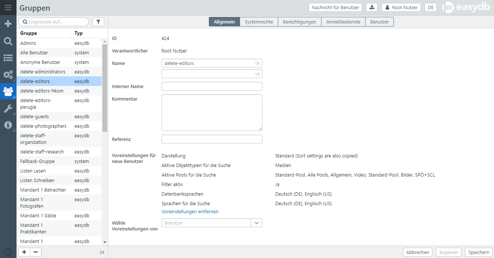
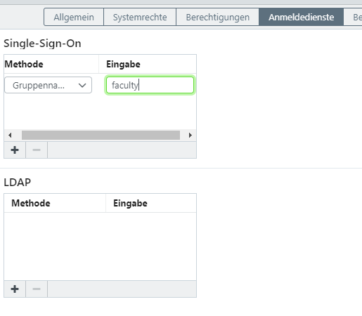

# Gruppen

Jeder Benutzer kann in einer oder mehreren Gruppen sein. Hierdurch kann ein Benutzer unterschiedliche Rollen innerhalb der easydb haben. Die Gruppen werden dem Benutzer im Benutzermanagement zugeordnet. Systemgruppen sind Gruppen, die automatisch erzeugt werden. Benutzer sind automatisch Mitglieder von Systemgruppen, wenn sie die Rechtekriterien der Systemgruppe erfüllen.

### Übersicht Systemgruppen

| Systemgruppe | Erläuterung | Intern |
|--------------|-------------|--------|
| Alle außer Systemnutzer | Jeder Benutzer ist in dieser Gruppe, mit Ausnahme der Systemnutzer **root**, **oai_pmh** und **deep_link** (siehe [Benutzertypen](../users/#benutzertypen)). | `:non_system` |
| Alle Benutzer | Jeder Benutzer ist in dieser Gruppe (inkl. anonymous, root, oai_pmh, deep_link, sso, ldap, selbstregistrierte). | `:all` |
| Anonyme Benutzer | Benutzer, die ohne Anmeldung auf extern freigegebene Datensätze zugreifen. | `:anonymous` |
| Fallback-Gruppe | Wenn eine Gruppe gelöscht wird die Besitzer (Owner) von Datensätzen ist wird die Fallback-Gruppe stattdessen als Besitzer eingetragen. | `:fallback` |
| LDAP-Benutzer | Benutzer, die sich über LDAP in easydb anmelden. | `:ldap` |
| Normale Benutzer                                  | Benutzer, die in easydb direkt angelegt sind. | `:easydb` |
| Pseudo-Benutzer zur Ansicht einzelner Collections | Benutzer, die für eine Mappenfreigabe (Collection Sharing) die keine Anmeldung erfordert, angelegt wurden. | `:collection` |
| Selbst-registrierte Benutzer                      | Benutzer, die sich selbst bei easydb registriert haben. | `easydb_self_register` |
| SSO-Benutzer | Benutzer, die sich über SSO in easydb anmelden. | `:sso` |
| Über eine E-Mail aingeladene Benutzer             | Benutzer, die nur mit ihrer E-Mail-Adresse für eine Mappenfreigabe (Collection Sharing) oder beim Export angelegt wurden. | `:email` |
| Über eine interne Verbindung zugreifende Benutzer | Jeder Benutzer, der sich über das Intranet angemeldet hat. Das Internet/Intranet wird in der [Basis-Konfiguration](../../administration/base-config) festgelegt. | `:intranet_connection` |
| Über eine externe Verbindung zugreifende Benutzer | Jeder Benutzer, der sich über das Internet angemeldet hat. Das Internet/Intranet wird in der [Basis-Konfiguration](../../administration/base-config) festgelegt. | `:internet_connection` |

> HINWEIS: Alle Benutzer kommen entweder aus dem Internet oder aus dem Intranet. Sie können daher nicht gleichzeitig in beiden Gruppen sein. Die Herkunft des Intranet ist anhand von IP-Adressbereichen konfigurierbar.

## Allgemein {#general}

Gruppen können vom easydb Administrator und von Benutzern, die das Systemrecht zur Verwaltung von Gruppen haben, angelegt, verändert und gelöscht werden. Zum Anlegen einer neuen Gruppe besteht die Möglichkeit, eine Gruppe des Typs *:easydb* zu kopieren, um sie dann zu modifizieren.

|Einstellung|Erläuterung|
|---|---|
|Verantwortlicher|Verantwortlicher Benutzer für die Gruppe, von dem die Gruppe erstellt wurde. |
|ID| System ID der Gruppe|
|Name|Der Name der Gruppe.|
|Interner Name|Der interne Name der Gruppe. Wird nur hier angezeigt, z. B. für Zugriff auf Gruppen über API.|
|Kommentar|Ein interner Kommentar, der nur hier angezeigt wird.|
|Referenz| Freitextfeld für die Eingaben einer eigenen Bezeichnung oder ID, z.B. für Migrationen oder für Verlinkungen von Benutzern und Gruppen über die API |
|Voreinstellungen für neue Benutzer|Wenn Voreinstellungen gewählt wurden, werden hier im Einzelnen die Einstellungen angezeigt für:   die Darstellung der Suchergebnisse,   die Auswahl aktiver Pools für die Suche,   die Auswahl aktiver Objekttypen für die Suche,   die aktiven Datenbanksprachen,   die aktiven Sprachen für die Suche,   Filter: aktiv oder verborgen. Ist ein Benutzer in mehreren Gruppen mit Voreinstellungen, erhält er die Voreinstellungen der ersten Gruppe.|
|Wähle Voreinstellungen von|Benutzer wählen, dessen Voreinstellungen für die Gruppe übernommen werden sollen. Werden Benutzer neu angelegt und zu dieser Gruppe hinzugefügt, erhalten sie direkt diese Voreinstellungen. |

## Systemrechte

Eine Auflistung der Systemrechte finden Sie unter [Rechtemanagement](/de/webfrontend/rightsmanagement). Beachten Sie, dass kontextabhängig ggfs. weitere, hier nicht aufgelistete Systemrechte zur Verfügung stehen können.

## Berechtigungen

Eine Auflistung aller Rechte finden Sie unter [Rechtemanagement](/de/webfrontend/rightsmanagement). Beachten Sie, dass kontextabhängig ggfs. nicht alle aufgelisteten Rechte zur Verfügung stehen.

## Anmeldedienste
Sofern eine Anbindung an einen [Single-Sign-On (SSO)](/en/sysadmin/configuration/easydb-server.yml/plugins/sso)- oder [LDAP](/en/sysadmin/configuration/easydb-server.yml/plugins/ldap)-Dienst konfiguriert wurde, können über dieses Gruppenmapping automatisch Gruppen die im SSO oder LDAP verwendet werden, auf easydb-Gruppen gemapped werden. Tragen Sie bei einer easydb-Gruppe im Feld "Eingabe" den Namen der SSO- bzw. LDAP-Gruppe ein, werden die Nutzer dieser Gruppen bei der Anmeldung automatisch der easydb-Gruppe zugeordnet und erhalten darüber ihre Zugriffsrechte.

## Benutzer {#users}

Dieser Reiter wird nur für easydb-Gruppen angezeigt, nicht für Systemgruppen. Hier werden alle Benutzer angezeigt, die zu dieser Gruppe gehören.

