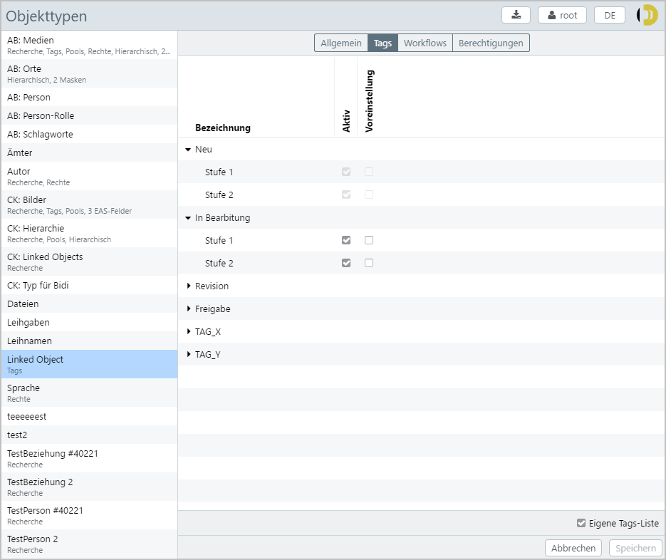
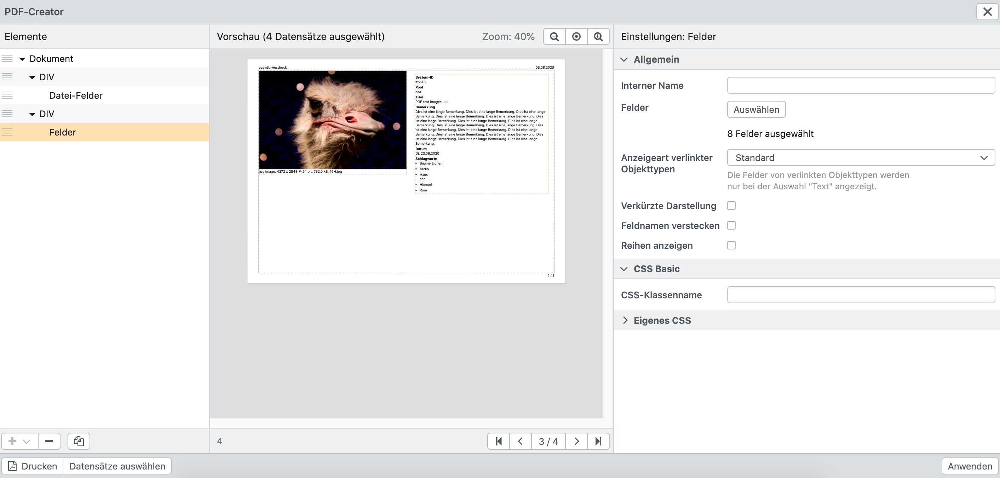

# Objekttypen

Mit den Einstellungen für Objekttypen im Rechtemanagement können Ausgabeoptionen und Zugriffsberechtigungen gesteuert werden. Je nach Konfiguration im Datenmodell stehen unterschiedliche Tabs (Reiter) für Einstellungen zur Verfügung. Beachten Sie hierfür die Hinweise in den Erläuterungen zu den jeweiligen Einstellungen.

Objekttypen werden von Administratoren im [Datenmodell](/de/webfrontend/administration/datamodel/objecttype) angelegt. Änderungen in der Entwicklungsumgebung für das Datenmodell müssen aktiviert werden, damit sie produktiv verwendet werden können. Das Aktivieren der Änderungen setzt einen kompletten Neubau des easydb-Daten-Index in Gang und kann ggfs. einige Zeit in Anspruch nehmen. Für Änderungen im Rechtemanagement ist dieser Prozess nicht nötig.

> HINWEIS: Beachten Sie, dass bei Änderungen an bestehenden Objekttypen es ggfs. passieren kann, dass betroffene Datensätze Benutzern nicht angezeigt werden können, bis der Neubau des easydb-Daten-Index abgeschlossen ist.


## Allgemein

|Einstellung|Option|Erläuterung|
|---|---|---|
|Ansprechpartner| |Der Benutzer, der als Ansprechpartner für Datensätze dieses Objekttypen in der Recherche-Ansicht angezeigt wird. Wenn ein Ansprechpartner angegeben wird, wird der Name im Info-Dialog neben dem Objekttyp in der Auswahl neben der Suchleiste angezeigt.|
|Beschreibung (Markdown)||Hier kann eine Beschreibung für den Objekttyp hinterlegt werden, auch mehrsprachig, wenn konfiguriert. Für Benutzer wird die Beschreibung neben dem Objekttyp im Auswahlmenü für Pools und Objekttypen als Information angezeigt. Eingeschränkte Formatierungen können mittels Markdown vorgenommen werden.|
|Standard Ein- und Ausgabe||Wenn die Checkbox deaktiviert ist, können sie hier die Reihenfolge der Masken verändern, um eine Priorität bei der Wahl der Standard-Maske vorzunehmen. Beachten Sie, dass mindestens eine Maske oberhalb der Linie liegen muss. Für Benutzer wird über das Rechtemanagement zunächst eine Liste der erlaubten Masken erstellt. Die hier angegebene Reihenfolge wirkt sich auf die Standard-Maske aus, die benutzt wird, um das Suchergebnis anzuzeigen. Falls die Checkbox aktiv ist, wird die Standard-Maske aus dem Datenmodell verwendet. Beachten Sie, dass diese Einstellung für Objekttypen am Pool noch geändert werden kann, wenn für diesen Objekttyp Pool-Management aktiviert ist.|
|Export-Profil für Dublin Core|Kein Profil|Beim Export aus diesem Objekttyp werden keine Metadaten geschrieben.|
| |Mapping aus dem Profil-Management|Beim Export wird das angegebene Mapping verwendet.|
|Export-Profil für Bilder|Kein Profil|Beim Export von Bilder aus diesem Objekttyp werden keine Datei-Metadaten (XMP, EXIF, IPTC) geschrieben.|
| |Mapping aus dem Profil-Management|Für den Export wird das angegebene Mapping verwendet. Bestehende Metadaten werden dabei überschrieben.|
|Import-Profil für Bilder|Kein Profil|Beim Import von Bildern werden keine Datei-Metadaten (XMP, EXIF, IPTC) in easydb geschrieben.|
| |Mapping aus dem Profil-Management|Für den Import wird das angegebene Mapping verwendet. |
| In Schnellanzeige anzeigen ||Kann für Nebenobjekttypen aktiviert werden. Der Nebenobjekttyp erscheint dann als [Kategoriebrowser](../../datamanagement/search/quickaccess/category) in der Schnellanzeige und ermöglicht eine Schnellverschlagwortung per Drag & Drop. |
| Im Filter in Gruppe "Verlinkte Objekttypen" anzeigen ||Wird ein Objekttyp bei mehreren Feldern hinterlegt, so wird durch Setzen dieser Checkbox im [Filtertree](../../../webfrontend/datamanagement/search/find) ein zusätzlicher Filter generiert, der über alle Felder filtert, in denen dieser Objekttyp verwendet wird. Für das Filtern auf die einzelnen Felder werden weiterhin einzelne Filter angezeigt. Voraussetzung ist, dass im [Datenmodell](../../../webfrontend/administration/datamodel/mask) bei den Feldern die Checkbox "Filter" aktiviert ist. |
|Dateinamen für Export und Download|Name des Datenbankfeldes|Beim Export und Download werden Dateien in dem festgelegten Format benannt. Durch Klick auf <code class="button">Ersetzungen anzeigen</code> können Sie sehen, welche Übersetzungen für einen Dateinamen zur Verfügung stehen. Bei einem Objekttyp *bilder* könnte der Dateiname beispielsweise so festgelegt werden: Für Textfelder gilt ```Meine-Easydb-%bilder.titel%``` und für Linkspalten gilt ```Meine-Easydb-%bilder.lk_copyright_id._standard.1.text%```. |
||Ersetzungen|siehe *Erweiterte Einstellungen* [Ersetzungen für Dateinamen](../../datamanagement/features/export)|


## Tags {#tags}

Die Verfügbarkeit von Tags kann grundsätzlich easydb-weit angepasst werden (siehe [Tags & Workflows](/de/webfrontend/rightsmanagement/tags)). Wenn Tags für einen Objekttyp ohne Pool aktiviert sind, wird dies in der Liste unterhalb des Objekttypen angezeigt. In der Detailanzeige für den Objekttyp steht der Reiter *Tags* zur Verfügung. Damit greifen für den Objekttyp die easydb-weit definierten Tags (siehe [Tags & Workflows](/de/webfrontend/rightsmanagement/tags)). Um individuelle Anpassungen vorzunehmen, muss die Checkbox "Eigene Tags-Liste" unten rechts aktiviert werden. Tags, die allgemein das Merkmal "persistent" tragen, können hier nicht geändert werden. Für alle anderen Tags können Sie einzeln definieren, ob der Tag aktiv sein soll und damit für Datensätze dieses Objekttypen zur Auswahl steht oder ob er immer automatisch gesetzt werden soll, wenn ein neuer Datensatz für den Objekttyp angelegt wird. Dafür aktivieren sie die Checkbox "Voreinstellung". Der Tag kann in dem Fall manuell am Datensatz entfernt werden.

> HINWEIS: Tags und Workflows sind für einen Objekttyp nur dann verfügbar, wenn der Objekttyp kein aktiviertes Pool-Management hat und Tag-Management aktiviert ist.




|Einstellung|Erläuterung|
|---|---|
|Eigene Tags-Liste|Um das globale Tag-Management zu überschreiben, muss diese Checkbox gesetzt sein. Beachten sie, dass Tags die als *Persistent* markiert wurden, nicht überschrieben werden können.|
|Aktiv|Muss gesetzt sein, damit der Tag für diesen Objekttyp aktiv ist.|
|Voreinstellung|Wenn gesetzt, dann ist dieser Tag für neue Datensätze dieses Objekttyps standardmäßig aktiv.|
|Persistent|Wenn gesetzt, kann der Tag in untergeordneten Pools nicht mehr überschrieben werden. Nur in [Rechtemanagement&nbsp;&gt;&nbsp;Pools](../pools) verfügbar.|

## Workflows {#workflows}

Grundsätzlich sind die Workflows in [Tags & Workflows](../tags) beschrieben.

|Einstellung| Erläuterung|
|---|---|
|Eigener Workflow|Wenn gesetzt, werden alle Workflows überschrieben, die in [Tags & Workflows](../tags)) nicht auf *Persistent* gesetzt sind. Wenn nicht, ergänzen die hier festgelegten Workflows die Globalen.|


### Aktion E-Mail

Bei der Aktion E-Mail wird an Benutzer oder/und Gruppen eine E-Mail geschickt, die die Operation auf dem Datensatz protokolliert. Sie können mehrere Empfänger eingeben.

|Einstellung|Erläuterung|
|---|---|
|Empfänger|Benutzer oder Gruppe(n).|
|Betreff|Der Betreff der E-Mail.|
|Nachricht|Der Text der E-Mail.|
|Sammelversand|Wenn gesetzt, erhält der Benutzer diese E-Mail als Teil seiner gebündelten E-Mails, die für einen Workflow versendet werden (siehe auch Zeitplan im Benutzermanagement). Ohne Sammelversand erhält der Benutzer die E-Mail sofort.|

### Aktion Tag setzen/entfernen

Sie können als Aktion beliebige Tags setzen oder entfernen. Klicken Sie dazu auf den jeweiligen Tag. Mehrfaches klicken schaltet den Tag um, zwischen Plus (Tag setzen), Minus (Tag entfernen) und ohne Symbol (nichts mit dem Tag machen). Nach dem Setzen der Tags ist der Workflow abgeschlossen, es werden bezogen auf diese Tag-Änderung keine weiteren Workflows angestossen.


## Berechtigungen

Berechtigungen an Objekttypen ohne Pool-Management.  Hier stellen Sie ein, welche Rechte Benutzer und Gruppen an Datensätzen haben, die von diesem Objekttyp sind.

Eine Übersicht über die Rechte finden Sie [hier](..).


## <a name="masks"></a>Ein- und Ausgabe

easydb benutzt zur Suche einen Index. Dieser Index wird immer dann aktualisiert, wenn ein Benutzer einen Datensatz abspeichert oder löscht. In diesen Fällen wird nur der neue Datensatz im Index aktualisiert. Wenn ein Datenbank-Schema aktiviert wird, dann wird der gesamte Index neu berechnet. In der Zeit des Neuberechnens kann es sein, dass ein Benutzer in seinem Suchergebnis einen alten Datensatz findet. Im Editor werden aber immer aktuelle Datensätze angezeigt.

Der Index-Dienst erstellt je Maske und je Datensatz ein Index-Dokument. Wenn ein Objekttyp 3 Masken hat, dann liegt im Index für jede Maske ein eigenes Index-Dokument.

Grundsätzlich wird ein Datensatz in seiner aktuellsten Version in den Index geschrieben. Ist dies nicht gewünscht, kann in dem Reiter *Ein- und Ausgabe* eine abweichende Version bestimmt werden. Die Version wird über einen Tagfilter ermittelt. Die letzte Version des Datensatzes, auf die der Tagfilter passt, wird benutzt, um sie im Index abzulegen. Wenn kein Datensatz passt, wird der Datensatz übersprungen und nicht in den Index geschrieben. Benutzer, die beispielsweise nur auf eine eingeschränkte Maske Zugriff haben, finden den Datensatz in diesem Fall nicht.

> HINWEIS: Einstellungen für die Ein- und Ausgabe stehen nur für Objekttypen zur Verfügung, für die mehrere Masken im Datenmodell definiert sind.

### Beispiel

Ein Beispiel soll das verdeutlichen. Wir haben im System zwei Masken *Standard* und *Internet* und zwei Tags *Internet* und *Gesperrt* angelegt.


#### Einstellung im Reiter Ein- und Ausgabe

|Ein- und Ausgabe|Tagfilter|
|---|---|
|Standard|*Kein Tagfilter möglich*|
|Internet|Tagfilter: ALL: *Internet*, NOT: *Gesperrt*|

#### Angelegte Tags

|Tag|Typ|Bemerkung|
|---|---|---|
|Internet|Individual||
|Gesperrt|Alle Versionen|Das ist wichtig:  *Alle Versionen* strahlt auf alle Versionen des Datensatzes aus.|

#### Verlauf der Datensatz-Eingabe

Im vorliegenden Beispiel wird ein Datensatz von der Version 1 bis 6 jeweils mit verschiedenen Tags versehen. Je nach gesetztem Tag wird er in der Maske *Internet* indiziert oder nicht.

|Version|Internet<br>*Individual*|Gesperrt<br>*Alle Versionen*|Bemerkung|
|---|---|---|---|
|6|X|-|Der Datensatz wurde entsperrt. Jetzt wird für die Maske *Internet* die **Version&nbsp;5** indiziert, weil der Tag *Gesperrt* für alle Versionen gilt.|
|5|X|X|Der Datensatz ist wieder komplett gesperrt, aber jetzt ist der *Internet*-Tag noch an.|
|4|X|-|Der Datensatz wurde wieder freigegeben. Für die Maske *Internet* wird jetzt die **Version&nbsp;2** indiziert.|
|3|-|X|Der Datensatz in der Maske *Internet* wird nicht indiziert, weil der Tag *Gesperrt* gesetzt ist.|
|2|X|-|Der Datensatz wurde freigegeben. Die **Version 1** wird für die Maske *Internet* indiziert.|
|1|-|-|Der Datensatz ist nicht freigegeben und nicht über die Maske *Internet* indiziert.|

## Feldrechte {#fieldrights}

Mit den Feldrechten können innerhalb eines Objekttyps Rechte an einzelne Felder für Benutzer oder Benutzergruppen definiert werden. Gleichzeitig werden für allen anderen Benutzer oder Benutzergruppen diese Felder ausgeblendet. Die Feldrechte können auch an Tags geknüpft werden, wenn Tag-Management für den Objekttyp aktiv ist.


|Eingabe|Erläuterung|
|---|---|
|Interner Name|Datenbankname für das Feldrecht. Es handelt sich dabei um die technische Bezeichnung des Feldes. Dieses Feld muss ausgefüllt werden.|
|Felder|Über das Dropdown Menü werden die Felder gewählt, die ausgeblendet werden sollen. Die ausgeblendeten Felder werden mit einer Checkbox angezeigt und erscheinen im Dropdown deaktiv (ausgegraut). Alle weiterhin sichtbaren Felder  sind im Dropdown als aktiv markiert. |
|Tag-Filter|Wenn Tag-Filter für den Objekttyp aktiv sind, kann hier eine Bedingung gewählt werden, unter der die Einschränkung in Kraft tritt.|
|Benutzer/Gruppe|Hier können ein oder mehrere Benutzer oder Gruppen eingegeben werden, für die das Feldrecht an den definierten Feldern gelten soll. Allen anderen Benutzer und Benutzergruppen wird hierdurch das Recht auf diese Felder entzogen. Ausnahmen können mit "Feldrechte ignorieren" über die [Systemrechte](..) für Benutzer und Gruppen hinzugefügt werden. |

> HINWEIS: Über die Feldrechte kann eine Verfeinerung der Sichtbarkeit von Feldern für Benutzer oder Gruppen vorgenommen werden. Komplexe Feldkonfigurationen für Objekttypen sowie die Ein- und Ausgabeoptionen für die Felder werden auf Ebene der Objekttypen und Masken im [Datenmodell](../../administration/datamodel) vorgenommen.


## Filter für verlinkte Objekttypen

Sofern ein Objekttyp auf andere Objekttypen verweist, können an dieser Stelle für diese Listen / Thesauri Filter definiert werden.


### Anwendungsfall 1

Hat man beispielsweise eine Liste von Personen bei der für jeden Eintrag definiert werden kann, ob es sich bei der Person z.B. um einen Fotografen oder um einen Bildhauer handelt, kann für das Eingabefeld "Fotograf" definiert werden, dass nur die Personen mit der Rolle "Fotograf" angezeigt werden sollen. Alle anderen Personen werden ausgeblendet. Ist die gleiche Liste noch bei anderen Feldern hinterlegt (z.B. bei "Abgebildetete Personen"), greift der Filter dort nicht und alle Einträge aus der Personen-Liste werden angezeigt.


### Anwendungsfall 2

Hat man beispielsweise eine hierarchische Liste von Kategorien und möchte, dass Benutzer bei der Verschlagwortung nur Einträge der untersten Ebene verknüpfen können, kann dies ebenfalls mit einem Filter realisiert werden. Hierzu wählt man das betroffene Feld aus (z.B. "Kategorien") und aktiviert die Checkbox "Selektierbarkeit auf die unterste Ebene einschränken". Anschließend können in diesem konkreten Feld nur die Einträge auf der untersten Ebene mit einem Datensatz verknüpft werden. Datensätze mit untergeordneten Einträgen können nicht verlinkt werden. Dieser Filter greift nicht in der Expertensuche. Dort können in dem betroffenen Feld weiterhin Einträge aller Ebenen ausgewählt werden.


### Optionen

| Option                                               | Erläuterung                                                  |
| ---------------------------------------------------- | ------------------------------------------------------------ |
| Name                                                 | Name des Filters. Wird im Frontend für alle Benutzer angezeigt. |
| Felder                                               | Wählen Sie das Feld aus, für welches der Filter greifen soll. |
| Selektierbarkeit auf die unterste Ebene einschränken | Wenn aktiviert, können in hierarchischen Listen nur die Einträge auf der untersten Ebene verknüpft werden. Datensätze mit untergeordneten Einträgen können nicht verknüpft werden. |
| Filter                                               | Definieren Sie hier die Filterkriterien die angewendet werden sollen. |


## PDF-Creator

> HINWEIS: Die Funktionalität "PDF-Creator" wird als separates Modul lizensiert. Bitte überprüfen Sie im Zweifel Ihren Lizenzvertrag.

Beim sog. PDF-Creator handelt es sich um ein zusätzliches Modul, welches über ein Plugin eingebunden werden kann. Es ermöglicht die Erstellung von [individuellen PDF-Layouts](../../datamanagement/features/print).

### Voraussetzungen

Um den PDF-Creator zu nutzen, benötigen Sie das Plugin "PDF-Creator". Darüber hinaus muss der FYLR-Server installiert und konfiguriert werden.

### Übersicht

Im Reiter "PDF-Creator" werden alle für den ausgewählten Objekttyp konfigurierten Templates angezeigt.

Folgende Informationen werden angezeigt und folgende Optionen stehen zur Verfügung:

| Information / Funktion  | Beschreibung                                                 |
| ----------------------- | ------------------------------------------------------------ |
| Template-Name           | Zeigt den Template-Namen an.                                 |
| Erstellt am             | Zeigt an, wann das Template erstellt wurde.                  |
| Erstell von             | Zeigt an, von wem das Template erstellt wurde.               |
| Letzte Änderung am      | Zeigt an, wann die letzte Änderung am Template vorgenommen wurde. |
| Letzte Änderung von     | Zeigt an, von wem die letzte Änderung am Template vorgenommen wurde. |
| +                       | Fügt ein neues Template hinzu.                               |
| -                       | Löscht das augewählte Template                               |
| Bearbeiten              | Bearbeitet das ausgewählte Template.                         |
| Kopieren                | Kopiert das ausgewählte Template.                            |
| Templates herunterladen | Lädt alle für diesen Objekttyp eingerichteten Templates herunter. |
| Templates hochladen     | Lädt alle für diesen Objekttyp eingerichteten Templates hoch und fügt diese zu den bestehenden hinzu. |
| Abbrechen               | Verwirft ungespeicherte Änderungen am Objekttyp (auch die auf anderen Reitern vorgenommenen). |
| Speichern               | Speichert die Änderungen am Objekttyp ab (auch die auf anderen Reitern vorgenommenen). |


### Template-Editor

Mit Hilfe des Template-Editors wird das Layout der PDF-Dateien erstellt.





Der Template-Editor ist wie folgt aufgebaut:

| Bereich / Funktion   | Beschreibung                                                 |
| -------------------- | ------------------------------------------------------------ |
| Elemente             | Hier sehen Sie die Struktur ihrer PDF-Datei. Sie können die Reihenfolge der Elemente über das Icon mit den drei Strichen ändern. |
| Vorschau             | Sofern Datensätze für die Vorschau ausgewählt wurden (siehe unten) wird hier eine Vorschau der PDF-Datei angezeigt. Die Vorschau-Ansicht kann gezoomt bzw. angepasst werden. |
| Einstellungen        | Hier finden Sie alle Optionen für die einzelnen Elemente. Eine Beschreibung finden Sie in den nachfolgenden Tabellen. |
| +                    | Fügt ein neues Element hinzu. Elemente können unter dem Dokument- oder einem DIV-Element hinzugefügt werden. |
| -                    | Entfernt ein Element.                                        |
| Kopieren             | Kopiert ein Element.                                         |
| Seiten               | Sofern Datensätze für die Vorschau ausgewählt wurden (siehe unten) und sich die PDF auf mehrere Seiten erstreckt, steht zusätzlich eine Seitennavigation zur Verfügung. |
| Drucken              | Erstellt eine PDF-Vorschau für die ausgewählten Datensätze.  |
| Datensätze auswählen | Wählen Sie hier Datensätze aus Ihrer easydb aus um eine Vorschau Ihres PDFs zu erhalten oder herunterzuladen. |


#### Dokument

| Panel       | Option                                        | Beschreibung                                                 |
| ----------- | --------------------------------------------- | ------------------------------------------------------------ |
| Allgemein   | Template-Name                                 | Geben Sie dem Template einen Namen, der im easydb-Frontend angezeigt werden soll. |
|             | Dateiname                                     | Vergeben Sie einen Dateinamen für die PDF-Datei.             |
|             | Ausrichtung                                   | Wählen Sie zwischen Hoch- und Querformat.                    |
|             | Papiergröße                                   | Wählen Sie die Papiergröße für das Dokument (z.B. A4 oder A3). |
|             | Rand oben \| unten \| links \| rechts (in cm) | Geben Sie den Rand nach oben, unten, links und rechts in Zentimetern an. |
|             | Äußeren Rahmen anzeigen                       | Zeigt den Rahmen als dünne Linie an.                         |
|             | Layout                                        | Wählen Sie hier, ob pro Seite nur ein Datensatz oder mehrere Datensätze angezeigt werden sollen. |
|             | Reihen                                        | Definieren Sie hier die Anzahl der Reihen pro Seite (max. 10). Nur verfügbar für Layout "Mehrere Datensätze". |
|             | Spalten                                       | Definieren Sie hier die Anzahl der Spalten pro Seite (max. 10). Nur verfügbar für Layout "Mehrere Datensätze". |
|             | Zeilenabstand (in mm)                         | Definieren Sie hier den Zeilenabstand in mm. Nur verfügbar für Layout "Mehrere Datensätze". |
|             | Spaltenabstand (in mm)                        | Definieren Sie hier den Spaltenabstand in mm. Nur verfügbar für Layout "Mehrere Datensätze". |
|             | Inneren Rahmen anzeigen (in mm)               | Zeigt beim Layout "Mehrere Datensätze" innere Tabellenrahmen an. |
|             | URL für eigenes CSS                           | Geben Sie hier einen Link zu ihrer CSS-Datei an. Diese muss vom easydb-Frontend und -Server aus erreichbar sein. |
| Header      | Typ (Links \| Rechts)                         | Wählen Sie zwischen Text oder dem in der Basis-Konfiguration hinterlegtem Logo. |
|             | Text (Links \| Mittig \| Rechts)              | Geben Sie hier einen Text für die Kopfzeile an. Je nach Feld wird dieser links, mittig oder rechts angezeigt. <br/>Die folgenden Ersetzungen können verwendet werden:<br/>%pageNumber%<br/>%totalPages%<br/>%date%<br/><br/>Jeweils für den ersten Datensatz:<br/>%_global_object_id%<br/>%_system_object_id%<br/>%_standard.1.text% |
| Footer      | Text (Links \| Mittig \| Rechts)              | Geben Sie hier einen Text für die Fußzeile an. Je nach Feld wird dieser links, mittig oder rechts angezeigt. <br/>Die folgenden Ersetzungen können verwendet werden:<br/>%pageNumber%<br/>%totalPages%<br/>%date%<br/><br/>Jeweils für den ersten Datensatz:<br/>%_global_object_id%<br/>%_system_object_id%<br/>%_standard.1.text% |
| Eigenes CSS |                                               | Schreiben Sie hier direkt ihr eigenes CSS.                   |


#### DIV

Mit diesem Element können Sie ein DIV einfügen. Folgende Optionen stehen zur Verfügung:

| Panel         | Option                                   | Beschreibung                                                 |
| ------------- | ---------------------------------------- | ------------------------------------------------------------ |
| Allgemein     | Interner Name                            | Vergeben Sie hier einen Namen für den DIV-Container.         |
| CSS Basic     | CSS-Klassenname                          | Vergeben Sie hier einen CSS-Klassennamen für den DIV-Container. |
|               | Höhe                                     | Geben Sie hier die Höhe des DIV-Containers an.               |
|               | Breite                                   | Geben Sie hier die Breite des DIV-Containers an.             |
| CSS Erweitert | Display                                  | Geben Sie hier an, wie der DIV-Container angezeigt werden soll (z.B. "inline" oder "block"). |
|               | Hintergrund                              | Geben Sie hier die Hintergrundfarbe des DIV-Containers im Hexadezimalcode an. Sie können auch die RGBA Farbwerte angeben (z.B. "rgba(0, 128, 0, 0.3)"). |
|               | Schriftgröße                             | Geben Sie hier die Schriftgröße in Pixeln an. Standard ist 12. |
|               | Farbe                                    | Geben Sie hier die Farbe für den Rahmen und Text im Hexadezimalcode an. |
|               | Position Absolut                         | Aktivieren Sie "Position Absolut" um mit den nachfolgenden vier Eingabefeldern den DIV-Container frei zu platzieren. |
|               | Margin (Top \| Bottom \| Left \| Right)  | Geben Sie hier die Außenabstände des DIV-Containers in Pixeln an (oben, unten, links, rechts). |
|               | Padding (Top \| Bottom \| Left \| Right) | Geben Sie hier die Innenabstände des DIV-Containers in Pixeln an (oben, unten, links, rechts). |
|               | Border (Top \| Bottom \| Left \| Right)  | Geben Sie hier die Rahmenstil, z.B. solid oder dotted, des DIV-Containers an (oben, unten, links, rechts). |
| Eigenes CSS   |                                          | Schreiben Sie hier direkt ihr eigenes CSS.                   |


#### Statischer Text

Mit diesem Element können Sie einen statischen Text eingeben und anzeigen. Folgende Optionen stehen zur Verfügung:

| Panel         | Option          | Beschreibung                                                 |
| ------------- | --------------- | ------------------------------------------------------------ |
| Allgemein     | Interner Name   | Vergeben Sie hier einen Namen für die Ausgabe des Textes.    |
|               | Text            | Geben Sie hier den anzuzeigenden Text an.                    |
| CSS Basic     | CSS-Klassenname | Vergeben Sie einen CSS-Klassennamen für dieses Objekt.       |
| CSS Erweitert | Farbe           | Geben Sie hier den Hexadezimal-Code für die Schriftfarbe ein. Standardmäßig wird der Text in schwarzer Schriftfarbe angezeigt. |
|               | Schriftgröße    | Geben Sie hier die Schriftgröße in Pixeln an. Standard ist 12. |
| Eigenes CSS   |                 | Schreiben Sie hier direkt ihr eigenes CSS.                   |


#### Datei hochladen

Mit diesem Element können Sie eine Datei hochladen und im PDF anzeigen. Folgende Optionen stehen zur Verfügung:

| Panel       | Option          | Beschreibung                                               |
| ----------- | --------------- | ---------------------------------------------------------- |
| Allgemein   | Interner Name   | Vergeben Sie hier einen Namen für die Ausgabe der Dateien. |
|             | Datei           | Laden Sie hier eine Datei hoch.                            |
| CSS Basic   | CSS-Klassenname | Vergeben Sie einen CSS-Klassennamen für dieses Objekt.     |
|             | Breite          | Geben Sie hier die Breite des Bildes in Pixeln an.         |
| Eigenes CSS |                 | Schreiben Sie hier direkt ihr eigenes CSS.                 |


#### Datei-Felder

Mit diesem Element können Sie Vorschauversionen von Dateien die in easydb abgelegt sind, anzeigen. Folgende Optionen stehen zur Verfügung:

| Panel       | Option                                               | Beschreibung                                                 |
| ----------- | ---------------------------------------------------- | ------------------------------------------------------------ |
| Allgemein   | Interner Name                                        | Vergeben Sie hier einen Namen für die Ausgabe der Dateien.   |
|             | Datei-Felder                                         | Wählen Sie hier die Datei-Felder aus die angezeigt werden sollen. |
|             | Zeilen                                               |                                                              |
|             | Umfang                                               | Sofern bei Datensätzen eines Objekttyp mehrere Dateien hochgeladen oder verknüpft werden können, kann hier gewählt werden, ob alle verknüpften Dateien oder nur die erste Datei angezeigt werden soll. |
|             | Geringe Auflösung                                    | Wenn aktiviert, wird die beste Auflösung für einen 500x500px-Viewport verwendet. |
|             | Datei-Informationen anzeigen                         | Zeigt die Dateiinformationen, wie z.B. Dateityp, Auflösung und Dateiname, an. |
|             | Platzhalter anzeigen, wenn keine Datei vorhanden ist | Zeigt einen Platzhalter an, wenn bei einem Datensatz keine Datei hochgeladen wurde. |
|             | Platzhalter-Text                                     | Geben Sie hier einen Text an, der zusätzlich zum Platzhalter-Icon angezeigt werden soll, wenn bei einem Datensatz keine Datei hochgeladen wurde. |
| CSS Basic   | CSS-Klassenname                                      | Vergeben Sie einen CSS-Klassennamen für dieses Objekt.       |
| Eigenes CSS |                                                      | Schreiben Sie hier direkt ihr eigenes CSS.                   |


#### Felder

Dieses Element ermöglicht die Anzeige von Inhalten aus easydb-Feldern. Folgende Optionen stehen zur Verfügung:

| Panel       | Option                                               | Beschreibung                                                 |
| ----------- | ---------------------------------------------------- | ------------------------------------------------------------ |
| Allgemein   | Interner Name                                        | Vergeben Sie hier einen Namen für die Ausgabe der Daten.     |
|             | Felder                                               | Wählen Sie hier die Felder aus, die Sie anzeigen möchten.    |
|             | Anzeigeart verlinkter Objekttypen                    | Die zuvor ausgewählten Felder von verlinkten Objekttypen werden nur bei der Auswahl "Text" angezeigt. Bei "Standard" wird bei verlinkten Objekttypen lediglich der als Standard A & B definierte Text angezeigt. Bei "Short" wird nur Standard A angezeigt. |
|             | Verkürzte Darstellung                                | Wenn aktiviert, werden die Inhalte von Mehrfachfeldern nicht als Liste, sondern Komma-separiert angezeigt. |
|             | Feldnamen verstecken                                 | Standardmäßig wird zusätzlich zum Inhalt der Felder auch die  Feldnamen anzeigt. Aktivieren Sie diese Checkbox um die Feldnamen auszublenden. |
|             | Reihen anzeigen                                      | Wenn aktiviert werden die Feldnamen und Inhalte nicht untereinander, sondern nebeneinander angezeigt. |
|             | Bei Mehrfachfeldern: nur den ersten Eintrag anzeigen | Wenn aktiviert, wird bei Mehrfachfeldern nur der erste Eintrag angezeigt. Alle weiteren Einträge werden ausgeblendet. |
| CSS Basic   | CSS-Klassenname                                      | Vergeben Sie einen CSS-Klassennamen für dieses Objekt.       |
| Eigenes CSS |                                                      | Schreiben Sie hier direkt ihr eigenes CSS.                   |


#### Barcode

Sofern Sie das Barcode-Plugin installiert haben, können Sie mit diesem Element Barcodes und QR-Codes erzeugen. Folgende Optionen stehen zur Verfügung:

| Panel       | Option          | Beschreibung                                                 |
| ----------- | --------------- | ------------------------------------------------------------ |
| Allgemein   | Interner Name   | Vergeben Sie einen internen Namen für die Ausgabe des Barcodes. |
|             | Typ             | Wählen Sie hier zwischen "Barcode" und "QR-Code".            |
|             | Barcode-Typ     | Wählen Sie hier aus unterschiedlichen Barcode-Typen aus. Eine Erklärung der einzenen Barcode-Typen finden Sie [hier](https://github.com/lindell/JsBarcode/wiki#barcodes). |
|             | Feld            | Wählen Sie hier das Feld auf dessen Grundlage der Barcode generiert werden soll, aus. Es werden nur Text- und Zahlenfelder unterstützt. |
|             | Barcode-Breite  | Geben Sie hier die Breite des Barcodes in Prozent an.        |
| CSS Basic   | CSS-Klassenname | Vergeben Sie einen CSS-Klassennamen für dieses Objekt.       |
| Eigenes CSS |                 | Schreiben Sie hier direkt ihr eigenes CSS.                   |
