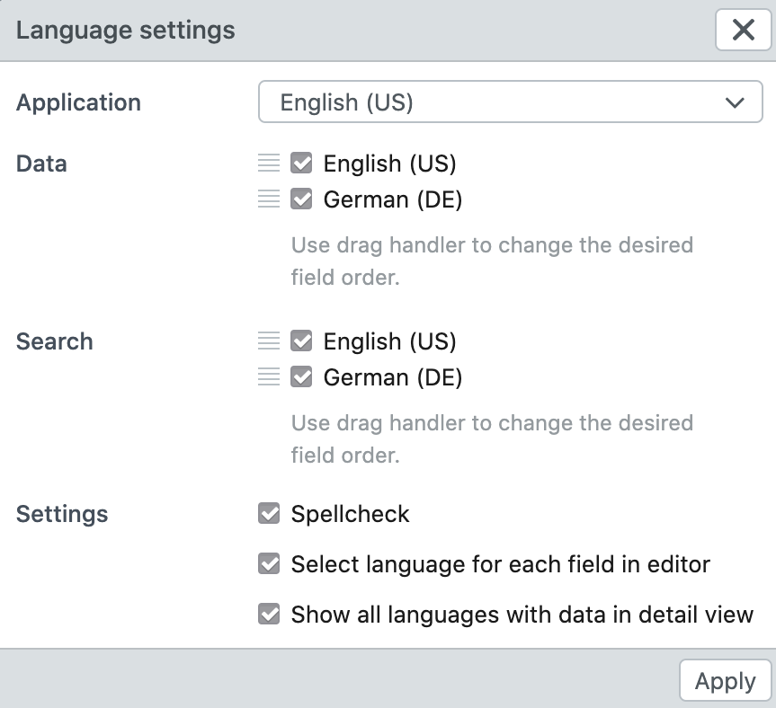

# Language settings

Every user has the possibility to choose languages for the application (system), the data and the search. The condition is that the multi-language support has been activated by the administrator in the base configuration or in the data model.

| Setting     | Option                                      | Description                                                  |
| ----------- | ------------------------------------------- | ------------------------------------------------------------ |
| Application | *Languages*                                 | If the administrator has selected languages in the base configuration, the language of the system can be selected here. All menus and buttons then appear in this language. |
| Data        | *Languages*                                 | Select the language(s) for entering and displaying the data. If several languages are selected, a field appears for each language in the editor and detail view. The order of the languages can be changed by dragging and dropping the languages. |
| Search      | *Languages*                                 | Activate this setting to perform the search in one or more languages. The order of the languages can be changed by dragging and dropping the languages. |
| Settings    |                                             |                                                              |
|             | Spellcheck                                  | By activating the spell checker, texts are checked as they are entered. The spell checker of the browser is used for this. First check your browser settings to see if the spell checker is activated. |
|             | Select language for each field in editor    | If activated, not all activated data languages are directly displayed in the editor, but only the first one. All other languages can be temporarily added per field by clicking on the language next to the input field. |
|             | Show all languages with data in detail view | If activated, all languages for which something has been entered are displayed in detail, even if the user has not activated the language as data language. |

## Sorting of languages

In the case of multilingual data, it can happen that for some data records both languages have been entered and some texts are only available in one language. Since only one value can be displayed at a time in the standard and list view, the order of the activated data languages takes effect.

Let us take the following example:

    Record 1: Wasser / Water
    Record 2: Feuer / (nothing)
    Record 3: (nothing) / Air

Depending on whether the order of the database languages ​​here is e.g. English-German, or German-English, the results are displayed as follows:

    English-Deutsch: Water, Feuer, Air
    Deutsch-English: Wasser, Feuer, Air
