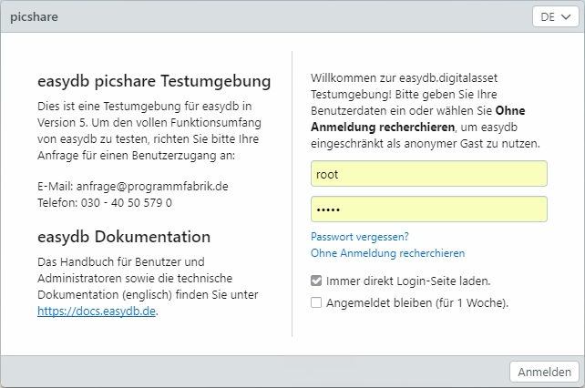

# Anmeldeseite

## Anmeldemaske

Nach dem Aufrufen der easydb im Webbrowser erscheint die Anmeldeseite.

## Eingabe

| Login | Erklärung | Details |
| --- | --- | --- |
| Login | Geben Sie hier Ihren Benutzernamen ein. |  |
| Passwort | Geben Sie hier Ihr Passwort ein. |  |
| Passwort vergessen | Falls Sie Ihr Passwort vergessen haben, öffnet sich hier ein neuer Dialog. |  |
|  | Dialog: Passwort vergessen? | Geben Sie hier Ihren Benutzernamen oder Ihre hinterlegte E-Mail-Adresse ein. Über 'Zugang senden' wird Ihnen ein Link mit neuem Zugangs-Code an die hinterlegte E-Mail-Adresse geschickt. Folgen Sie dem Link in der E-Mail und vergeben Sie dann Ihr neues Passwort. |
|  | Dialog: Bestätigung | Nachdem Sie eine E-Mail an Ihre E-Mail-Adresse versendet haben, öffnet sich ein Dialog mit der Bestätigung über die Versendung des Zugangs-Codes. Sollten Sie keine E-Mail erhalten, versuchen Sie es erneut um Tippfehler auszuschließen oder kontaktieren Sie den Administrator. |
| Ohne Anmeldung recherchieren | Wenn eingerichtet, können Benutzer anonym und ohne Registrierung in freigegebenen Datensätzen recherchieren. |  |
| Immer direkt Login-Seite laden | Aktivieren Sie diese Check-Box, wenn Sie beim Aufrufen der easydb immer direkt den Login-Dialog erhalten möchten. |  |
| Angemeldet bleiben \(für 1 Woche\) | Aktivieren Sie diese Check-Box, wenn Sie bei jedem Zugriff auf easydb eine Woche lang eingeloggt bleiben möchten. |  |
| Sprache | Sofern diese Einstellung aktiviert ist, erscheint oben rechts ein Auswahlmenü, in dem eine Sprachauswahl vorgenommen werden kann. Es handelt sich hierbei um die Sprache der Anwendung \(nicht der Datenbank-Inhalte\). |  |

## Texte und Informationen für Benutzer {#information}

In der Anmeldemaske können Texte mit Informationen (wie oben im Screenshot dargestellt) für Benutzer erscheinen. Oberhalb der Eingabefelder für die Zugangsdaten kann ein vom Administrator hinterlegter Willkommenstext erscheinen. Neben dem Login ist bei Bedarf Platz für einen Informationstext. Die Texte werden in der [Basis-Konfiguration](../../administration/base-config) hinterlegt.

## Zugriff als anonymer Benutzer (Gastzugang) {#guest}

Bestände in Ihrer easydb können für eine freie Recherche - also für eine Recherche ohne Anmeldung - freigegeben werden. Beim Aufruf Ihrer easydb-URL erhält der Nutzer dann direkten Zugriff auf die freigegebenen Datensätze \(der Umfang der Nutzung ist abhängig von den eingestellten Rechten\) ohne sich anmelden zu müssen. Dafür muss vom Administrator in der Basis-Konfiguration die Option zum anonymen Zugriff zugelassen und Rechte für die Gruppe  "Anonyme Nutzer" eingerichtet werden.

Über Ihre easydb-URL und "/login" am Ende ( http: //ihre.easydburl.de/login/ ) öffnet sich direkt die Anmeldeseite mit der Option zur Recherche ohne Anmeldung (sofern konfiguriert).

Eine weitere Option Gastnutzern den Zugriff auf freigegebene Datensätze zu gewähren, ist der Zugang per Link inklusive Kennung. Hierbei besteht die Möglichkeit, einen Link beispielsweise auf der eigenen Webseite zu setzen. Der Gast wird dann direkt zu easydb geleitet und mit entsprechenden Rechten angemeldet. Login und Passwort werden dabei direkt per URL eingegeben \(der Benutzer "gast" mit dem Passwort "gast" wird beispielsweise wie folgt übergeben: http: //your.easydburl.com?login=gast&password=gast\).

