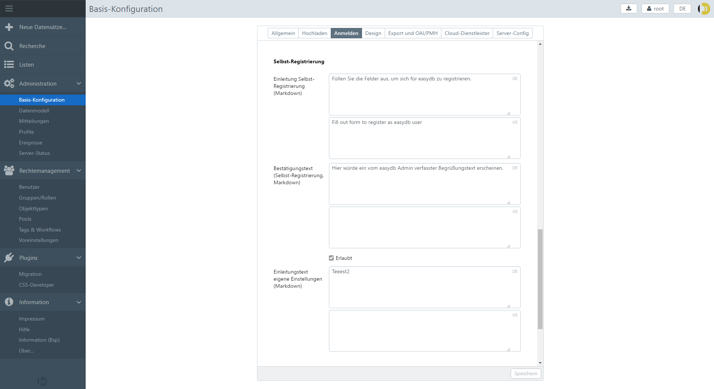

#Self-registration

## Register as a user

Once set up, users can register themselves for easydb. If easydb is opened in the browser, the button for registration appears in the upper right corner of the browser.

## Set up self-registration as an admin 

To set up a public access with self-registration, the easydb administrator must place the following settings.

### 1) Make settings in the basic configuration
*PATH: Basic Configuration> Tab: Login*

* Enable "Anonymous over Internet Allowed"
* Complete all fields in the section "Self-Registration"

### 2) Adjust system rights for user group
*PATH: Rights management> Groups/Roles> Anonymous users> Tab: System rights*

* Activate "Search"
* "Create user registration"
	* Select all fields required for self-registration
	* Type "easydb self-registration"

### 3) Share content for the groups/roles "Anonymous Users"
*PATH: Tags & Workflows> Tabs: Tags*

* In the "Tags & Workflows" area, create the tag group "Release"
* Create the tag "external" inside

*PATH: Pool Management> Pools> Pool (level)> Tab: Permissions*

* In the "Pools" section, add rights for the group "Anonymous Users" (see Minutes, Enable Allowed Masks and Pool and, depending on requirements, also display/download rights)
* Select the tag "external" as tag filter

###4) Include a message (optionally with confirmation checkbox)

Optionally, a message for the user can be included in the registration form. This option is available via [messages](../../administration/messages) in the main menu. Select there the option 'Permanent notice on the self-registration form'. These can be, for example, general information or terms of use. A link text appears at the bottom of the form, via which the message is displayed in a pop-up window. Optionally, it is possible to include a checkbox, if reading the text needs to be obligatory before completing the registration process.

