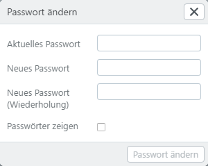

# Benutzereinstellungen

Im Benutzer-Menü werden Informationen zu Ihrem Benutzer angezeigt. Nachfolgend werden die Details, die in den Benutzereinstellungen angepasst und geändert werden können, beschrieben.

## Einstellungen

Ändern Sie hier die Einstellungen zu Ihrem Benutzer. Es kann vom easydb-Administrator festgelegt werden, welche Einstellungen Sie hier selbst vornehmen können. Fehlen einige der Funktionen, liegt es daran, dass diese nicht freigegeben sind.

|Einstellung|Erläuterung|
|---|---|
|Login|Ihr hinterlegtes Login (= Benutzername), wenn es angelegt wurde. Das kann hier nicht geändert werden.|
|Owner|Der Besitzer, der diesen Benutzer angelegt hat. Das kann der easydb Administrator sein oder ein anderer Benutzer, der das Recht hat Benutzer anzulegen. Der Owner kann nicht geändert werden.|
|ID| Jeder Datensatz, auch der von Benutzern, erhält beim Anlegen in easydb eine ID. Diese kann hier nicht geändert werden.|
|Vorname|Ist ein optionales Feld. Wenn es für Ihren Benutzer freigegeben ist, ist es ein Pflichtfeld. Der Vorname kann von Ihnen geändert werden.|
|Nachname|Ist ein optionales Feld. Wenn es für Ihren Benutzer freigegeben ist, ist es ein Pflichtfeld. Der Nachname kann von Ihnen geändert werden.|
|Anzeigename|Optionaler Anzeigename für Ihren Benutzer. Diesen Namen sehen andere Benutzer.|
|Firma|Optionale Angabe einer Firma.|
|Abteilung|Optionale Angabe einer Abteilung.|
|Telefon|Optionale Telefonnummer.|
|Bild|Optionales Bild. Durch die Drag & Drop Funktion (halten mit der linken Maustaste) kann das Bild positioniert werden. Andere Benutzer sehen dieses Bild.|
|Bemerkung| Dieses Feld sehen Sie, der easydb Administrator und jeder Benutzer, der das Recht für das [Benutzermanagement](../../rightsmanagement/users) hat.|
|Erstellt|Geloggter Zeitpunkt der Erstellung Ihres Benutzers.|
|Adress-Zusatz|Optionales Feld.|
|Straße|Optionales Feld.|
|PLZ|Optionales Feld.|
|Stadt|Optionales Feld.|
|Land|Optionales Feld.|
|Aktuelle E-Mail|Ihre aktuelle Haupt-E-Mail-Adresse.|
|Neue E-Mail|Geben Sie eine neue E-Mail-Adresse an, diese wird zur Haupt-E-Mail, sobald Sie von Ihnen bestätigt wurde.|
|E-Mail-Zeitplan|Informationen zur Konfiguration des E-Mail-Zeitplans finden Sie im Kapitel Rechtemanagement unter [Benutzer](../../rightsmanagement/users).|
|Gruppen|Hier wird angezeigt in welchen [Gruppen](../../rightsmanagement/groups) ihr Benutzer Mitglied ist. Es wir die Zugehörigkeit zu easydb Gruppen als auch zu Systemgruppen angezeigt.|

## Passwort ändern

Falls vom Administrator erlaubt, können Sie hier Ihr Passwort ändern.

|Einstellung|Erläuterung|
|---|---|
|Aktuelles Passwort|Ihr aktuelles Passwort. Wenn Sie Ihr aktuelles Passwort vergessen haben, können Sie auf der Login-Seite den [Passwort-Vergessen-Prozess](../../userprefs/loginscreen) starten (falls vom Administrator erlaubt).|
|Neues Passwort|Ihr neues Passwort. Der Server kann das Passwort ablehnen, wenn Sie ein schon mal verwendetes Passwort nehmen oder das Passwort nicht den Anforderungen entspricht. Beides wird vom Administrator der easydb festgelegt.|
|Neues Passwort (Wiederholung)|Geben Sie hier nochmal das neue Passwort. Nur wenn die Eingabe hier mit dem der Eingabe für das neue Passwort übereinstimmt, kann der Vorgang beendet und das neue Passwort gesppeichert werden.|
|Passwort anzeigen|Wenn gesetzt, können Sie sich das Passwort unverschlüsselt anzeigen lassen, um Ihre Eingabe zu überprüfen.|
