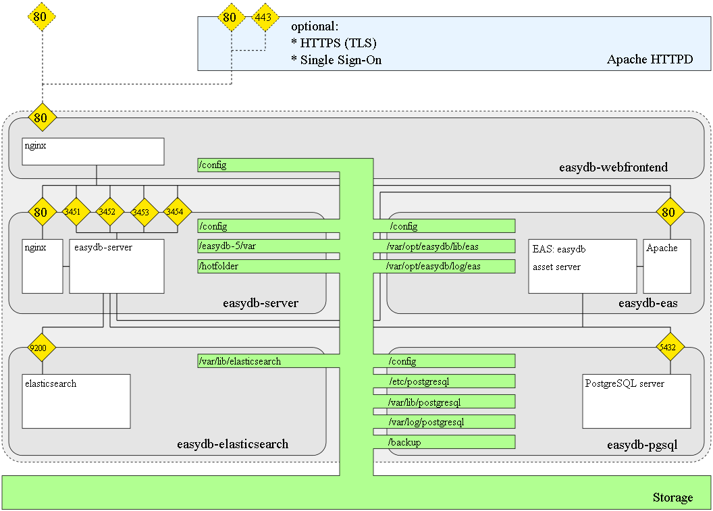

# Systemadministration

In diesem Abschnitt dokumentieren wir administrative Eingriffe außerhalb des Web-Interfaces.

* [Voraussetzungen](/sysadmin/requirements/requirements.md)
* [Installation](/sysadmin/installation/installation.md)
* [Konfiguration](/sysadmin/konfiguration/konfiguration.md)
* [Betrieb](/sysadmin/betrieb/betrieb.md)
* [Migration](/sysadmin/migration/migration.md)
* [Instanziierung](/sysadmin/instances/instances.md) \(mehrere easydbs auf dem gleichen Server\)

### Begriffsklärung

Im Zweifelsfall bezieht sich "Systemadministration" auf dieses Kapital und ["Administration"](../webfrontend/administration/administration.md) auf Eingriffe mithilfe des Web-Interfaces.

# Docker Integration

* Docker: 1 großer **hellgrau**er Kasten mit gepunkteter Linie
* Docker Container: 5 **grau**e Kästen
* Services: **weiß**e Rechtecke
* Speicher der in docker eingeblendet wird: **grün**
* Ports: **gelb**
* Optionale ports zum Netzwerk außerhalb des Servers zeigend: **gepunktet** \(ganz oben\)
* Optionaler Webserver für z.B. HTTPS oder Single Sign-On: **hellblau**es Rechteck \(ganz oben\)

### Weiterführendes

Für u.a. die Aufgaben der einzelnen Komponenten siehe bei Bedarf: [Technische Dokumentation](//en/technical/technical.html).

