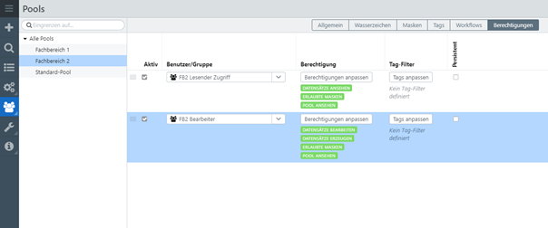

# Zugriff für verschiedene Fachbereiche / Abteilungen

Dieses Tutorial beschreibt exemplarisch, das Setzen von Rechten für verschiedene Fachbereiche. In diesem Szenario hat jede Abteilung (Fachbereich = FB) einen eigenen Pool und ist abgegrenzt von den anderen Fachbereichen.

Falls Sie noch nicht mit dem Tutorial [Rechte 1.1: Anlegen eines lesenden und eines schreibenden Benutzers](rechte1_1/rechte1_1.html)  vertraut sind, machen Sie sich bitte vorab damit vertraut.

## Schritt 1: Pools anlegen

Legen Sie die Pools „Fachbereich 1“ und „Fachbereich 2“ an.

## Schritt 2: Gruppen anlegen

Legen Sie die Gruppen

- FB1 Lesender Zugriff
- FB2 Lesender Zugriff
- FB1 Bearbeiter
- FB2 Bearbeiter

an.

Für die Gruppen „FB1 Lesender Zugriff“ und „FB2 Lesender Zugriff“ setzen Sie die Systemrechte, wie in [Rechte 1.1: Anlegen eines lesenden und eines schreibenden Benutzers](rechte1_1/rechte1_1.html) für den "Lesenden Nutzer" beschrieben.

Für die Gruppen „FB1 Bearbeiter“ und „FB2 Bearbeiter“ setzen Sie die Systemrechte, wie in [Rechte 1.1: Anlegen eines lesenden und eines schreibenden Benutzers](rechte1_1/rechte1_1.html) für den "Schreibenden Nutzer" beschrieben.

## Schritt 3: Pool-Berechtigungen bearbeiten

Bearbeiten Sie die Poolrechte für den Pool „Fachbereich 1“, wie in [Rechte 1.1: Anlegen eines lesenden und eines schreibenden Benutzers](rechte1_1/rechte1_1.html) für Fachbereich 1 beschrieben.

Bearbeiten Sie die Poolrechte für den Pool „Fachbereich 2“, entsprechend wie für Fachbereich 1.

## Anwendungsbeispiele

*Auf diese Weise können Sie Abteilung für Abteilung vorgehen. Dieses Szenario ist z.B. dafür geeignet, wenn mehrere Abteilungen mit einer easydb arbeiten und die Abteilungen keinen Zugriff auf die Datensätze untereinander erhalten sollen.*

*Sie haben hier auch die Möglichkeit z.B. einen Lesenden Zugriff für alle auf alle Datensätze zu ermöglichen, die Bearbeitung der Datensätze in einzelnen Pools jedoch strikt zu trennen. D.h. jeder Fachbereich bearbeitet und verwaltet die Datensätze im eigenen Pool und dennoch kann jeder alle Datensätze zumindest ansehen.*

*Ein weiteres Szenario könnte z.B. sein, dass es einen Archivpool gibt auf den nur Power-User oder Administratoren Zugriff haben. D.h. Sie gewähren Zugriff auf alle Pools – ausgenommen den Archivpool. Für diesen Archivpool haben nur wenige Nutzer Zugriff. Die Inhalte in diesem Pool werden damit von den übrigen Nutzern nicht gefunden.*