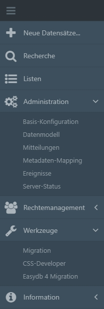

# Administration

In diesem Abschnitt des Handbuchs sind Eingriffe mit dem Web-Interfaces dokumentiert. Administrative Eingriffe außerhalb des Web-Interfaces sind unter [Systemadministration](../../sysadmin/sysadmin.html) dokumentiert.

Dieser Teil besteht aus den Kapiteln, die im easydb Hauptmenü unter **Administration ** und **Werkzeuge** zu finden sind.

**Administration:**

* [Basis-Konfiguration](../administration/base-config/base-config.html)
* [Datenmodell](../administration/datamodel/datamodel.html)
* [Mitteilungen](../administration/messages/messages.html)
* [Metadaten-mapping](../administration/profiles/profiles.html)
* [Ereignisse](../administration/events/events.html)
* [Server-Status](../administration/server-status/server-status.html)

**Werkzeuge:**

* Migration (*Kapitel steht noch aus*)
* [CSS-Developer](../administration/cssplugin/cssplugin.html)

Eine Anleitung zur Einrichtung einer Selbstregistrierung für Benutzer ist im Kapitel Benutzerverwaltung zu finden:

* [Selbstregistrierung](../userprefs/selfregister/selfregister.html)

