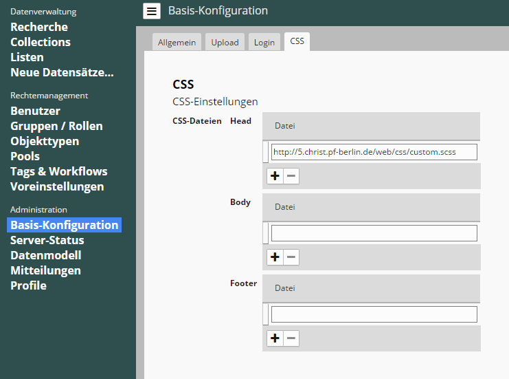

# Schnelleinstieg
Ziel dieses Tutorials ist es die Hintergrundfarbe des Hauptmenüs zu ändern.
Erreicht wird dies durch den Einbau von benutzereigenem SCSS oder CSS Code in die vorhandene SCSS Dateien Struktur der EasyDB5.

##Die CSS-Developer Console
Um das genutzte CSS effizient und konsistent zu halten werden verschiedene SCSS-Dateien abhängig von der aktuellen Konfiguration der EasyDB zu einer CSS Datei kompiliert.
Um eine Übersicht der SCSS-Dateien zu erhalten drücken sie den <code class="button">CSS-Developer</code> Knopf, dieser erscheint wenn das CSS Plugin korrekt installiert wurde.


Es öffnet sich die *CSS-Developer Console* in einem eigenen Fenster.


Hier sind die Dateien aufgelistet die die EasyDB zur Erstellung ihrer CSS Datei benötigt.
Alle Resource Dateien gehören zu den Bereichen Head, Body oder Footer.

|Resource Datei|Erläuterung|
|--|--|
|*1. ez5_header.scss*|Beinhaltet Variablen, Mixins und Extends aufgeteilt in Skin (Farben, Fonts) und Structure (Groessen, Paddings, Margins.)|
|*2. ez5_header_light_theme.scss*|Überschreibt die header SCSS Datei mit Theme eigenen Werten. 'light' steht hier für das aktuell gewählte Theme. Oben rechts in der `CSS-Developer Console` ist ein Dropdown Menü mit dem das Theme geändert werden kann.|
|*3. ez5_body.scss*|Diese Datei beinhaltet die eigentlichen CSS Klassen die Variablen und Mixins nutzt.|
|*4. ez5_footer_light_theme.scss*|Analog zum Header eine Theme eigene Datei die es erlaubt alles bisher Definierte zu überschreiben.|


|Knopf|Erläuterung|
|--|--|
|<code class="button">View</code>|zeigt die Resource Datei im Browser an.|
|<code class="button">Download</code>|erlaubt es die Datei zur genaueren Untersuchung herunterzuladen.|
|<code class="button">View CSS</code>|zeigt die finale aus den Resource Dateien erzeugte CSS Datei, oder ggf. ein Fehlerprotokoll.|
|<code class="button">Reload CSS</code>|baut aus den Resource Dateien eine neue CSS Datei und lädt diese nach Fertigstellung automatisch in das EasyDB Frontend.|

##Einbinden eigener SCSS-Dateien
In der Basis Konfiguration im CSS Tab können eigene SCSS oder CSS Dateien eingebunden werden die dann den jeweiligen Bereich überschreiben.


In unserem Beispiel wird die Datei *custom.scss* mittels einer URL eingebunden um den Head unserer SCSS Dateien zu überschreiben.

*custom.scss* Source code:
```scss
$root_menu_background_color: darkslategray;
```

Nach dem Eintragen der URL und dem <code class="button">Speichern</code> wird das CSS sofort kompiliert.
Stellen Sie vorher sicher das die *CSS-Developer-Console* geöffnet ist um etwaige Fehler beheben zu können.

Das Hauptmenü sollte jetzt seine Farbe geändert haben.




