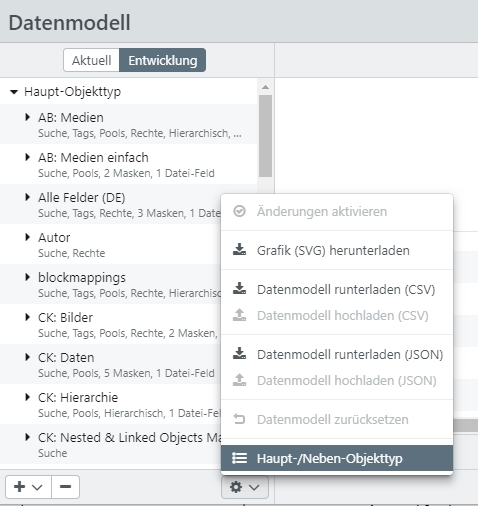
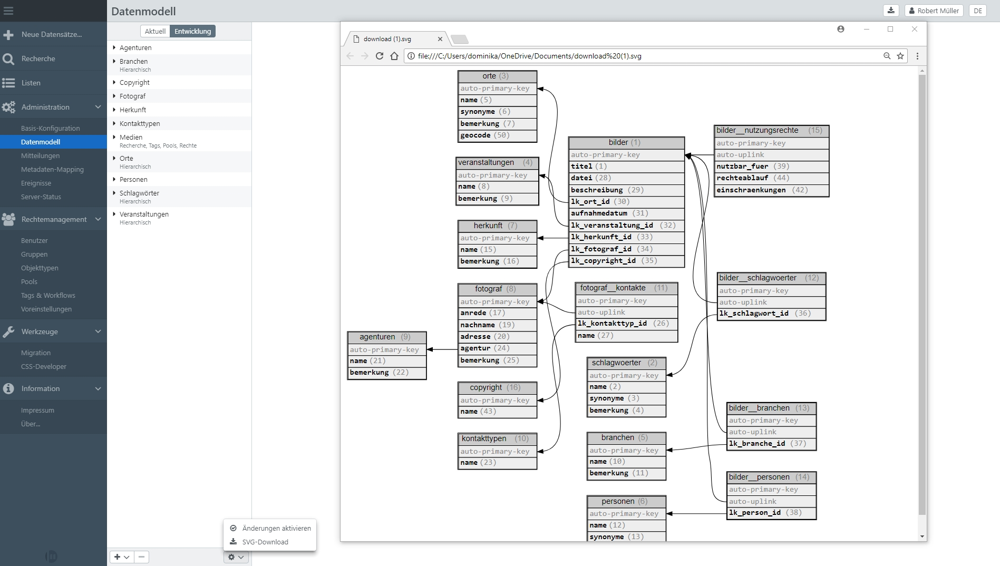

# Datenmodell

Beim Datenmodell kann das aktuellen Datenmodell <code class="tab">Aktuell</code> und wenn Zugriffsrecht besteht die Entwicklungsversion <code class="tab">Entwicklung</code> angezeigt werden. Mit <code class="button">Änderungen aktivieren</code> können Änderungen, die in der Entwicklungsversion vorgenommen wurden, übernommen werden. Hierdurch wird die aktuelle Version überschrieben.

> HINWEIS: Beachten Sie, dass dieser Vorgang serverseitig sehr viel Aktivität in Gang setzt, u.a. ein komplettes Neu-Indizieren aller Datensätze. Bis zur vollständigen Neu-Indizierung finden Benutzer ggfs. Datensätze im alten Format vor. In manchen Fällen, kann es auch passieren, dass von Änderungen betroffene Datensätze Benutzern nicht angezeigt werden, bis die Neu-Indizierung abgeschlossen ist.

## Definition von Feldern

Im Datenmodell werden Objekttypen und Masken definiert. Objekttypen beschreiben die Struktur der Daten in der Datenbank. Masken beschreiben die Aus- und Eingabeansicht auf die Objekttypen und somit die Datensätze. Sind beispielsweise für einen Objekttyp insgesamt 20 Feldern definiert, können über Masken unterschiedliche Feldkombinationen ausgegeben werden. Benutzer 1 könnte mit dem Recht auf Maske 1 z. B. 5 dieser Felder erhalten. Nutzer 2 könnte mit Maske 2 z. B. 5 andere Felder erhalten und mit  Maske 3 wiederum 15 Felder sehen.

* [Objekttypen](objecttype/objecttype.html)

* [Masken](mask/mask.html)

> HINWEIS: Über die [Feldrechte](../../rightsmanagement/objecttypes/objecttypes.html#fieldrights) am Objekttyp ist es möglich einzelne Felder für bestimmte Benutzer oder Gruppen auszublenden und die Ansicht eines Objekttyps und entsprechender Masken zu verfeinern.  

## Datenmodell exportieren/importieren {#datamodelfile}

easydb bietet die Möglichkeit das Datenmodell der easydb 5 Instanz herunterzuladen und es als JSON- oder CSV-Datei zu sichern oder wiederzuverwenden. Der JSON-Export enthält die Konfiguration aller Objekttypen mit dazugehöriger Masken und Einstellungen. Der CSV-Export enthält die Tabellen für alle Objekttypen ohne Masken und ohne Einstellungen.

Ebenfalls ist es möglich ein extern gesichertes Datenmodell (JSON & CSV) in easydb zu importieren. 

Der Download und Uplaod des Datenmodells wird im Hauptmenü über das Datenmodell erreicht und ist unterhalb der Liste der Objekttypen in der Entwicklungsumgebung über das <i class="fa fa-cog"></i>-Menü zu finden. 

> HINWEIS: Der Upload eines Datenmodells ist vor allem für die Überführung existierender Datenmodelle in neu aufgesetzte easydb 5 Instanzen vorgesehen. Beachten Sie, dass das Hochladen und Aktivieren eines neuen Datenmodells, ein bereits bestehendes Datenmodell überschreibt und es nicht ergänzt.

### Verwendungshinweise

1. Der Download und Upload von Datenmodellen dient der Sicherung als Backup. Dies ist vor allem im JSON-Format empfehlenswert, da auch Masken und Einstellungen zu den Objekttypen gespeichert werden. 

2. Die Nutzung gespeicherter Datenmodelle erleichtert den schnellen Aufbau neuer Instanzen, wenn diese auf bereits bestehenden Datenmodellen aufbauen sollen.

3. In einer CSV gesicherte Datenmodelle können übersichtlich in einer Tabelle angezeigt werden. CSV- Dateien können von Tabellenverarbeitungsprogrammen wie z.B. Excel gelesen werden. Die Tabellen für alle Objekttypen werden in einem Tabellenblatt angezeigt.

4. Eine CSV kann beispielsweise dafür genutzt werden, Übersetzungen für das Datenmodell zunächst außerhalb der Datenbank hinzuzufügen.

5. Mit der Sicherung von CSV-Dateien in regelmäßigen Abständen, kann die Entwicklung eines Datenmodells übersichtlich dokumentiert werden.

## Datenmodell zurücksetzen

Das Menü in der Entwicklungsumgebung erlaubt das Zurücksetzen des Datenmodells im Entwicklungsmodus. Änderungen, die am Datenmodell vorgenommen wurden, werden damit auf den Stand des aktuellen Datenmodells zurückgesetzt. 

## Objectstore {#objectstore}

Der Objectstore ist ein Knotenpunkt, der ein Datenmodell für verschiedene Instanzen verwaltet. Hierbei wird das aktuelle Datenmodell in einer virtuellen Umgebung abgelegt und vor weiteren Änderungen mit anderen Instanzen synchronisiert.

Ist der Objectstore eingerichtet, erscheint neben dem <i class="fa fa-cog"> </i>-Menü ein <i class="fa fa-lock"> </i>-Button. Um am Datenmodell zu arbeiten, wird der Button aktiviert und offen <i class="fa fa-unlock"> </i> angezeigt. In der Zeit ist es nicht möglich von anderen Instanzen Änderungen am Datenmodell vorzunehmen. Das Icon bleibt dort verschlossen. Sind die Änderungen am Datenmodell abgeschlossen und aktiviert, muss das <i class="fa fa-unlock"> </i>-Icon nochmal geklickt werden, um den Vorgang abzuschließen. Das aktuelle Datenmodell wird dann im Objectstore abgelegt. Aktiviert nun ein andere Bearbeiter von einer anderen Instanz die Bearbeitung des Datenmodells, erscheint zunächst eine Mitteilung, dass das Datenmodell erst aktualisiert werden muss. Ist die Synchronisierung mit dem Datenmodell aus dem Objectstore abgeschlossen, kann die Bearbeitung am Datenmodell erfolgen.

## Datenmodellgrafik

Über das Auswahlmenü in den Bearbeitungsoptionen besteht die Möglichkeit die Strukturen des Datenmodells zu visualisieren. Das aktuelle Datenmodell kann dazu als svg-Grafik heruntergeladen werden.

