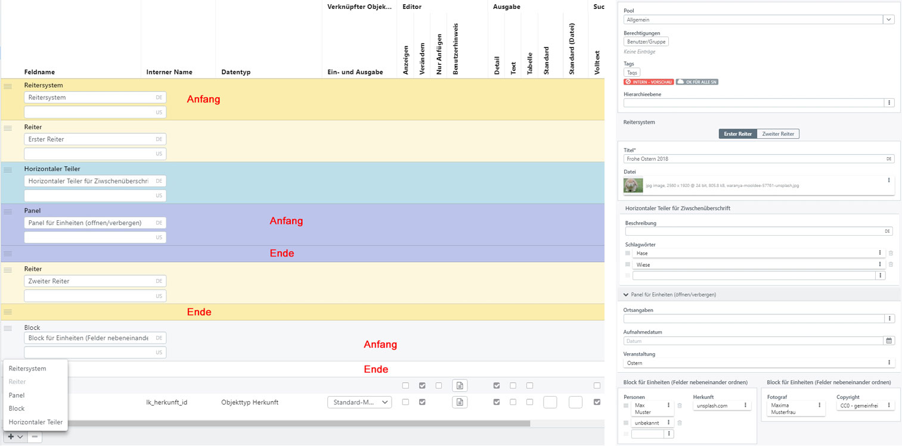

# Masken {#masks}

Masken dienen der Veränderbarkeit und Sichtbarkeit von Feldern in Datensätzen. Eine Maske ist das zentrale Instrument in easydb für feldbezogenes Rechtemanagement. Dabei geht es sowohl um die Einstellung, welche Datenfelder verändert als auch angezeigt werden können. Mit Masken kann die Reihenfolge der angezeigten Felder eingestellt werden. Hierbei kann auch für die Detailansicht und den Editor festlegen werden, ob Felder in Reitern, Panels oder gruppiert angezeigt werden.

Für jeden Objekttyp muss mindestens eine Maske angelegt (die erste wird automatisch angelegt) und als Standard-Maske definiert sein. Es kann pro Objekttyp nur eine Maske als Standard-Maske definiert sein. Die Standard-Maske wird verwendet, um in Situation, in denen ein Benutzer Rechte für mehr als eine Maske hat (z. B. über verschiedene Gruppen-Mitgliedschaften), entscheiden zu können, welche Maske zur Anzeige im Suchergebnis und Detail verwendet wird. Stehen mehrere Masken zur Verfügung, so kann der Benutzer im Detail und im Editor zwischen den Masken umschalten.

## Ein- und Ausgabe

|Einstellung| |Erläuterung|
|--|--|--|
|Name| |Name der Maske. Dieser Name wird für die Kommunikation zwischen Client und Server verwendet und als Fallback, wenn kein Anzeigename vergeben wurde.|
|Bezeichnung|  |Ist der Anzeigename für die Maske, mehrsprachig. Unter diesem Namen sieht der Benutzer die angezeigten Datensätze.|
|Kommentar (intern)| |Kommentar, wird nur hier angezeigt.|
|Standard-Maske| |Falls gesetzt, ist diese Maske die Standard-Maske.|
|Nach Kommentar beim  Speichern oder Löschen fragen| |Ein Kommentar wird vom Benutzer eingegeben und erscheint in der Änderungshistorie für andere sichtbar.|
| |Aus|Der Benutzer kann beim Speichern und Löschen keinen Kommentar eingeben.|
| |Optional- Nein|Der Benutzer kann einen Kommentar eingeben, Voreinstellung ist "aus".|
| |Optional - Ja|Der Benutzer kann einen Kommentar eingeben, Voreinstellung ist "an", der Benutzer kann aber darauf verzichten.|
| |Immer|Der Benutzer muss einen Kommentar eingeben und kann das auch nicht abstellen.|
|Systemfelder: *Hierarchie*| |Nur für hierarchische Objekttypen.|
|                        |Editor|*Verändern* - Im Editor kann der übergeordnete Datensatz verändert werden  *Nur anzeigen* - Im Editor wird der übergeordnete Datensatz angezeigt, kann aber nicht verändert werden  *Nicht angezeigt* - Der übergeordnete Datensatz wird nicht angezeigt|
|                        |Ausgabe|*Anzeige* - Im Detail und in der Text-Ansicht wird der übergeordnete Datensatz angezeigt  *Nicht angezeigt* - der übergeordnete Datensatz wird nicht angezeigt.|
|                        |Maske  |Mit der Maske wird festgelegt, welche Felder für den übergeordneten Datensatz bei der Anzeige berücksichtigt werden  *- unverändert -* Der übergeordnete Datensatz wird mit derselben Maske angezeigt wir der Datensatz selber  *Standard-Maske* es wird die Standard-Maske verwendet  *Maske* die angegebene Maske wird verwendet|
|                        |Anzeigeart  |*Standard* - Anzeige in der Standard-Ansicht  *Text* - Anzeige in der Text-Ansicht  *Kurz* - Anzeige in der Minimal-Ansicht|
|Systemfelder: *Tags*| |Legt fest, ob Tags im Editor oder Detail angezeigt werden.|
|                   |Editor|*Verändern* - Tags können im Editor verändert werden  *Nur anzeigen* - Tags werden nur angezeigt  *Nicht anzeigen* - Tags erscheinen nicht im Editor|
|                   |Ausgabe|*Anzeigen* - Tags werden in der Detail- und Textansicht angezeigt  *Nicht anzeigen* - Tags werden nicht angezeigt.|
|Systemfelder: *Owner*| |Wie Tags. Zeigen den Verantwortlichen an.|
|Systemfelder: *Berechtigungen*| |Wie Tags. Zeigen die Berechtigungen am Datensatz an. Berechtigungen sind nur verfügbar, wenn für den Objekttyp Berechtigungen eingerichtet sind.|
|Systemfelder: Mappen| |Wie Tags. Hier wird festgelegt, ob angezeigt wird, in welchen Mappen sich der Datensatz befindet. Eine Veränderung im Editor ist nicht möglich. Nur verfügbar, wenn der Objekttyp in der Haupt-Suche angezeigt wird.|
|Systemfelder: *Pool*| |Wie Tags. Allerdings wird die Pool-Zugehörigkeit im Editor immer angezeigt und ist auch immer veränderbar (soweit die Rechte des Benutzers das erlauben). Nur verfügbar, wenn für den Objekttyp Pool-Management angeschaltet ist.|

## Definition {#definition}

|Einstellung  |                 |Erläuterung      |
|--           |--               |--               |
|Feld         |                 |Anzeigename des Feldes, bei Trennern kann hier der Anzeigename des entsprechenden Trenners festgelegt werden.|
|Datentyp     |                 |Datentyp des Feldes, nur für den Überblick es können hier keine Einstellung vorgenommen werden.|
|Ein- und Ausgabe|              |Nur bei Vorwärts-Verlinkungen. Vorwärts-Verlinkungen werden immer als Datensatz angezeigt. Der vorwärts verlinkte Datensatz kann selber nicht direkt verändert werden. Daten des verlinkten Datensatzes werden mit der angegeben Maske in den Haupt-Datensatz geschrieben. In Bezug auf das Rechtemanagement, zählt nur das Rechtemanagement des Haupt-Datensatzes. Der Benutzer erhält automatisch das Recht den verlinkten Datensatz (im Rahmen der gewählten Maske) vollständig zu sehen.|
|                |Standard-Maske|Für die Anzeige wird die Standard-Maske des verlinkten Objekttyp benutzt.|
|                |*Maske*|Benutzt die angegebene Maske für den verlinkten Objekttyp.|
|**Editor**| | |
|Anzeigen| |Das Feld wird im Editor nur angezeigt und ist nicht veränderbar.|
|Verändern| |Das Feld wird angezeigt und ist veränderbar.|
|Nur Anfügen| |Das Mehrfachfeld erlaubt nur ein ergänzen, löschen ist nicht erlaubt. *Nur bei Mehrfachfeldern.*|
|Als Tabelle| |Wenn gesetzt wird das Mehrfachfeld in einer horizontalen Tabelle angezeigt. Wenn nicht gesetzt, wird das Mehrfachfeld in der Haupt-Tabelle angezeigt. *Nur bei Mehrfachfeldern.*|
|Benutzerhinweis| |Wird im Editor angezeigt und dient dem Benutzer als Hilfe, wie dieses Feld benutzt wird.|
|**Ausgabe**| | |
|Detail| |Das Feld ist in der Detailansicht und in der Experten-Suche sichtbar.|
|Text| |Das Feld ist in der Text-Ansicht sichtbar.|
|Tabelle| |Das Feld ist in der Tabellen-Ansicht sichtbar.|
|Standard| |In die Standard-Ausgabe können verschiedene Felder einbezogen werden. Durch die Einstellungen in dem Popover kann festgelegt werden, in welcher Wichtigkeit und mit welchem Design die Felder ausgeben werden. Standard-Ausgaben werden überall verwendet, wo Datensätze in einer Übersicht angezeigt werden (z. B. das "Standard"-Suchergebnis) oder nicht viel Platz ist und Übersicht erforderlich (z. B. die Vorwärts-Verlinkung-Datensätze).|
|  |Position|*Nicht anzeigen* - Das Feld wird in der Standard-Ansicht nicht angezeigt  *Titel* - Das Feld ist das wichtigste Standard-Feld  *Untertitel* - Das Feld gehört thematisch zum Titel ist aber nicht so wichtig  *Beschreibung* - Das Feld hat die dritthöchste Priorität für die Anzeige|
|   |Design des Textes|*normal* - Das Feld wird normal ausgeben  *bold* - Das Feld wird fetter ausgegeben  *thin* -Das Feld wird dünner ausgegeben|
|  |Trenner nach der Ausgabe|Wenn mehrere Felder dieselbe Position benutzen, werden sie durch den angegebenen Trenner verbunden oder formatiert.  *space* - Leerzeichen  *comma* - Komma  *semicolon* - Semikolon  *newline* - Neue Zeile  *brackets* - Text wird in { ... } ausgegeben  *round-parentheses* - Text wird in ( ... ) ausgegeben,  *square-brackets* - Text wird in [ ... ]ausgegeben.|
|**Suche**| | |
|Volltext| |Das Feld wird im Volltext durchsucht, d. h. es werden Wortvorschläge für dieses Feld generiert und es wird in einer allgemeinen Volltextsuche durchsucht.|
|Expertensuche| |Das Feld wird in der Expertensuche berücksichtigt.|
|Filter| |Das Feld wird in der Filtersuche berücksichtigt. Bei Mehrfachfeldern muss die Checkbox auf Top Level Ebene aktiviert werden, sowie für jedes einzelne Feld, das innerhlab des Mehrfachfelds liegt und im Felder berücksichtigt werden soll.|
|Nested Index| |Kann bei Mehrfachfeldern (oder auch Wiederholfelder genannt) gesetzt werden. Die Mehrfachfelder werden dann als Block kombiniert und bei der Suche zusammenhängend berücksichtigt. Besteht das Mehrfachfeld z. B. aus Person und Rolle werde beide in Kombination gesucht.|
|**Optionen**| | Erweiterte Optionen für die Ausgabe im Editor|
||Anzeige im Editor|*- Standard -* - wie konfiguriert  *Verbergen* - im Frontend nicht anzeigen  *Nur lesend* - Im Frontend nur lesen möglich  HINWEIS: Damit das Feld über die API schreibbar ist, muss es für *Editor* aktiviert werden. Mit der Option *verbergen* wird das Feld lediglich im easydb-Frontend für den Benutzer ausgeblendet.|
||Anzeigeart|*Standard*  *Text*  *Kurz*|
||Sortierung|*Aufsteigend*  *Absteigend*|
||Verkürzte Darstellung|Bei Mehrfachfeldern kann diese Option aktiviert werden, um die Darstellung zu verkürzen und mehrere Felder in einer Zeile darzustellen. Beispiel: das Mehrfachfeld besteht aus den Feldern "Person" und "Rolle". In der verkürzten Darstellungen stehen die Einträge kommagetrennt in einer Zeile.  |
||Feldbreite| Für die meisten Felder kann eine Breite Festgelegt werden. 2 aufeinanderfolgende Felder, die in Summe 100% Breite nicht übersteigen, würden innerhalb eines Trennbereichs (siehe [Trenner](#separator)) nebeneinander geordnet werden. |
||Feldname ausblenden|Der Feldname für das Feld kann für die Detailansicht und den Editor ausgeblendet werden, z.B. wenn mehreren Masken verwendet werden und nicht für jeden eizelnen Feldinhalt eine Bezeichnung angezeigt werden soll.  |
||Feldname in Filter ausblenden| Kann genutzt werden, um die Filter nur über die API anzusprechen. Der Filter muss zunächst aktiviert werden, damit er im Index erscheint und kann über diese Option für das Frontend ausgeblendet werden. |
||In Karte anzeigen|Bei Feldern für Dateien, die GPS Koordinaten enthalten, kann je Maske die Darstellung auf einer Karte in der Detailansicht de-/aktiviert werden. Global muss diese Funktion zuerst in der [Basis-Konfiguration](/webfrontend/administration/base-config/base-config.html#design) aktiviert werden.|
||Immer im Detail anzeigen|Für Ja/Nein-Felder (Boolesch) kann über die Maske gesteuert werden, wie die Anzeige des Eintrags in der Detailansicht erscheint. Wird die Checkbox nicht aktiviert, wird das Feld im Detail nur angezeigt, wenn ein Wert gesetzt wurde. Wird die Checkbox aktiviert, erscheint der Wert im Detail immer und zeigt an, ob ja oder nein gesetzt ist.|

Die Maske kann für die Ein- und Ausgabe mit sogenannten Trennern formatiert werden. Trenner können mit <code class="button">+</code> und <code class="button">-</code> angelegt bzw. gelöscht werden.

### Trenner {#separator}

_Links: Trenner im Datenmodell, Rechts: Darstellung der Trenner in der Detailansicht
_
Trenner können in einer Maske über <code class="button">+</code> und <code class="button">-</code> hinzugefügt und entfernt werden. Einige Trenner bestehen aus zwei Zeilen, die den Anfang und das Ende markieren. Dazugehörigen Felder werden zwischen der Anfangs- und der Endzeile platziert.

|Trenner|Erläuterung|
|--|--|
|Kopfbereich| Im Kopfbereich erscheinen die Systemfelder, die für Masken über den Reiter "Ein- und Ausgabe" aktiviert werden können. Der Kopfbereich wird im Editor und der Detailansicht immer im oberen Eingabebereich angezeigt. Diese Position ist nicht veränderbar. In der Detailansicht erscheint zudem eine Infoleiste, die die Asset-ID oder wahlweise einen als Kurzinfo festgelegten Titel sowie gesetzte Tags angezeigt. Diese Infoleiste ist fixiert und scrollt nicht mit, wenn die Detailansicht einen Scrollbalken erzeugt.  |
|Reitersystem|Felder können in einem Reitersystem angezeigt werden. Für das Reitersystem kann ein Anzeigename vergeben werden, der über den Reitern angezeigt wird. Im Reitersystem muss mindestens ein Reiter angelegt werden, der mit dem Trenner *Reiter* hinzugefügt wird. Es können beliebig viele Reiter in dem Reitersystem angelegt werden. Felder, die unterhalb des Reitersystems angelegt werden, behalten ihre Position über alle Reiter hinweg.|
|Reiter|Innerhalb von einem *Reitersystem* können mehrere Reiter definiert werden. Die Felder für einen Reiter werden dann unterhalb des Trenners *Reiter* platziert.|
|Panel|Felder können innerhalb eines Panels gruppiert werden und sind als Einheit auf- und zuklappbar. Panels können wie auch Reiter dazu genutzt werden, komplexe Feldmodelle übersichtlicher anzuordnen. Ein Panel besteht, wie das Reitersystem aus einer Kopf- und einer Endzeile. In der Kopfzeile wird die Bezeichnung für das Panel eingetragen. Die Felder werden zwischen der Kopf- und Endzeile angelegt. Standardmäßig werden die Panel geschlossen angezeigt. Über die Optionen kann das Panel Für die Detailansicht, den Editor und die Expertensuch auf standardmäßig geöffnet gesetzt werden.|
|Block| Ähnlich wie beim Panel können Felder innerhalb eines Blocks als Einheit gruppiert werden. Blöcke können nicht geschlossen werden, sind aber dynamisch in der Darstellung. Mehrere Blöcke werden in der Sidebar untereinander angezeigt. Wird die Sidebar in die Breite gezogen oder das Vollbild gewählt, gleiten die Blöcke nebeneinander. Blöcke können im Gegensatz zu den anderen Trenner nicht innerhalb eines Reitersystems angelegt werden. | 
|Horizontaler Teiler|Dieser Trenner ist eine einfache Zwischenüberschrift zwischen Feldern.|
|Keine Trenner| Felder ohne oder außerhalb von Trennern werden im Block angezeigt. Im Gegensatz zu Panels oder Blöcken, sind diese Blöcke aber nicht dynamisch und werden im Editor immer vollständig angezeigt.|

> HINWEIS: Die Position aller Trenner und Felder in Masken kann per Drag & Drop verändert werden. Es kann sowohl der Anfang als auch das Ende des Trenners verschoben werden, um so den Bereich, den der Trenner definiert, zu variieren. Hierdurch können die Spaltenbreiten für die Eingabebereiche individuell angepasst werden.

## Vorschau Editor

Der Reiter (Tab) zeigt die Vorschau auf die Ausgabe der Maske im Editor.

## Vorschau Suche

Der Reiter (Tab) zeigt eine Vorschau auf die Ausgabe der Datensätze in dieser Maske in verschiedenen Kontexten.

Beachten sie, dass für hierarchische Objekttypen mehrere Vorschauoptionen gezeigt werden, da diese Datensätze teilweise als Pfade angezeigt werden.

## Vorschau Detail

Der Reiter (Tab) zeigt die Vorschau der Ausgabe der Datensätze im Detail.
