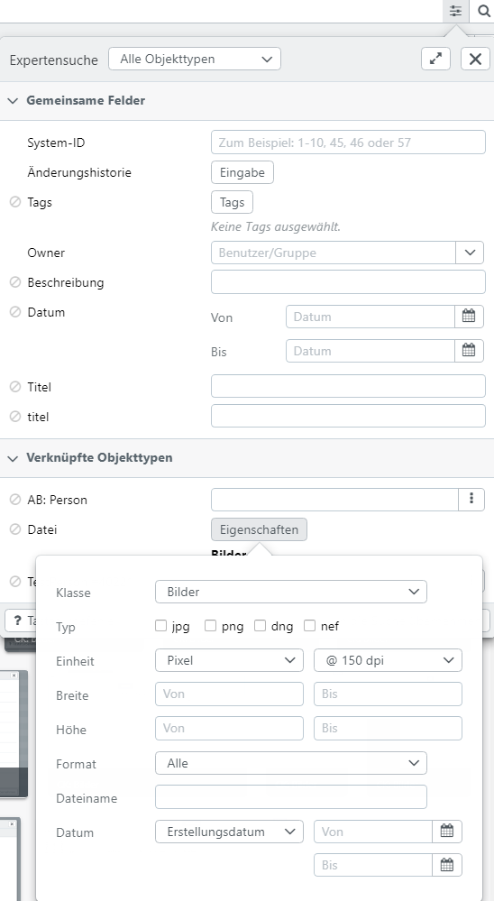
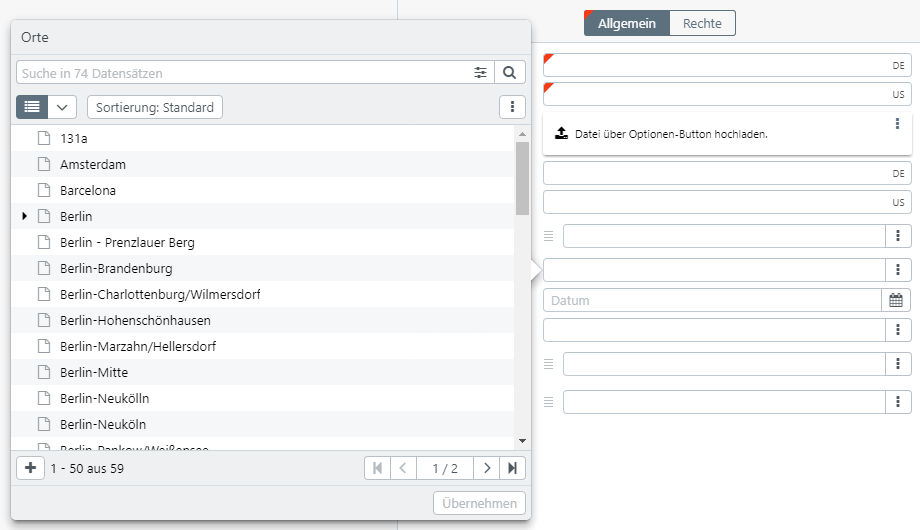

# Datentypen (User)

easydb unterstützt verschiedene Datentypen, die unterschiedliche Ein- und Ausgaben in der [Suche](../search/search.html), im [Detail](../search/detail/detail.html) und im [Editor](../search/editor/editor.html) hervorbringen.

## Einzeiliger Text

|Umgebung |Erläuterung |
|---|---|
|Suche |Text wird in Tokens zerteilt und linksbündig gesucht.|
|Detail|Text wird angezeigt. Bei langem Text kann es zu einem Umbruch kommen.|
|Editor|Einzeilige Eingabe.|

## Einzeiliger Text (mehrsprachig)

|Umgebung|Erläuterung|
|--|--|
|Suche|Mehrsprachiger Text wird in Tokens zerteilt und linksbündig gesucht. Entsprechend der [Spracheinstellungen](../../userprefs/language/language.html) werden eine oder mehrere Sprachen durchsucht.|
|Detail|Text wird in den aktuell eingestellten [Datensprachen](../../userprefs/language/language.html) angezeigt. Nicht ausgefüllte Sprachen werden nicht angezeigt. Jede Sprache wird im enstprechenden Feld am Ende mit dem Länderkürzel markiert.|
|Editor|Text kann in den aktuell eingestellten [Datensprachen](../../userprefs/language/language.html) eingegeben werden.|

## Mehrzeiliger Text

Verhält sich wie *Einzeiliger Text*, mit dem Unterschied, dass Zeilenumbrüche erlaubt sind und die Eingabefelder größer sind.

## Mehrzeiliger Text (mehrsprachig)

Verhält sich wie *Einzeiliger Text (mehrsprachig)*, mit dem Unterschied, dass Zeilenumbrüche erlaubt sind und die Eingabefelder größer sind.

## Einfacher Text (String)

Verhält sich wie *Einzeiliger Text* mit dem Unterschied, dass bei der Suche nicht in einzelne Tokens aufgeteilt wird. Der *String* wird als eine Einheit verstanden, somit wie ein einziger Token behandelt und links- und rechtsbündig durchsucht.

Postleitzahlen werden ebenfalls als String behandelt. Zur Suche kann eine Wildcard (3* für 3...) verwendet werden, um zum Beispiel alle Postleitzahlen, die mit einer 3 beginnen zu finden. 

## Datum

Das Datum kann im Eingabefeld verkürzt als Jahr und Jahr+Monat eingegeben werden. Hierbei werden auch Negativwerte für Datumsangaben v. Chr. unterstützt.

## Datum (Bereich)

Datumsangabe mit Start und Enddatum **von - bis**.

## Datum+Zeit

Datumsangabe mit Datum und Uhrzeit, z. B. **12.06.2011 10:13**

## Zahl (ganzzahlig)
Zahl, die aus einer Zahl besteht.

Ausgenommen sind hierbei Postleitzahlen, die diese eine führende 0 beinhalten können. Postleitzahlen werden als *String* behandelt.

## Zahl (Komma)
Mehrere kommagetrennte Zahlen. Zum Beispiel 1-10,45, 46 oder 57

## Boolesche Variablen (Ja/Nein Option)

|Umgebung|Erläuterung|
|--|--|
|Suche|Bei der Suche wird über ein Pulldown gesucht.|
|Detail|Wenn gesetzt, wird der Eintrag "Ja" oder optional "Nein" angezeigt. Siehe dazu auch [Optionen](../../../administration/datamodel/mask/mask.html) in Maskendefinition.|
|Editor|Wird über ein Pulldown gesetzt.|

## Mehrfach-Felder

Mehrfach-Felder bestehen aus mehreren Datenzeilen. Die einzelnen Datenzeilen können wiederum ein oder mehrere Felder enthalten. In den Masken-Einstellungen kann festgelegt werden, ob die Felder horizontal oder vertikal in der Ein- und Ausgabe angezeigt werden.

Die Position der neu eingefügten Datenzeilen kann manuell geändert werden. Greifen Sie dafür die Zeile am linken Rand und ändern Sie die Position per Drag & Drop. Die neue Positionierung wird mit dem Speichern gesichert.

### Horizontale Darstellung

Durch die Eingabe in ein Feld wird automatisch eine weitere Datenzeile erzeugt. Gespeichert werden nur Zeilen, die eine Eingabe enthalten. Über den Optionen-Button <i class="fa fa-ellipsis-v"></i> auf der rechten Seite kann die jeweilige Zeile wieder gelöscht werden.

### Vertikale Darstellung

In der vertikalen Darstellung werden mehrere Datenzeilen als Block angezeigt. Die Zeilen erscheinen untereinander. Die Trennung der Blöcke wird durch eine Leerzeile in der Feldspalte markiert. Für das Hinzufügen von Blockzeilen stehen folgende Optionen zur Verfügung:

|Auswahl|Erklärung|
|--|--|
|Neue Zeile|Fügt eine neue leere Datenzeile hinzu.|
|*Objekttyp* suchen| Öffnet die Suche für verlinkte Objekttypen. Die Auswahl erscheint für verlinkte Objekttyp-Felder in der Datenzeile. In der Suche kann mehr als ein Datensatz auswählt werden. Es werden dann entsprechend viele Datenzeilen am Ende eingefügt.|
|*Objekttyp* neu anlegen|Erscheint für verlinkte Objekttyp-Felder in der Datenzeile. Benutzen Sie diese Auswahl, um neue Datensätze dieses verlinkten Objekttyps anzulegen.|
|Dateien hochladen|Wenn sich in der Datenzeile Datei-Felder befinden, so erscheint diese Auswahl. Sie können damit direkt Dateien hochladen. Je Datei wird eine Datenzeile am Ende angefügt.|
|Am Anfang|Wird gesetzt, um die neue Datenzeile an erster Stelle anzufügen.|
|Am Ende|Wird gesetzt, um die neue Datenzeile an letzter Stelle anzufügen.|

Markieren Sie die Blockzeile, um dann mit <i class="fa fa-minus"></i> den gesamten Block zu entfernen.

## Datei

### Suche

Im Volltext werden Dateien mit ihrem Original-Dateinamen gefunden, wenn in der Maske *Volltext* für dieses Feld aktiviert ist.

In der Expertensuche erscheint unter *Alle Objekttypen* eine gemeinsame Suche für *Dateien*. In *Gemeinsame Felder* erscheint die Sucheingabe, wenn das Feld bei mehr als einem Objekttyp zur Verfügung steht. Bei den *verknüpften Objekttypen* erscheint die Sucheingaben für die einzelnen Objekttypen.

Je nach ausgewählter Datei-Klasse (*Bilder*, *Video*, *Audio*, *Office*, *Sonstige*) erscheinen andere Auswahlfelder. Beachten Sie, dass die angezeigten Datei-Endungen bereits das Ergebnis einer Sichtbarkeitssuche sind, d.h. wenn Sie in der Datenbank keine *TIF*-Dateien haben (oder keine sehen, weil Ihnen die Rechte fehlen), so erscheint *TIF* nicht in der Auswahl.

|Feld| |Erläuterung|
|--|--|--|
|Klasse| |Auswahl der Datei-Klasse, die Eingabe-Felder passen sich entsprechend an. Die Klasse *Alle* sucht über alle Datei-Klassen.|
|Typ| |In der Datenbank für Sie sichtbare Typen der Dateien.|
|Einheit|Pixel|Die Felder *Breite* und *Höhe* werden in Pixel interpretiert.|
| |mm|Die Felder *Breite* und *Höhe* werden in Millimeter interpretiert, dazu müssen noch die *DPI* festgelegt werden.|
| |cm|Wie *mm* nur mit Zentimetern.|
| |KB|Hier können Sie die Datei-*Größe* in Kilobyte für die Suche bestimmen.|
| |MB|Hier können Sie die Datei-*Größe* in Megabyte für die Suche bestimmen.|
| |GB|Hier können Sie die Datei-*Größe* in Gigabyte für die Suche bestimmen.|
|DPI|@150|150 DPI für die Maß-Berechnung (150 Pixel pro Inch, d.h. 2.54cm).|
| |@300|300 DPI für die Maß-Berechnung (300 Pixel pro Inch, d.h. 2.54cm).|
| |@600|600 DPI für die Maß-Berechnung (600 Pixel pro Inch, d.h. 2.54cm).|
| |@1200|1200 DPI für die Maß-Berechnung (600 Pixel pro Inch, d.h. 2.54cm).|
|Breite|von|Unteres Maß für die Breite (bei *Pixel*, *mm*, *cm*).]
| |bis|Oberes Maß für die Breite (bei *Pixel*, *mm*, *cm*).]
|Höhe|von|Unteres Maß für die Höhe (bei *Pixel*, *mm*, *cm*).]
| |bis|Oberes Maß für die Höhe (bei *Pixel*, *mm*, *cm*).]
|Format|Egal|Das Format wird nicht berücksichtigt.|
| |Hochformat|Suche im Aspect-Ratio > 1.05, d.h. Hochformat.|
| |Querformat|Suche im Aspect-Ratio < 0.95, d.h. Querformat.|
| |Quadratisch|Suche im Aspect-Ratio zwischen 0.95 und 1.05, d.h. quadratisch.|
|Dateiname| |Original-Dateiname der Datei beim Hochladen. In einigen Fällen beinhaltet das auch den Pfad zur Datei. Mit automatischer Vervollständigung.|
|Datum|Erstellungsdatum|Datei wird nach Herstellungsdatum gefiltert. Geben Sie einen Zeitraum für die Suche an. Nur Jahr oder Jahr + Monat sind erlaubt.|
| |Hochladedatum|Datei wird nach Hochladedatum gefiltert. Geben Sie einen Zeitraum für die Suche an. Nur Jahr oder Jahr + Monat sind erlaubt.|

### Editor

|Button|Erläuterung|
|--|--|
|<code class="button">Hochladen</code>|Datei wird von Ihrem Desktop in die easydb geladen. Eine bereits bestehende Datei wird dabei überschrieben. Wenn Sie den Editor schließen ohne zu speichern, wird die vorherige Datei wieder hergestellen. Die Metadaten für esasydb-Felder werden hierbei nicht gemappt. Dies ist nur im Uploader und Hotfolder für das Anlegen [neuer Datensätze](../new_objects/new_objects.html) möglich. Weiterführende Informationen zum Mapping sind unter [Profile](../../administration/profiles/profiles.html) zu finden.|
|<code class="button">Löschen</code>|Entfernen Sie die Datei. Beim Speichern wird ein leeres Feld gespeichert. Unter Umständen ist das nicht erlaubt und Sie müssen eine neue Datei hochladen.|
|<code class="button">Herunterladen</code>|Die Datei wird lokal heruntergeladen.|
|<code class="button">Teilen</code>|Die Datei wird lokal heruntergeladen.|
|<code class="button">Dateivorschau</code>|Blendet die Vorschau der Datei im Editor ein und aus.|
|<code class="button">Versionen</code>|easydb speichert je Datei auf Wunsch mehrere Versionen. Diese Versionen sind unabhängig von den Versionen des gesamten Datensatzes. Mehr zu Versionen erfahren Sie unter [Datei-Versionen](../search/assetversions/assetversions.html).
|<code class="button">90° links</code>|Drehen des Bildes nach links. Ein stufenloses Drehen ist zurzeit nicht vorgesehen.|
|<code class="button">90° rechts</code>|Drehen des Bildes nach rechts. Ein stufenloses Drehen ist zurzeit nicht vorgesehen.|
|<code class="button">Zurücksetzen</code>|Setzt das Bild auf den Ursprungszustand zurück.|

### Ausgabe

Bei der Datei-Ausgabe werden je nach Datei-Klasse andere Tools zur Verfügung gestellt.

#### Metadaten

Mit diesem Tool zeigen Sie die Original-Metadaten der Datei zum Hochlade-Zeitpunkt an.

#### Zoomer

Bilder können gezoomt werden. Die maximale Zoom-Größe beträgt 800%. Beachten Sie, dass der easydb Zoomer ab 100% nur noch in 100er-Schritten arbeitet, und die Pixel unverändert, also nicht interpoliert dargestellt werden.

Der Zoomer zeigt unten rechts eine kleine Karte an. Nutzen Sie auch das Mausrad, um rein und raus zu zoomen. Mit Drag & Drop können sie den gezoomten Ausschnitt verschieben. Das funktioniert auch in der Karte.

#### Viewer

Für Office-Dokumente bietet easydb einen Einzel-Seiten Viewer an. Es werden automatisch Vorschau-Bilder mit einer 1000er Auflösung berechnet.

#### Video

easydb nutzt HTML5 zum Anzeigen von Videos, d.h. es wird kein zusätzliches Plugin wie Flash oder Silverlight benötigt. Videos werden in MP4 mit AAC Codec gespeichert. Die Auflösung lässt sich umschalten.

#### Audio

easydb nutzt HTML zum Abspielen von Audio-Dateien, d.h. es wird kein zusätzliches Plugin wie Flash oder Silverlight benötigt. Audio-Dateien werden in MP3 gespeichert.

## Verlinkter Objekttyp

Verlinkte Objekttypen sind Verknüpfungen mit anderen Datensätze. Die Verknüpfung erfolgt intern über eine ID. Wenn am verknüpften Datensatz Änderungen vorgenommen werden, so sind diese automatisch auch im verlinkten Datensatz aktiv.

### Editor

Im Editor erscheinen verlinkte Objekttypen zuerst einmal als Suche.

In dem Eingabefeld können Sie nach den Regeln der Volltext-Suche den zu verlinkenden Datensatz schnell suchen. Für hierarchische Datensätze (wie in unserem Beispiel) wird die Position des gefunden Datensatzes mit einer Pfad-Anzeige verdeutlicht.

Wenn Sie auf einen der gefunden Datensätze klicken, wird dieser übernommen.

Klicken Sie auf <i class="fa fa-ellipsis-v"></i>, um in einem Popover den Datensatz zu suchen. Die Suche im Popover funktioniert genauso wie die Hauptsuche.

Den zu verlinkenden Datensatz wählen Sie durch anklicken aus. Mit <code class="button">Übernehmen</code> schließen Sie die Suche und übernehmen den ausgewählten Datensatz.

Nachdem der Datensatz übernommen ist, wird er an Stelle des Suchfeldes angezeigt. Je nach Art der Anzeige (Eingestellt in der [Maske](../../administration/datamodel/datamodel.html#mask)), wird der verlinkte Datensatz als *Link*, *Card* oder *Tabelle* angezeigt.

### Anzeige

Bei der Anzeige können Sie auf <i class="fa fa-ellipsis-v"></i> am verlinkten Datensatz klicken, um mehr Information zu erhalten.

|Button|Erläuterung|
|--|--|
|<i class="fa fa-info-circle"></i>|Öffnet ein Popover mit der Detailanzeige für den Datensatz.|
|<i class="fa fa-search"></i>|Übernimmt den Eintrag in die Suche.|
|<i class="fa fa-arrow-circle-right"></i>|Zeigt den Datensatz in der Sidebar an. Mit entsprechender Berechtigung kann er hier geändert werden. Die Änderung wird easydb-weit übernommen. |

### Suche

Die Suche nach verlinkten Datensätzen kann in der Hauptsuche in der Autocompletion per Volltext erfolgen. Alternativ kann in der Expertensuche im Such-Feld wie im Editor gesucht werden. Bei der Auswahl ist es erlaubt, mehrere verlinkte Datensätze auszuwählen. So kann eine Suche in einem Schritt Datensätze suchen, die mit mindestens einem der gesuchten verlinkten Datensätze verlinkt sind (ODER-Suche).

# Datentypen (System)

## Pool

> Beachten Sie, dass die grundsätzliche Sichtbarkeit des *Pool* davon abhängt, ob im [Datenmodell](../../administration/datamodel/datamodel.html) Pool-Management aktiviert ist.

### Editor

Wählen Sie hier den *Pool* aus. Benutzen Sie das Such-Feld, <code class="button">Backspace</code> oder <code class="button">Delete</code> zum Löschen und <code class="button">Esc</code> zum Zurücksetzen.

Ein Datensatz muss immer einem Pool zugeordnet sein.

### Anzeige

> Beachten Sie, dass die grundsätzliche Sichtbarkeit des *Pool* in der Anzeige im Datenmodell bei den [Masken](../../administration/datamodel/datamodel.html#mask) festgelegt wird.

Der Pool wird mit komplettem Pfad angezeigt.

### Suche

Um die Suche nach Pool zu filtern, nutzen Sie die [<code class="button">Objekttypen/Pool</code>-Auswahl](../search/search.html#pool).

## Owner

> Beachten Sie, dass die grundsätzliche Sichtbarkeit des *Owner* im Datenmodell bei den [Masken](../../administration/datamodel/datamodel.html#mask) festgelegt wird.

Jeder Datensatz hat zwingend einen *Owner* (Eigentümer). Der *Owner* eines Datensatzes ist automatisch mit bestimmten Rechten ausgestattet. Ein Wechsel des *Owner* erfordert das Recht *CHANGE_OWNER*. *Owner* können in easydb auch Gruppen sein.

> Die Anzeige und das Verhalten des Owner-Feldes wird in der [Maske](../../administration/datamodel/datamodel.html#mask) eingestellt.

### Editor

Benutzen Sie <code class="button">Delete</code> oder <code class="button">Backspace</code>, um einen Owner zu ändern. Es öffnet sich eine Schnellsuche. Jeder Datensatz hat zwingend einen *Owner*. Beim Anlegen eines Datensatzes wird immer der aktuelle Benutzer zum *Owner*. Wenn Sie <code class="button">Esc</code> benutzen, schließen Sie beim ersten Mal das Such-Ergebnis und beim zweiten Mal wird der ursprüngliche *Owner* wieder hergestellt.

### Anzeige

Der *Owner* wird mit seinem Anzeige-Namen angezeigt.

### Suche

Es kann in einem Suchelement genau ein *Owner* gesucht werden.

## Berechtigungen

>Beachten Sie, dass die grundsätzliche Sichtbarkeit der Rechte-Listen im Datenmodell unter [Masken](../../administration/datamodel/datamodel.html#mask) festgelegt wird.

Berechtigungen können am Datensatz eingerichtet werden, wenn der zugehörige *Objekttyp* dies im [Datenmodell](../../administration/datamodel/datamodel.html) vorsieht.

### Editor

Wie man Rechte-Listen bearbeitet finden Sie [hier](../../rightsmanagement/rightsmanagement.html#search:Listen)

### Anzeige

Bei der Ausgabe erscheint eine Liste der Benutzer, für die aktuell der Zugriff erlaubt ist.

## Tags

>Beachten Sie, dass die grundsätzliche Sichtbarkeit der Tags im Bereich [Tags & Workflows](../../rightsmanagement/tags/tags.html) eingestellt wird.

### Editor

Am Datensatz werden die Tags angezeigt, die aktuell aktiv sind. Es erscheint ein Tooltip über den Tags, wenn ein Erklärtext hinterlegt ist. Aktivieren und deaktivieren Sie Tags nach Belieben. Beachten Sie, dass erst beim Speichern überprüft werden kann, ob die neue Kombination von Tags für Sie erlaubt ist oder nicht. Beispielweise kann ein [Workflow](../../rightsmanagement/tags/tags.html) das Setzen verbieten oder das [Rechtemanagement](../../rightsmanagement/rightsmanagement.html) allgemein diesen Vorgang für Sie nicht erlauben.

### Anzeige

Am Datensatz werden die Tags angezeigt, die aktuell aktiv sind. In einigen Suchergebnis-Darstellungen kann es sein, dass nur die Tags angezeigt werden, die mit einem *Icon* versehen sind. Es erscheint ein Tooltip über den Tags, wenn ein Erklärtext hinterlegt ist.

### Suche

Die Suche sucht alle Datensätze in den alle aktiv gesetzten Tags gemeinsam gesetzt sind. Wenn Sie alternative Tags suchen wollen, müssen Sie in der Suche mit *OR* arbeiten.

## Änderungshistorie (Changelog)

Beim Speichern wird für jeden Datensatz eine Kopie in der Änderunghistorie abgelegt.

### Editor

Auf die Historie-Versionen kann im Vollbild-Editor per Pulldown zugegriffen werden.

### Detail

Hier kann nicht auf die Historie-Versionen zugegriffen werden.

### Suche

Mit der Änderungshistorie in der Expertensuche kann nach Datensätzen gesucht werden, in denen bestimmt Änderungen durchgeführt wurden. Das Suchergebnis zeigt nicht an, in welcher Historie-Version die Suche gefunden hat.

|Feld||Erläuterung|
|--|--|--|
|Wer| |Benutzer oder Gruppe, die die Änderung durchgeführt hat. Bei der Suche nach Gruppen, werden alle Benutzer berücksichtigt, die Mitglied dieser Gruppe sind.|
|Vorgang|Alle|Es werden eingefügte als auch aktualisierte Datensätzen gesucht.|
| |Angelegt|Es werden nur eingefügte Datensätze gesucht.|
| |Aktualisiert|Es werden nur aktualisierte Datensätze gesucht.|
|Von||Die Änderung fand nach oder genau zu diesem Zeitpunkt statt.|
|Bis||Die Änderung fand vor oder genau zu diesem Zeitpunkt statt.|
|Kommentar||Sucht in den Kommentaren die beim Speichern hinterlegt wurden. Mit automatischer Vervollständigung.|

